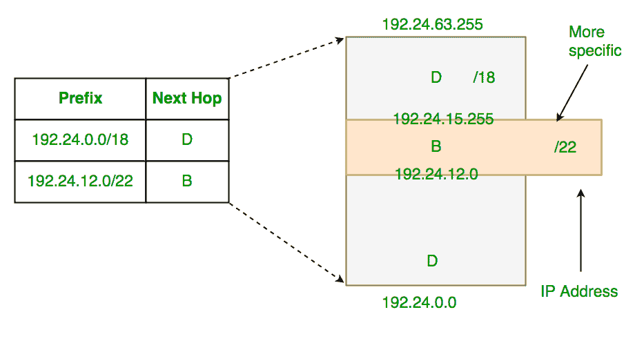

# 路由器中最长前缀匹配

> 原文:[https://www . geesforgeks . org/最长前缀匹配路由器/](https://www.geeksforgeeks.org/longest-prefix-matching-in-routers/)

**什么是转发？**
转发是将传入的数据包移动到适当的接口。路由器使用转发表来决定哪些传入数据包应该转发到下一跳。

**什么是** **IP 前缀？**
IP 前缀是 IP 地址的前缀。一个网络上的所有计算机都有相同的 IP 前缀。例如，在 192.24.0.0/18 中，18 是前缀的长度，前缀是地址的前 18 位。

**转发是如何工作的？**
路由器基本上是查看目的地址的 IP 前缀，在转发表中搜索匹配项，然后将数据包转发到转发表中对应的下一跳。

**如果前缀重叠会发生什么？**
由于前缀可能重叠(这是可能的，因为无类寻址到处都在使用)，一个传入 IP 的前缀可能与一个表中的多个 IP 条目相匹配。
例如，考虑下面的转发表

<figure class="table">

| 前缀 | 下一跳 |
| --- | --- |
| 192.24.0.0/18 | D |
| 192.24.12.0/22 | B |

在上表中，从 192.24.12.0 到 192.24.15.255 的地址重叠，即与表的两个条目匹配。
为了处理上述情况，路由器使用**最长前缀匹配**规则。规则是在表中找到与传入数据包的目的 IP 匹配最长前缀的条目，并将数据包转发给相应的下一个希望。
在上面的示例中，重叠范围(192.24.12.0 到 192.24.15.255)内的所有数据包都被转发到下一跳 B，因为 B 的前缀较长(22 位)。



**示例 1:** 路由器使用转发表条目转发数据包。传入数据包的网络地址可能匹配多个条目。路由器如何解决这个问题？
(一)转发条目与传入数据包最长前缀匹配的路由器
(二)转发数据包到所有网络地址匹配的路由器。
(三)丢弃数据包。
(D)将其转发给条目与传入数据包的最长后缀匹配的路由器

**回答:** (A)转发表中不同条目的网络地址可能重叠。路由器将传入的数据包转发到路由器，路由器对与传入数据包匹配的最长前缀进行哈希处理。

**示例 2:** 无类域间路由(CIDR)收到地址为 131.23.151.76 的数据包。路由器的路由表包含以下条目:(GATE CS 2015)

```
Prefix           Output Interface Identifier
131.16.0.0/12              3
131.28.0.0/14              5
131.19.0.0/16              2
131.22.0.0/15              1 
```

将在其上转发该数据包的输出接口的标识符是 ______。

**回答:**“1”。我们需要首先找出地址为“131.23.151.76”的传入数据包的匹配表条目。该地址与两个条目“131.16.0.0/12”和“131.22.0.0/15”匹配(我们通过分别匹配前 12 位和 15 位找到了这一点)。
那么数据包应该去往接口 3 还是接口 1 呢？我们使用最长前缀匹配来决定二者。最具体的匹配表条目用作接口。因为“131.22.0.0/15”是最具体的，所以数据包会到达接口 1。

**练习**
考虑以下路由器的路由表。

<figure class="table">

| 前缀 | 下一跳 |
| --- | --- |
| 192.24.0.0/18 | D |
| 192.24.12.0/22 | B |

考虑以下三个 IP 地址。

1.  192.24.6.0
2.  192.24.14.32
3.  192.24.54.0

</figure>

</figure>