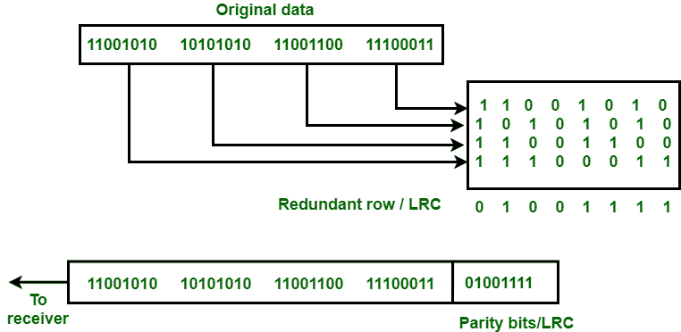
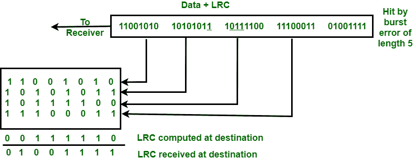
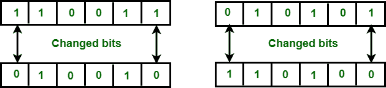

# 纵向冗余校验(LRC)/二维奇偶校验

> 原文:[https://www . geesforgeks . org/纵向-冗余校验-LRC-2-d-奇偶校验/](https://www.geeksforgeeks.org/longitudinal-redundancy-check-lrc-2-d-parity-check/)

**[【纵向冗余校验(LRC)](https://practice.geeksforgeeks.org/problems/what-is-lrc)** 也称为二维奇偶校验。在这种方法中，用户想要发送的数据被组织成行和列的表格。一个位块被分成行和列的表格或矩阵。为了检测错误，将冗余位添加到整个块中，并将该块发送到接收器。接收器使用这个冗余行来检测错误。检查数据错误后，接收器接受数据并丢弃冗余的一行位。

**示例:**
如果要传输一个 32 位的块，它被分成四行八列的矩阵，如下图所示:

**图:** LRC

在这个位矩阵中，为每一列计算一个奇偶校验位(奇数或偶数)。这意味着 32 位数据加上 8 个冗余位被传输到接收器。每当数据到达目的地时，接收器使用 LRC 检测数据中的错误。

**优势:**
LRC 用于检测突发错误。

**示例:**假设正在传输的 32 位数据加上 LRC 被长度为 5 的突发错误击中，一些位被破坏，如下图所示:

**图:**突发错误& LRC

目的地收到的 LRC 与新损坏的 LRC 不匹配。目的地知道数据是错误的，所以它丢弃数据。

**缺点:**
LRC 的主要问题是，如果一个数据单元中的两个比特被损坏，并且另一个数据单元中完全相同位置的两个比特也被损坏，则无法检测到错误。

**示例:**如果数据 110011 010101 更改为 010010110100。

**图:**2 个数据单元中相同位位置的两个位损坏

在这个例子中，一个数据单元中的第 1 和第 6 位被改变。第二个单元的第一位和第六位也发生了变化。