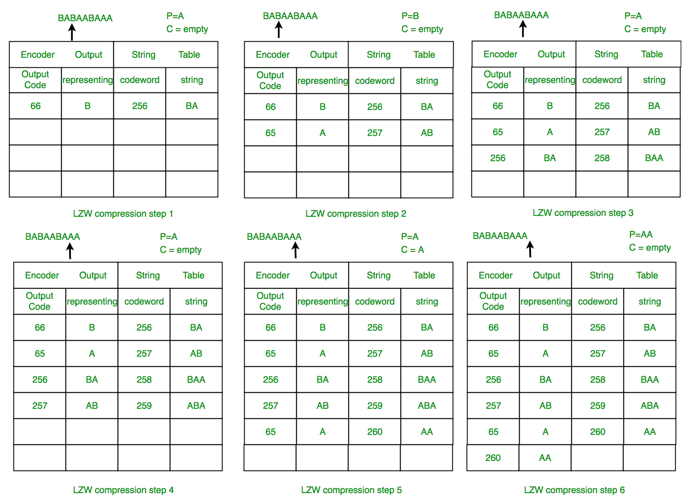
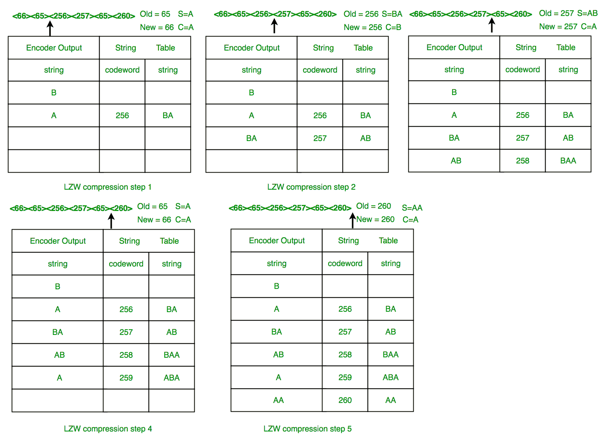

# LZW(伦佩尔-齐夫-韦尔奇)压缩技术

> 原文:[https://www . geesforgeks . org/lzw-lempel-ziv-Welch-compression-technology/](https://www.geeksforgeeks.org/lzw-lempel-ziv-welch-compression-technique/)

**为什么我们需要压缩算法？**

有两类压缩技术，有损和无损。虽然两者使用不同的技术来压缩文件，但两者都有相同的目的:在图形中寻找重复的数据(LZW 的 GIF)，并使用更紧凑的数据表示。无损压缩通过识别和消除统计冗余来减少比特。无损压缩不会丢失任何信息。另一方面，有损压缩通过删除不必要或不太重要的信息来减少比特。所以我们需要数据压缩，主要是因为:

*   未压缩的数据会占用大量空间，这对有限的硬盘空间和互联网下载速度不利。
*   虽然硬件变得更好、更便宜，但减少数据量的算法也有助于技术的发展。
*   示例:一分钟的未压缩高清视频可以超过 1 GB。我们如何在 25 GB 的蓝光光盘上放一部两小时的电影？

有损压缩方法包括离散余弦变换(DCT)、矢量量化和变换编码，而无损压缩方法包括 RLE(游程编码)、串表压缩、LZW (Lempel Ziff Welch)和 zlib。有几种压缩算法，但我们集中在 LZW。

**什么是伦佩尔-齐夫-韦尔奇(LZW)算法？**

LZW 算法是一种非常常见的压缩技术。该算法通常用于 GIF，也可以用于 PDF 和 TIFF。Unix 的“压缩”命令以及其他用途。它是无损的，这意味着压缩时不会丢失任何数据。该算法易于实现，并且在硬件实现中具有非常高的吞吐量的潜力。它是广泛使用的 Unix 文件压缩实用程序的压缩算法，用于 GIF 图像格式。
Idea 依靠重复出现的模式来节省数据空间。由于其简单性和多功能性，LZW 是通用数据压缩的首要技术。它是许多声称“硬盘容量翻倍”的 PC 实用程序的基础。

**它是如何工作的？**

LZW 压缩的工作原理是读取一系列符号，将符号分组为字符串，并将字符串转换为代码。因为代码占用的空间比它们替换的字符串少，所以我们得到了压缩。LZW 的特色包括，

*   LZW 压缩使用代码表，4096 是表条目数的常用选择。代码表中的代码 0-255 总是被指定代表输入文件中的单个字节。
*   当编码开始时，代码表只包含前 256 个条目，表的其余部分为空白。压缩是通过使用代码 256 到 4095 来表示字节序列来实现的。
*   随着编码的继续，LZW 识别数据中重复的序列，并将它们添加到码表中。
*   解码是通过从压缩文件中取出每个代码，并通过代码表翻译它来找到它所代表的字符来实现的。

例如:ASCII 码。通常，每个字符都存储有 8 个二进制位，最多允许 256 个唯一的数据符号。该算法试图将库扩展到每个字符 9 到 12 位。新的唯一符号由字符串中先前出现的符号组合组成。它并不总是压缩得很好，尤其是短而多样的字符串。但是对于压缩冗余数据是有好处的，并且不需要将新字典和数据一起保存:这种方法既可以压缩数据，也可以解压缩数据。
已经有优秀的文章写好了，这里可以更深入的看看[，还有马克·尼尔森的](https://www.cs.cmu.edu/~cil/lzw.and.gif.txt)[文章](http://marknelson.us/2011/11/08/lzw-revisited/)值得称赞。

**实施**

压缩算法的思想如下:当输入数据被处理时，字典保持最长遇到的单词和代码值列表之间的对应关系。单词被它们相应的代码替换，因此输入文件被压缩。因此，随着输入数据中长而重复的单词数量的增加，算法的效率也会提高。

**LZW 编码**

```
  *     PSEUDOCODE
  1     Initialize table with single character strings
  2     P = first input character
  3     WHILE not end of input stream
  4          C = next input character
  5          IF P + C is in the string table
  6            P = P + C
  7          ELSE
  8            output the code for P
  9          add P + C to the string table
  10           P = C
  11         END WHILE
  12    output code for P 
```

测试下面的代码:

[](http://cdnwrite.geeksforgeeks.org/wp-content/uploads/eee-e1493174848773.jpg)

输出:


另外，检查一下马克·尼尔森转换成 C++风格的[代码](http://people.cs.pitt.edu/~kirk/cs1501/assignments/lzw/lzw.cxx)。这里还有 6 个不同版本[的另一个变体](http://www.cplusplus.com/articles/iL18T05o/)。此外， [Rosettacode](http://rosettacode.org/wiki/LZW_compression#D) 列出了 LZW 在不同语言中的几种实现。

**使用 LZW 压缩**

示例 1:使用 LZW 算法压缩字符串: **BABAABAAA**
涉及的步骤系统地显示在下图中。



**LZW 减压**

LZW 解压缩器在解压缩期间创建相同的字符串表。它从初始化为单个字符的前 256 个表条目开始。除了第一个字符之外，字符串表会针对输入流中的每个字符进行更新。解码是通过读取代码并通过正在构建的代码表进行翻译来实现的。

**LZW 解压缩算法**

```
*    PSEUDOCODE
1    Initialize table with single character strings
2    OLD = first input code
3    output translation of OLD
4    WHILE not end of input stream
5        NEW = next input code
6        IF NEW is not in the string table
7               S = translation of OLD
8               S = S + C
9       ELSE
10              S = translation of NEW
11       output S
12       C = first character of S
13       OLD + C to the string table
14       OLD = NEW
15   END WHILE
```

例 2: LZW 解压:使用 LZW 解压输出顺序:**<66><65><256><257><65><260>**
涉及的步骤系统的如下图所示。



在这个例子中，72 位用 72 位数据表示。在构建了合理的字符串表之后，压缩会显著提高。
**LZW 总结:**这个算法很好地压缩了重复的数据序列。由于码字是 12 位，任何单个编码字符都将扩大而不是缩小数据大小。

用于编码和解码的 LZW 压缩的 C++代码如下:

## C++

```
#include <bits/stdc++.h>
using namespace std;
vector<int> encoding(string s1)
{
    cout << "Encoding\n";
    unordered_map<string, int> table;
    for (int i = 0; i <= 255; i++) {
        string ch = "";
        ch += char(i);
        table[ch] = i;
    }

    string p = "", c = "";
    p += s1[0];
    int code = 256;
    vector<int> output_code;
    cout << "String\tOutput_Code\tAddition\n";
    for (int i = 0; i < s1.length(); i++) {
        if (i != s1.length() - 1)
            c += s1[i + 1];
        if (table.find(p + c) != table.end()) {
            p = p + c;
        }
        else {
            cout << p << "\t" << table[p] << "\t\t"
                 << p + c << "\t" << code << endl;
            output_code.push_back(table[p]);
            table[p + c] = code;
            code++;
            p = c;
        }
        c = "";
    }
    cout << p << "\t" << table[p] << endl;
    output_code.push_back(table[p]);
    return output_code;
}

void decoding(vector<int> op)
{
    cout << "\nDecoding\n";
    unordered_map<int, string> table;
    for (int i = 0; i <= 255; i++) {
        string ch = "";
        ch += char(i);
        table[i] = ch;
    }
    int old = op[0], n;
    string s = table[old];
    string c = "";
    c += s[0];
    cout << s;
    int count = 256;
    for (int i = 0; i < op.size() - 1; i++) {
        n = op[i + 1];
        if (table.find(n) == table.end()) {
            s = table[old];
            s = s + c;
        }
        else {
            s = table[n];
        }
        cout << s;
        c = "";
        c += s[0];
        table[count] = table[old] + c;
        count++;
        old = n;
    }
}
int main()
{

    string s = "WYS*WYGWYS*WYSWYSG";
    vector<int> output_code = encoding(s);
    cout << "Output Codes are: ";
    for (int i = 0; i < output_code.size(); i++) {
        cout << output_code[i] << " ";
    }
    cout << endl;
    decoding(output_code);
}
```

**Output:** 

```
Encoding
String    Output_Code    Addition
W    87        WY    256
Y    89        YS    257
S    83        S*    258
*    42        *W    259
WY    256        WYG    260
G    71        GW    261
WY    256        WYS    262
S*    258        S*W    263
WYS    262        WYSW    264
WYS    262        WYSG    265
G    71
Output Codes are: 87 89 83 42 256 71 256 258 262 262 71 

Decoding
WYS*WYGWYS*WYSWYSG
```

**LZW 相对于** [**霍夫曼**](https://www.geeksforgeeks.org/greedy-algorithms-set-3-huffman-coding/) **的优势:**

*   LZW 不需要关于输入数据流的预先信息。
*   LZW 可以一次压缩输入流。
*   LZW 的另一个优点是简单，允许快速执行。

**资源:**

*   MIT . edu
*   戴夫。马歇尔
*   [duke.edu](https://www.cs.duke.edu/csed/curious/compression/lzw.html)
*   迈克尔·迪博斯坦
*   lzw(YouTube)
*   [facility . kfupm . edu . sa](http://faculty.kfupm.edu.sa/ics/garout/Teaching/ICS202/)
*   [github repository(kmeeu)](https://github.com/kmeelu/LZW)

本文由 **Amartya Ranjan Saikia** 供稿。如果你喜欢 GeeksforGeeks 并想投稿，你也可以使用[write.geeksforgeeks.org](https://write.geeksforgeeks.org)写一篇文章或者把你的文章邮寄到 review-team@geeksforgeeks.org。看到你的文章出现在极客博客主页上，帮助其他极客。
如果你发现任何不正确的地方，或者你想分享更多关于上面讨论的话题的信息，请写评论。