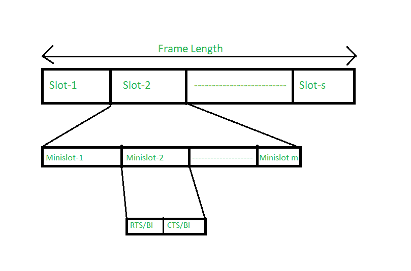

# 基于预留的媒体访问控制竞争-PRMA

> 原文:[https://www . geesforgeks . org/MAC-基于竞争的保留-d-prma/](https://www.geeksforgeeks.org/mac-contention-based-with-reservation-d-prma/)

先决条件–[媒体访问控制协议的分类](https://www.geeksforgeeks.org/classification-of-mac-protocols/)
媒体访问控制协议分类下的第一个类别是使用竞争和保留机制的媒体访问控制协议。第一种基于竞争的协议是**分布式分组预约多址协议(D-PRMA)。**

分组预约多址是已经建立的协议，不同的是，在这种情况下，它是分布式的，用于自组织。所以基本上，它是 PRMA 的更新版本。它是基于时分多址的技术。

在这种情况下，通道按帧长度划分。在每一帧中，都有一些槽，比如说 s 槽。这意味着有通道，它的小部分是框架，更进一步，它的小部分是槽，然后槽有它的小部分。

**例–**
有 A 和 b 两个终端，A 进一步命名为 D 和 e，它们有相同的通道，这个过程就是在这个通道中进行的。b 是要向其传输数据的地址。现在，正如我们所知，将会有某种数据包保留。

每个时隙的第一个微时隙是竞争的，因为如果第一个微时隙被保留，那么剩下的下一个微时隙(假设(m-1))也被保留。所以整个时隙被分配给那个特定的终端。就像 A 一样，D 和 E 正在完成插槽 2 的迷你批次-1，A 赢了，所以下一个迷你批次将只分配给 A。

现在，Minislot 进一步分配了 RTS/BI 和 CTS/BI。RTS 代表请求发送，CTS 代表清除发送。RTS/BI 用于处理暴露的终端问题，CTS/BI 用于避免隐藏的终端问题。

A 正在向每个人发送 CTS，比如 D 和 e。直到 CTS/BI 中有值的时候，他们才知道他们不能发送值，因为 A 正在向 CTS/BI 发送值。现在假设，对于另一个数据包，假设 F 想发送到 C 终端，在那里 RTS 正在侦听和响应，但 CTS 没有。这意味着 F 现在不会与 CTS 相关，如果它正在为终端 C 获取 RTS，那么 F 被允许传输数据。因此，这避免了暴露的终端问题。

基本上，该协议有两个基本要求–

*   如果第一个迷你时隙被保留，那么下一个迷你时隙也将被保留给该终端。
*   如果一个时隙被预留，或者其他时隙也被预留，那么对于该时隙，没有其他终端会浪费它的资源。

简而言之，该协议用于**语音流量。**总的来说，如果任何节点想要传输它的包，那么第一个条件就是预留时隙。