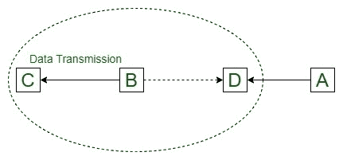
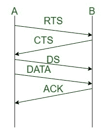
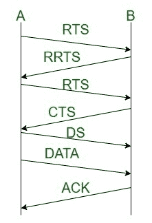

# MACAW 协议

> 原文:[https://www.geeksforgeeks.org/macaw-protocol/](https://www.geeksforgeeks.org/macaw-protocol/)

**多址与[无线(MACAW)](https://www.geeksforgeeks.org/collision-avoidance-in-wireless-networks/)** 冲突避免是一种在自组织网络系统中广泛使用的[媒体访问控制(MAC)](https://practice.geeksforgeeks.org/problems/what-is-media-access-controlmac) 协议。此外，它是无线传感器系统(WSN)中使用的许多其他媒体访问控制协议的建立。

IEEE 802.11 RTS/CTS 系统就是从这个协议接收的。它利用 RTS-CTS-DS-DATA-ACK 帧序列来移动信息，偶尔在 RTS-RRTS 帧排列之前，以便给出隐藏节点问题的答案。虽然协议依赖于 MACAW，但 MACAW 不利用载波侦听。

**特征:**

*   [MACA](https://www.geeksforgeeks.org/multiple-access-with-collision-avoidance-maca/) 中的问题是如果分别有两个发送方和两个接收方 A、B、C、D。
*   如果 B 已经同时向 C 和 D 发送了 RTS，但仅在收到 C 的 CTS 时才发送数据
*   现在，A 想向 D 发送数据，但无法发送，因为它会感觉到 D 当前正忙，并将退避计数器(A 在重新传输之前将等待多长时间)的值增加两倍，因此它将陷入循环，直到 D 获得自由。
*   成对站之间的阻塞数据交易，促使更好的阻塞控制和退避方法

**相对 MACA 的优势:**

*   如果附近的站点没有发送即时战略，发送方检测到要查看的承载并发送即时战略(请求发送)。
*   Macao 的公平性比 MACA 好很多。
*   它比 MACA 更好地处理隐藏和暴露节点问题。
*   在每个数据帧之后，确认信号被发送到媒体访问控制层。
*   它还结合了载波检测，以进一步减少冲突
*   在每个消息级别，而不是在每个节点级别，进行不规则的暂停和重新尝试传输。

**工作:**

*   这个问题通过无线协议的冲突避免多址接入来解决，因为它引入了包含当前传输节点的退避计数器值的分组，以复制到另一个发送节点。这将大大减少等待时间。
*   MACAW 还引入了两个新的数据帧 DS(数据发送)，它提供关于传入数据帧长度的信息，以及 RRTS(请求发送请求)，它充当 RTS 的代理。

**例:**
在 MACAW 的情况下，成功的传播将看起来像:

*   从甲到乙的即时战略
*   从乙到甲的中旅
*   从甲到乙的 DS
*   从甲到乙的数据帧
*   从乙到甲的确认

RRTS MACAW 的成功传播如下:

*   从甲到乙的即时战略
*   从乙到甲的 RRTS
*   从甲到乙的即时战略
*   从乙到甲的中旅
*   从甲到乙的 DS
*   从甲到乙的数据帧
*   从乙到甲的确认

