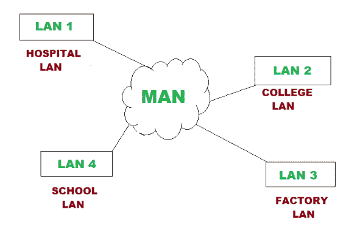

# 计算机网络中的 MAN 完整形式

> 原文:[https://www . geeksforgeeks . org/man-全形态计算机网络/](https://www.geeksforgeeks.org/man-full-form-in-computer-networking/)

**MAN** 代表**城域网**。它是将多个局域网连接起来形成更大的网络，使计算机资源得以共享的计算机网络。这种类型的网络比局域网覆盖的面积大，但比广域网覆盖的面积小，广域网的设计是为了覆盖整个城市。城域网是专门为用户提供高速连接而设计的，其速度范围以兆位/秒为单位。城域网的架构相当复杂，因此很难设计和维护。

**城域网的历史:**
当 1994 年建立局域网以便在建筑物和办公室中提供数据通信时，企业主要依靠公共交换电话网络来实现局域网的互连。但是电话网络不足以处理这么多的流量。因此，为了克服这个问题，有人建议使用单模光纤线路连接局域网，这导致了城域网的创建，以有效地提供局域网的互连。这些光纤城域网由私人组织或企业拥有和运营，不一定通过网关与公共广域网完全集成。

**MAN 的特性:**

*   它可以覆盖 5 到 50 公里的区域，能够将一组建筑带到整个城市。
*   在城域网中，数据速率从中到高。
*   在城域网中，主要使用的介质是光纤，这导致了高速连接。
*   城域网提供了高可靠性，因为该网络中的错误率非常低。

**MAN 的优势:**

*   城域网提供高速连接，速度范围为 10-100 兆比特每秒。
*   与广域网相比，城域网的安全级别既高又严格。
*   由于双总线结构，它支持双向同时传输数据。
*   城域网可以用同一高速互联网同时为多个用户服务。

**MAN 的缺点:**

*   城域网的架构相当复杂，因此很难设计和维护。
*   这个网络非常昂贵，因为它需要很高的成本来建立光纤。
*   它提供较少的容错能力。
*   与局域网相比，城域网的数据传输速率较低。

**MAN 示例:**

*   有线电视网络。
*   用于政府机构。
*   大学校园。