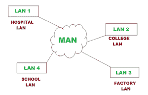

# MAN 完整形式

> 原文:[https://www.geeksforgeeks.org/man-full-form/](https://www.geeksforgeeks.org/man-full-form/)

[MAN](https://www.geeksforgeeks.org/types-of-area-networks-lan-man-and-wan/) 代表城域网，基本上是由多个局域网连接而成的计算机网络。城域网覆盖了一个被称为都市圈的地理区域。它作为一种比局域网大但比广域网小的连接。它一般覆盖一个城市的面积。它通过点对点连接将一个区域内的不同局域网连接起来。城域网还提供区域资源共享。城域网在像城市或大校园这样的大区域使用非常有效。



```
Examples:
Cable TV network and telephone networks
```

**特征:**

*   **覆盖面积–**
    覆盖面积从 5 公里到 50 公里，可以覆盖一个城市。
*   **所有权–**
    MAN 由一组用户所有，而非单一公司所有。
*   **高速–**
    城域网提供使用共享区域资源的高速网络。
*   **规模–**
    城域网的规模介于广域网和局域网之间。

**优势:**

*   城域网比局域网覆盖的面积更大。
*   它的实施成本更低，使用的资源也更少。
*   它比广域网提供更高的安全性。
*   它可以覆盖一个城市那么大的面积。
*   城域网是将两个快速局域网连接在一起的一种更快的方式。这是由于链接的快速配置。
*   在一些 MANs 安装中，用户可以共享他们的互联网连接。因此多个用户可以获得相同的高速互联网。

**劣势:**

*   人是不容易管理的，因为它变得非常复杂。
*   它需要高技能的人来照顾它。
*   它需要更多的电缆来连接局域网。
*   管理成本高
*   它比广域网占地面积小。
*   它只在大都市地区使用。

**城域网示例:**

城域网的一些例子如下

*   数字有线电视
*   用于政府机构
*   用来连接当地学校的几个分校
*   消防站网络
*   大学校园
*   国内社区学院之间的联网
*   有线宽带