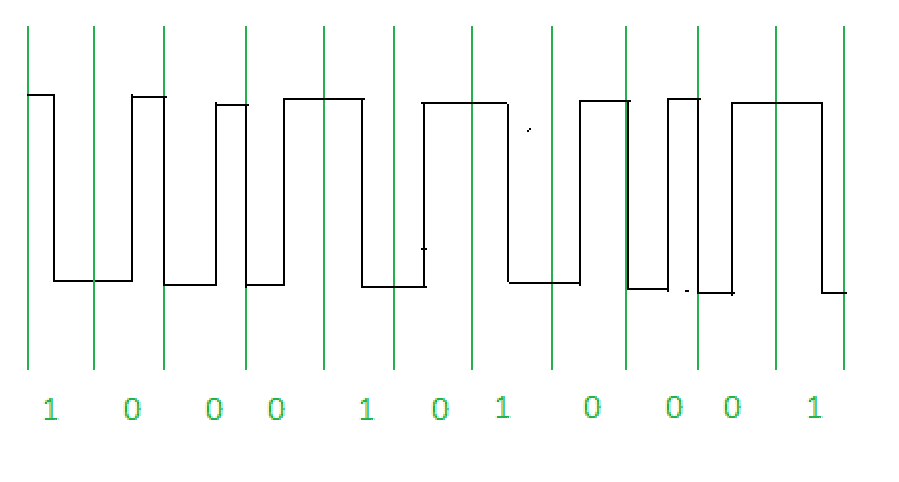

# 计算机网络中的曼彻斯特编码

> 原文:[https://www . geesforgeks . org/Manchester-计算机网络编码/](https://www.geeksforgeeks.org/manchester-encoding-in-computer-network/)

先决条件–[单极性、极性和双极性线路编码方案的区别](https://www.geeksforgeeks.org/digital-electronics-difference-unipolar-polar-bipolar-line-coding-schemes/)
曼彻斯特编码是开放系统互连(OSI)物理层使用的同步时钟编码技术，用于对同步比特流的时钟和数据进行编码。


要通过电缆传输的二进制数据不作为 NRZ[不归零]发送。

**不归零码【NRZ】–**
NRZ 码的电压电平在一个比特间隔内是恒定的。当 0 和 1 的序列很长时，接收端就会出现问题。问题是同步由于缺少传输而丢失。
有两种类型:

1.  **NRZ 级编码–**
    当输入信号从‘1’变为‘0’或从‘0’变为‘1’时，信号的极性会发生变化。它将数据的第一位视为极性变化。
2.  **NRZ-反相/差分编码–**
    在这种情况下，位间隔开始时的跃迁等于 1，如果位间隔开始时没有跃迁，则等于 0。

**曼彻斯特编码的特征–**

*   逻辑 0 由位中心的 0 到 1 转换表示，逻辑 1 由 1 到 0 转换表示。
*   信号转换并不总是发生在“位边界”上，但在每个位的中心总是有一个转换。
*   **差分物理层传输**不使用反相线路驱动器将二进制数字转换为电信号。因此导线上的信号与编码器的输出不相反。
*   曼彻斯特编码也被称为**双相码**，因为每个比特由正 90 度相位转换或负 90 度相位转换编码。
*   **数字锁相环(DPLL)** 提取时钟信号并解除分配每个位的值和定时。传输的比特流必须包含高密度的比特转换。
*   曼彻斯特编码消耗的带宽是原始信号的两倍。
*   曼彻斯特码的优点是信号的 DC 分量不携带任何信息。这使得通常不携带电能的标准可以传输这种信息。

    ```
    Eg: For 10Mbps LAN the signal spectrum lies between 5 and 20
    ```

*   另一个通过观察跃迁找出位的例子。



1.  [GATE-CS-2007 |问题 85](https://www.geeksforgeeks.org/gate-gate-cs-2007-question-19/)
2.  [GATE IT 2007 |问题 59](https://www.geeksforgeeks.org/gate-gate-it-2007-question-59/)
3.  [ISRO CS 2007 |第 22 题](https://www.geeksforgeeks.org/isro-isro-cs-2007-question-22/)

**参考:**
[**<u>图书–计算机网络作者:谭恩宝</u>**](https://amzn.to/3hfQerb)