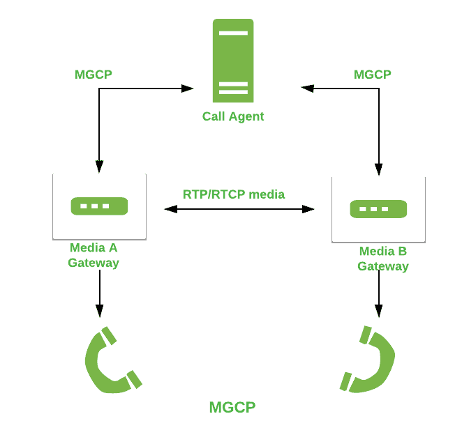

# 媒体网关控制协议(MGCP)

> 原文:[https://www . geesforgeks . org/media-gateway-control-protocol-mgcp/](https://www.geeksforgeeks.org/media-gateway-control-protocol-mgcp/)

MGCP 代表媒体网关控制协议。这是一种广泛用于信令和控制通信协议的协议，应用于 [VoIP 电信系统](https://www.geeksforgeeks.org/voice-over-internet-protocol-voip/)。MGCP 紧随简单网关控制协议之后。MGCP 反映了这样一种体系结构，其中端点是能力较弱的设备，只执行来自网关的命令，并提供指示作为响应。

**MGCP 特色:**

*   这是 RFC 3035 的一种疾病。
*   它可以使用 IPv4 和 IPv6。
*   它可以通过 MGCP 软件进行扩展以获得额外的能力。
*   它支持使用 SIP 和 H.323 协议。

**MGCP 的工作:**
要了解 MGCP 的工作，我们需要了解[主从架构](https://www.geeksforgeeks.org/typical-multiprocessing-configuration/)，因为 MGCP 是一个主从协议，其中媒体网关由呼叫代理控制。这些呼叫代理称为媒体网关控制器。代理负责向媒体网关请求事件、报告和配置数据。控制代理相互同步，并向其控制下的网关发送可理解的命令。

**MGCP 的建筑:**

**MGCP 的申请:**

*   它用于无线局域网的无线电话。
*   广泛用于个人通信。
*   用于各种音频和视频会议。
*   它用于无线 GPRS 和 EDGE 系统。

**优势:**

*   它为大型系统提供了简单的配置。
*   它可以很容易地为呼叫处理提供更好的控制。
*   为呼叫处理系统提供更好的吞吐量。
*   该协议将媒体处理和信令功能分开。

**缺点:**

*   对于小型应用程序来说，它太复杂了。
*   它依赖呼叫代理进行通信，这使得它容易出现单点故障。
*   它得到的支持有限。
*   它对网关的配置很少。