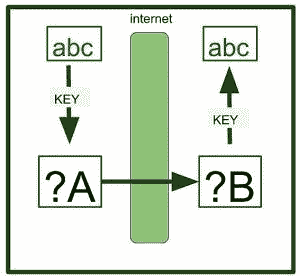
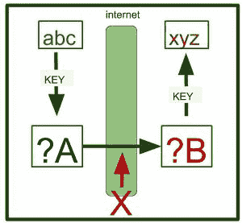
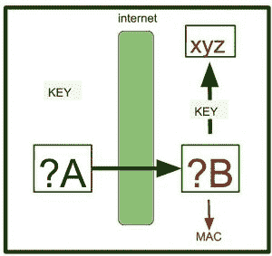

# 消息认证码

> 原文:[https://www.geeksforgeeks.org/message-authentication-codes/](https://www.geeksforgeeks.org/message-authentication-codes/)

消息认证码是在两个重要功能中发挥作用的代码:认证检测和篡改检测。

**我们在哪里需要这些代码？**
假设用户甲向用户乙发送消息，消息为–‘ABC’。使用**共享密钥密码系统**加密消息。a 使用源密钥将密钥发送给 B。密钥交换基于不同的协议，如**公钥密码系统。** B 使用密钥解密密文，获得消息。

**这一切都不是那么容易发生的。存在一个问题**。
如果恶意用户 X 在传输过程中篡改了密文。那么，那样的话，B 就没有办法意识到自己被证伪了。当 B 解密消息时，会得到错误的消息。未知事实的 B 会认为错误的信息是正确的。虽然您可以稍后解密或加密数据，但是这些操作会应用错误的数据。

**这里我们需要检测 B 得到的消息中的造假。**
这里 A 会创建一个密钥(用于创建消息认证码)并将密钥发送给 b，A 会使用密文和密钥创建一个值，并获得该值。该值由**密文+密钥=消息认证码**创建。必须使用消息认证码检查密文是否被篡改。现在 B 可以清楚地知道密文是否被篡改。

