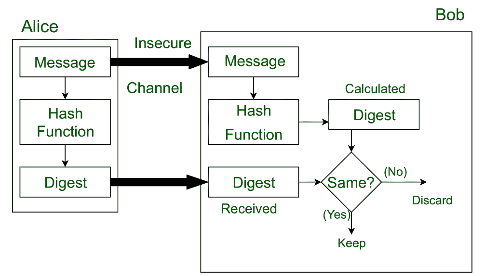

# 信息安全中的消息摘要

> 原文:[https://www . geesforgeks . org/message-digest-in-information-security/](https://www.geeksforgeeks.org/message-digest-in-information-security/)

**消息摘要**用于确保通过不安全信道传输的消息的完整性(在该信道中，消息的内容可以更改)。消息通过[加密散列函数](https://www.geeksforgeeks.org/passwords-and-cryptographic-hash-function/)传递。该功能创建一个名为**摘要**的消息压缩图像。

让我们假设，爱丽丝向鲍勃发送了一条消息和摘要对。为了检查消息的完整性，Bob 对收到的消息运行加密散列函数，并获得一个新的摘要。现在，鲍勃将比较新的摘要和爱丽丝发送的摘要。如果两者相同，那么鲍勃确信原始消息没有改变。

该消息和摘要对相当于一个物理文档和该文档上的一个人的指纹。与物理文档和指纹不同，消息和摘要可以分开发送。

*   最重要的是，摘要在传输过程中应该保持不变。
*   密码散列函数是一个单向函数，也就是说，一个实际上不可行的函数。该加密散列函数以可变长度的消息为输入，创建固定长度的**摘要/散列/指纹**，用于验证消息的完整性。
*   消息摘要确保了文档的完整性。为了提供消息的真实性，用发送者的私钥对摘要进行加密。现在这个摘要被称为数字签名，只有拥有发送者公钥的接收者才能解密。现在，接收者可以验证发送者，也可以验证发送消息的完整性。

**示例:**
哈希算法 MD5 被广泛用于检查消息的完整性。MD5 将消息分成 512 位的块，并创建 128 位摘要(通常为 32 个十六进制数字)。它不再被认为是可靠的，因为研究人员已经证明了能够在商用计算机上轻松生成 MD5 冲突的技术。
MD5 的弱点在 2012 年被*火焰恶意软件*利用。

针对 MD5 哈希算法的不安全性，发明了[安全哈希算法(SHA)](https://www.geeksforgeeks.org/sha-1-hash-in-java/) 。

**实现:**
[Java 中的 MD5 哈希](https://www.geeksforgeeks.org/md5-hash-in-java/)

**相关 GATE 问题:**
[GATE-CS-2014-(Set-1)](https://www.geeksforgeeks.org/gate-gate-cs-2014-set-1-question-34/)
[GATE-CS-2016(Set-1)](https://www.geeksforgeeks.org/gate-gate-cs-2016-set-1-question-62/)