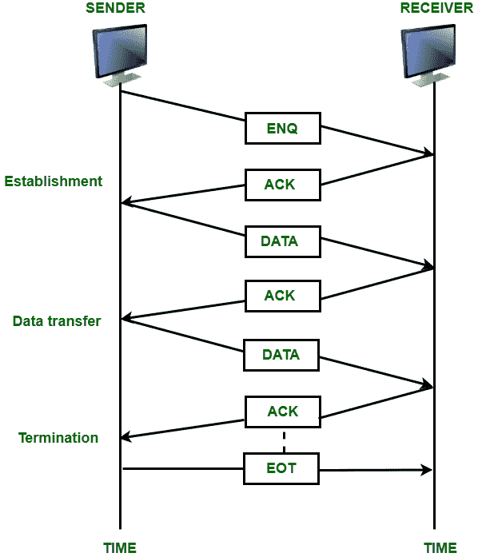
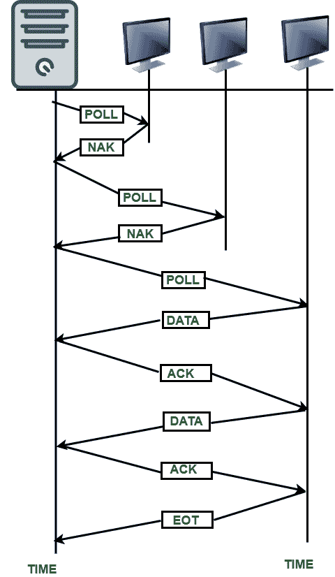
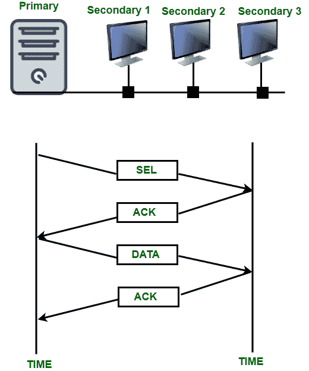

# 线路规程方法

> 原文:[https://www.geeksforgeeks.org/methods-of-line-discipline/](https://www.geeksforgeeks.org/methods-of-line-discipline/)

**线路规程:**
线路规程是数据链路层的基础，它决定了**在给定的时间内**在网络中各种连接的设备中，哪台设备可以发送数据，以及何时可以发送该数据。从而线学科坐标链接系统。它还用于确保发送方发送的数据被特定的接收方接收。当发送方发送数据时，接收方可能没有准备好接受该数据或正忙。在这种情况下，发送方将继续发送接收方无法接收的数据，数据将被浪费。

为了克服这样的问题，线路规程方法在数据由接收者发送之前，在数据由发送者发送之前，确认接收者的存在和能力。线路规程功能负责在发送方和接收方之间建立链路，并负责特定设备在给定时间传输数据的权利。

**线路规程的方法:**
提供线路规程功能有两种方式:

1.  **查询/确认(ENQ/确认):**

    **图:** ENQ/确认模式

    *   当发送方和接收方之间有专用链路时，使用此方法。
    *   这种方法用于对等通信。
    *   它协调哪个设备可以开始传输，以及接收器是否准备好接受数据。
    *   如果两个通信设备处于同一等级，则两个设备中的任何一个都可以开始通信。
2.  **投票/选择:**
    *   此方法用于具有主次关系的客户端-服务器类型网络。
    *   在这种情况下，一个设备称为主站，它向所有其他称为辅助设备的设备提供和控制服务。
    *   在这种网络中，主设备控制链路，辅助设备遵循其指令。
    *   主设备确定在给定时间哪个设备控制链路。
    *   每当要在主设备和辅助设备之间或者辅助设备和辅助设备之间建立通信时，主设备总是会话发起者。
    *   在这样的网络中，有两种功能是可能的:轮询和选择。这些解释如下。
        *   **(一)。轮询:**
            当主设备想要接收详细信息时，会询问辅助设备是否有要发送的内容，此功能称为轮询。

            **图:**轮询模式

        *   **(二)。选择:**
            当主设备想要向任何辅助设备发送数据时，它会告诉该设备准备接收数据，该功能称为选择。

            **图:**选择模式