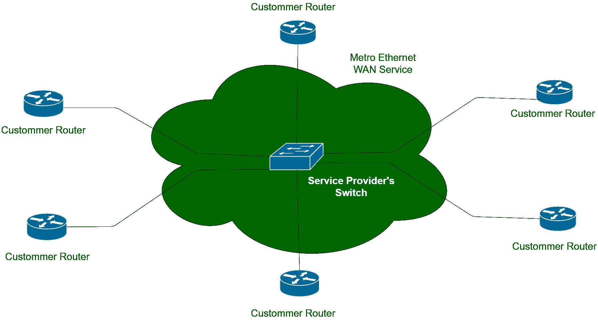
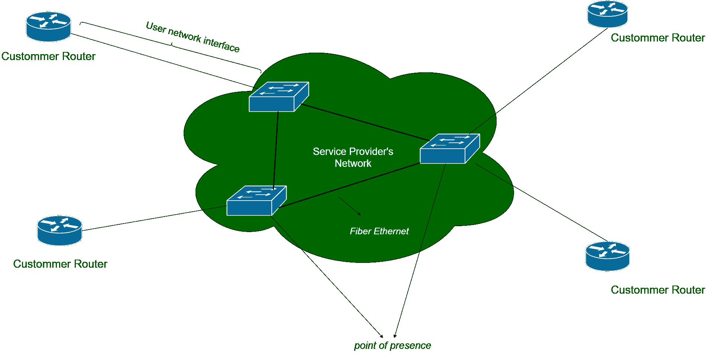

# 地铁以太网(metro)

> 原文:[https://www.geeksforgeeks.org/metro-ethernet-metroe/](https://www.geeksforgeeks.org/metro-ethernet-metroe/)

**城域以太网(metre)**顾名思义使用[以太网](https://www.geeksforgeeks.org/local-area-network-lan-technologies/)链路将客户网络连接到服务提供商的设备。城域以太网的客户通常是需要连接多个办公室的企业。城域以太网服务使用第 2 层标准，即它将[以太网帧](https://www.geeksforgeeks.org/ethernet-frame-format/)从一台客户设备转发到另一台。

城域以太网类似于在不同虚拟局域网之间转发帧的大型局域网。由于城域以太网覆盖的服务区域很大，服务提供商需要实施光纤以太网标准。光纤以太网支持无损耗的高速长距离布线。

**Figure –** Metro Ethernet Analogy

**城域以太网实施:**
如果我们从客户(企业)的角度考虑，每个站点都必须连接到服务提供商的网络。此外，没有必要直接连接两个企业站点，因为这是企业使用城域以太网的原因。对于任何企业来说，仅仅为了连接不同的站点而在城市之间铺设以太网电缆都是不可行的。

从服务提供商的角度来看，它需要将交换机放置在大量客户可以访问交换机的地方。这个地方被称为存在点。选择 PoP 是经过深思熟虑的，因为客户的以太网标准能够承受这个距离。客户和服务提供商设备之间的连接称为用户网络接口(UNI)。用户是指客户和网络是指服务提供商的网络。

**Figure –**Metro Ethernet Implementation

对于用于城域以太网的以太网标准，IEEE 建议了一些标准，如下表所示–

| 标准名称 | 速度 | 距离 |
| --- | --- | --- |
| 100 base-LX 10-基本型-LX 10-基本型-基本型-基本型-基本型-基本型-基本型-基本型-基本型-基本型-基本型-基本型-基本型-基本型-基本型-基本型 | 100mbps | 10 Km |
| 1000Base-LX | 1 Gbps | 5 Km |
| 1000Base-LX10 | 1 Gbps | 10 Km |
| 1000Base-ZX | 1 Gbps | 100 公里 |
| 10GBase-LR | 10 Gbps | 10 Km |
| 10G 基站 | 10 Gbps | 40 Km |

