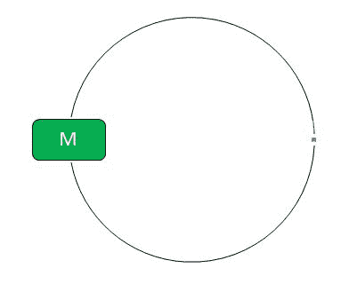
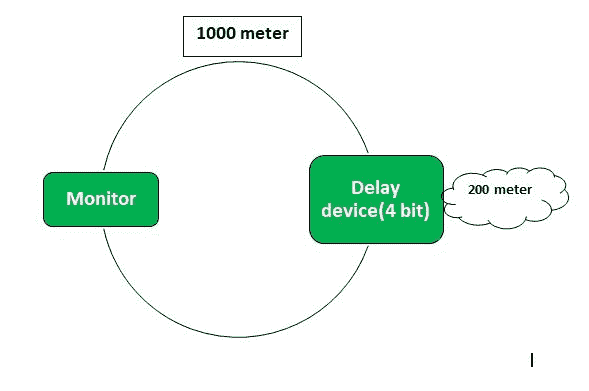

# 令牌环的最小长度

> 原文:[https://www.geeksforgeeks.org/minimum-length-of-token-ring/](https://www.geeksforgeeks.org/minimum-length-of-token-ring/)

先决条件–[令牌环帧格式](https://www.geeksforgeeks.org/computer-network-token-ring-frame-format/)、[令牌环的效率](https://www.geeksforgeeks.org/computer-network-efficiency-token-ring/)、[令牌环的问题](https://www.geeksforgeeks.org/computer-networks-problems-with-token-ring/)
我们已经熟悉了令牌环。现在，在本文中，我们将讨论令牌环的最小长度应该是多少。

在最坏的情况下，可能所有系统都将关闭，唯一的监视器将保持活动状态。因此，令牌环应该能够完全容纳一个令牌，以避免冲突。
我们知道 Token 的大小= 24 位。



```
Hence, the minimum length of the Token Ring 
= Length of wire that can hold 24 bits 
```

让我们看看如何计算可以容纳 24 位的导线长度:

```
Capacity of wire = Propagation Delay * Bandwidth
Capacity >= 24
Propagation Delay * Bandwidth >= 24

Propagation Delay = Length of wire / velocity

(length of wire/velocity) * Bandwidth >= 24
Length of wire >= ( 24 * velocity ) / Bandwidth 
```

因此，环的大小必须大于(24 *速度)/带宽。

**例:**给定，

```
Bandwidth = 4 Mbps, 
Velocity = 2 * 108 
```

戒指的最小长度应该是多少？

**说明:**

```
length >= ( 24 * velocity ) / Bandwidth
length >= (24 * 2 * 10^8) / (4 * 10^6)
length >= 1200 meter 
```

在这种情况下，如果我们没有这么多电线，那么我们可以使用*延迟装置*。
让我们假设对于给定的例子，我们只有 1000 米的电线，那么延迟将等于 200 米。要将仪表转换为位:

```
Meter --/velocity--> Second --*Bandwidth--> bit 
```

因此，200 米所需的位延迟是

```
= (200/(2 * 108)) * (4 * 106) 
= 4 bit time 
```



因此，在需要 1200 米的 1000 米电线中，需要 4 比特的延迟装置来无冲突地工作环。