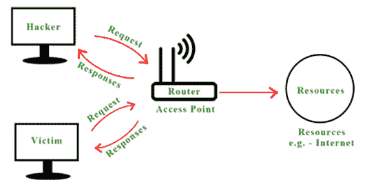
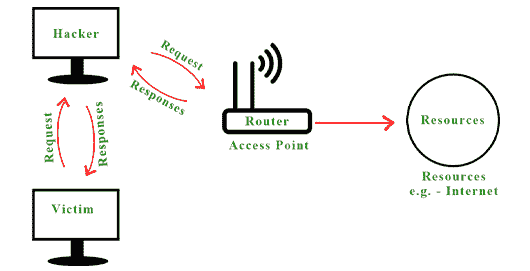
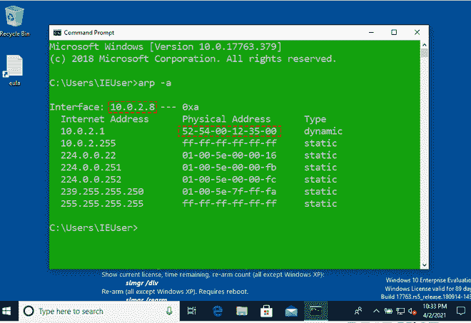
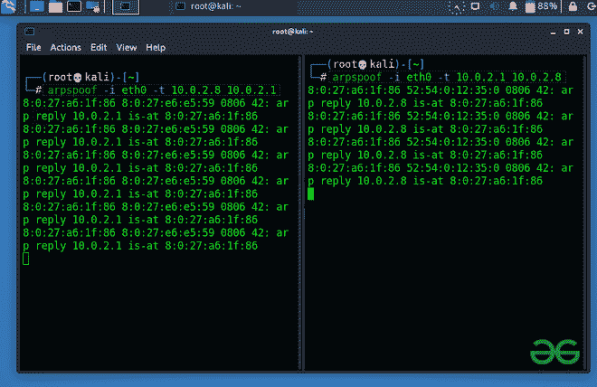
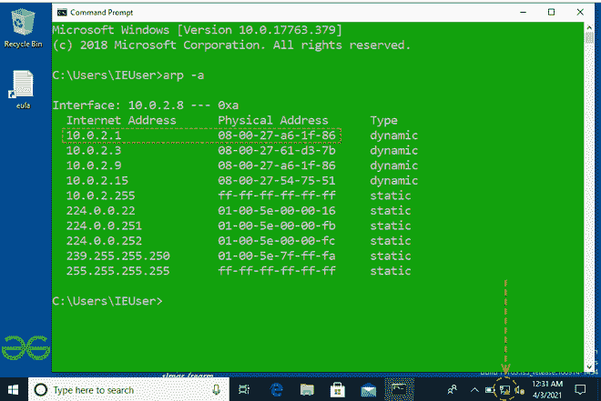
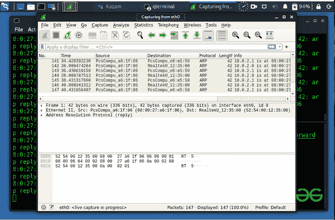

# MITM(中间人)使用 ARP 中毒攻击

> 原文:[https://www . geesforgeks . org/mitm-中间人-攻击-使用-ARP-中毒/](https://www.geeksforgeeks.org/mitm-man-in-the-middle-attack-using-arp-poisoning/)

**简介:**
中间人攻击意味着一种主动攻击，攻击者/黑客在受害者之间建立连接，并在他们之间发送消息，或者可能捕获受害者的所有数据包。在这种情况下，受害者认为他们在相互通信，但实际上，恶意攻击者/黑客控制了通信，即存在第三方来控制和监控双方(即客户端和服务器)之间的通信流量。

**中路进攻的人的类型:**
在这里，我们将讨论中路进攻的人的类型如下。

1.  **ARP 欺骗–**
    [ARP](https://www.geeksforgeeks.org/how-address-resolution-protocol-arp-works/)**代表地址解析协议。该协议用于将 IP 地址解析为机器 MAC 地址。所有想要在网络中通信的设备都在系统中广播 ARP 查询，以找出其他机器的 MAC 地址。ARP 欺骗也称为 ARP 中毒。在这种情况下，ARP 中毒，ARP 数据包被迫向攻击者的机器发送数据。ARP 欺骗构建了大量的强制 ARP 请求和回复数据包，以使交换机过载。攻击者的意图是将所有网络数据包和交换机设置在转发模式。** 
2.  ****DNS 欺骗**–
    与 ARP 类似，DNS 将域名解析为 IP 地址。DNS 欺骗是非常危险的，因为在这种情况下，黑客将能够劫持和欺骗用户提出的任何 DNS 请求，并可以为用户提供虚假网页、虚假网站、虚假登录页面、虚假更新等服务。**

****中间人攻击手法:**
在这里，我们将讨论中间人攻击手法如下。**

*   **[数据包嗅探](https://www.geeksforgeeks.org/what-is-packet-sniffing/)**
*   **[会话劫持](https://www.geeksforgeeks.org/session-hijacking/)**
*   **[SSL](https://www.geeksforgeeks.org/secure-socket-layer-ssl/) 剥离**
*   **[封包注入](https://www.geeksforgeeks.org/fault-injection-in-software-engineering/)**

****利用 ARP 欺骗进行中间人攻击:**
下面我们将讨论利用 ARP 欺骗进行中间人攻击的步骤如下。**

****步骤-1:**
**ARP 欺骗**-它允许我们重定向计算机网络中的数据包流。典型网络示例如下。**

**

典型的计算机网络** 

****步骤 2 :**
但是当黑客通过 ARP 欺骗成为中间人时，所有的请求和响应都开始流经黑客的系统，如下所示–**

**

ARP 欺骗后的计算机网络** 

****第三步:**
黑客通过伪装成受害者来欺骗受害者的路由器，同样，他也通过伪装成路由器来欺骗受害者。**

****如何进行 ARP 欺骗攻击:**
我们可以使用 Kali Linux 中名为 ARP 欺骗的内置工具进行 ARP 欺骗攻击，也可以使用 [python 程序创建 ARP 欺骗攻击。](https://www.geeksforgeeks.org/python-how-to-create-an-arp-spoofer-using-scapy/?ref=rp)**

****执行步骤:**
在这里，我们将讨论如下执行步骤。**

****步骤-1:**
我们可以在 Kali Linux 中运行内置的“arpuocate”工具。如果 ARP 欺骗工具不存在，请运行以下命令安装该工具。**

```
apt install dsniff
```

****步骤-2 :**
要运行这次攻击，我们需要两样东西受害机器的 IP 地址&网关的 IP。在这个例子中，我们使用一台 Windows 机器作为我们的受害者，使用 Kali 机器来运行攻击。要知道受害机器的 IP 地址和网关 IP，请在 Windows 机器和 Linux 机器上运行以下命令，如下所示。**

```
arp -a
```

****输出:**
这将向我们显示如下输出。
T4【受害者机器(视窗机器)–**

**

windows 机器** 

****攻击者机器(Kali Linux)–**
从这些我们可以观察到 Windows 机器的 IP 地址是 10.0.2.8，网关的 IP 和 MAC 地址是 10.0.2.1 和 52:54:00:12:35:00，同样我们 Kali 机器的 MAC 地址是 08:00:27:a6:1f:86。**

****

****步骤-3 :**
现在，编写以下命令来执行 ARP 欺骗攻击。**

```
arpspoof -i eth0 -t 10.0.2.8 10.0.2.1
```

**这里 eth0 是接口的名称，10.0.2.8 是 Windows 机器的 IP，10.0.2.1 是网关的 IP。这将通过假装路由器来愚弄受害者。因此，我们将再次运行上面的命令，切换其 IP 地址如下。**

```
arpspoof -i eth0 -t 10.0.2.1 10.0.2.8
```

****输出:**
**攻击者机器(Kali Linux)–**
这说明我们的 ARP 欺骗攻击正在运行，我们已经成功将我们的系统放置在客户端和服务器中间。**

**

ARP 欺骗攻击正在运行** 

**我们也可以通过运行如下命令来检查它。**

```
arp -a 
```

****输出:**
在输出画面中，可以观察到网关的 MAC 地址变成了 Kali Machine 的 MAC 地址。现在所有的数据包都将流经我们的 Kali 机器。此外，您可以看到受害机器的互联网连接不起作用，因为这是 Linux 的安全功能，不允许数据包通过。因此，我们需要启用端口转发，这样这台计算机将允许数据包像路由器一样通过它。**

****

****步骤-4 :**
要启用端口转发，请按如下方式运行命令。**

```
echo 1 > /proc/sys/net/ipv4/ip_forward 
```

****输出:**
该命令将再次建立受害计算机的互联网连接。这样，我们就可以利用 ARP 欺骗攻击成为中间人。因此，来自受害者计算机的所有请求不会直接到达路由器，而是会流经攻击者的机器，攻击者可以通过使用 Wire Shark 等各种工具嗅探或提取有用的信息。如下所示。**

**

wire Shark–用于从数据包中嗅探有用信息。**