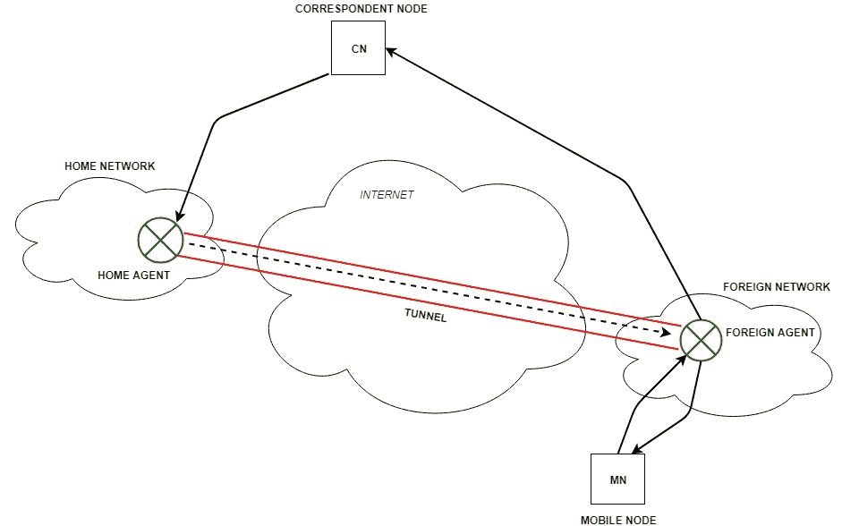

# 移动互联网协议(或移动 IP)

> 原文:[https://www . geesforgeks . org/mobile-internet-protocol-or-mobile-IP/](https://www.geeksforgeeks.org/mobile-internet-protocol-or-mobile-ip/)

**移动 IP** 是一种通信协议(通过扩展互联网协议(Internet Protocol，IP)创建的)，允许用户使用相同的 IP 地址从一个网络移动到另一个网络。它确保通信将继续，而不会中断用户的会话或连接。

**术语:**

*   **移动节点(MN):**
    是用户使用的手持通信设备，例如手机。
*   **归属网络:**
    根据移动节点分配的 IP 地址(归属地址)，它是移动节点最初所属的网络。
*   **归属代理(HA):**
    它是移动节点最初连接到的归属网络中的路由器
*   **归属地址:**
    它是分配给移动节点(在其归属网络内)的永久 IP 地址。
*   **外地网络:**
    它是移动节点正在访问的当前网络(远离其归属网络)。
*   **外地代理(FA):**
    是移动节点当前连接到的外地网络中的路由器。来自本地代理的分组被发送到外地代理，外地代理将其传递到移动节点。
*   **通信节点(CN):**
    它是互联网上与移动节点通信的设备。
*   **转交地址(COA):**
    它是移动节点离开其归属网络时使用的临时地址。

**工作:**
对应节点将数据发送给移动节点。数据包包含通信节点的地址(源)和归属地址(目的)。数据包到达本地代理。但是现在移动节点不在家庭网络中，它已经移动到了外地网络中。外地代理将转交地址发送到所有数据包都应该发送到的本地代理。现在，将通过隧道过程在本地代理和外地代理之间建立隧道。

[隧道](https://practice.geeksforgeeks.org/problems/what-is-tunneling)为隧道入口和端点之间可用的数据包建立虚拟管道。它是通过隧道发送数据包的过程，通过一种称为封装的机制来实现。

现在，归属代理将数据包封装成新的数据包，其中源地址是归属地址，目的地址是转交地址，并通过隧道将其发送到外地代理。隧道另一端的外地代理接收数据包，将其解封并发送给移动节点。移动节点响应收到的数据包，向外地代理发送应答。外地代理直接向通信节点发送回复。

**移动 IP 中的关键机制:**

1.  **代理发现:**
    代理通过定期广播他们的代理广告消息来宣传他们的存在。接收代理广告消息的移动节点观察消息是否来自它自己的本地代理，并确定它是在本地网络中还是在外地网络中。
2.  **代理注册:**
    移动节点发现外地代理后，向外地代理发送注册请求(RREQ)。外地代理依次向本地代理发送带有转交地址的注册请求。本地代理向外地代理发送注册回复(RREP)。然后将注册回复转发给移动节点，完成注册过程。
3.  **隧道:**
    它为隧道入口和端点之间可用的数据包建立一个虚拟管道。它是通过隧道发送数据包的过程，通过一种称为封装的机制来实现。它将 IP 数据报从本地代理转发到转交地址。每当归属代理接收到来自通信节点的分组时，它就封装该分组，将源地址作为归属地址，将目的地作为转交地址。

**移动 IP 中的路由优化:**
路由优化向通信节点添加了一个概念数据结构，即绑定缓存。绑定缓存包含移动节点的归属地址及其当前转交地址的绑定。每当归属代理接收到目的地为当前远离归属网络的移动节点的 IP 数据报时，它向通信节点发送绑定更新，以更新通信节点的绑定缓存中的信息。此后，通信节点可以直接将分组隧道传输到移动节点。