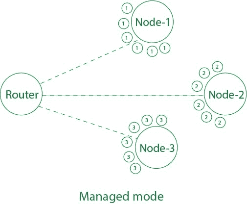

# 无线连接模式

> 原文:[https://www . geesforgeks . org/modes-of-wireless-connectivity/](https://www.geeksforgeeks.org/modes-of-wireless-connectivity/)

从有线网络到无线网络的转变在过去的 2-3 年中非常明显。先进的无线网络被用来管理办公室、学校、学院和更多的地方。
与这些无线网络的连接通常由网络接口卡或网络适配器维护。无线网络适配器是帮助我们连接到无线网络的设备。它充当服务器或其他计算机与我们的机器之间的中介，这有助于发送和接收文件。此外，网络中的每台计算机或机器都被称为**节点**。

理解这些网络适配器的不同工作模式和无线连接是非常必要的。因此，为你自己、你的家或你的公司选择正确的模式。

**无线连接基本上有 4 种类型:**

1.  **自组织模式:**在自组织模式下，节点在不存在任何基站或接入点的情况下相互连接。节点可以直接相互通信，也可以共享资源，而不需要任何外部介质(路由器等)。)，前提是它们连接在同一网络和同一通道上。
    T3】
2.  **管理模式:**在管理模式下，每个节点都连接到接入点或基站(路由器等)。)并且它只接收由接入点发送给它的数据。为了以管理模式连接到网络，节点根据接入点自动改变其信道。
    例如，假设有一个 wifi 路由器，连接了 5 台电脑。现在，wifi 路由器将发送包含网络中目的地址的数据包，并且节点只有在拥有其地址的情况下才会收到数据包。
    
3.  **主模式:**在主模式下，一个节点充当接入点，其他节点可以连接到它。它可以提供与路由器相同的功能。它基本上就像一个 wifi 热点，其中主节点可以与连接到它的节点单独共享互联网和资源。
    T3】
4.  **监控模式:**在监控模式下，节点不连接到任何接入点或任何节点，但它有能力监控其范围内给定信道上无线介质中传输的所有数据包。它不是用来进行日常交流的。
    T3】

笔记本电脑和计算机中常见的网卡都带有默认的托管模式。此外，它们的功能不足以支持监视器模式。它们可以通过创建 wifi 热点在主模式下使用，也可以在点对点模式下使用。