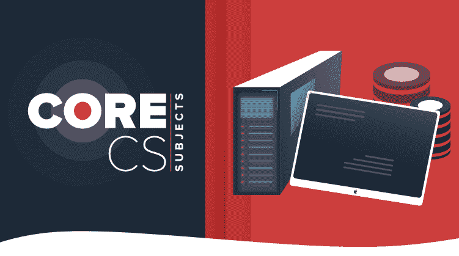

# 亚马逊、微软、Flipkart 最常问的计算机科学科目面试问题

> 原文:[https://www . geesforgeks . org/most-question-computer-science-subjects-interview-questions-in-Amazon-Microsoft-flipkart/](https://www.geeksforgeeks.org/most-asked-computer-science-subjects-interview-questions-in-amazon-microsoft-flipkart/)

本文包含了在对亚马逊、微软、Flipkart、Paytm 等顶级产品公司的采访中，来自*操作系统*、*计算机网络*和*数据库管理系统*的最常见问题列表。


**操作系统:**

*   **工艺介绍**
    1.  [什么是微处理器？](https://www.geeksforgeeks.org/introduction-of-microprocessor/)
    2.  解释内存的内部架构。
    3.  [编译器是如何编译互联库的？](https://www.geeksforgeeks.org/static-vs-dynamic-libraries/)
    4.  解释[虚拟方法](https://www.geeksforgeeks.org/virtual-function-cpp/)、[动态绑定](https://www.geeksforgeeks.org/static-vs-dynamic-binding-in-java/)、vtables 等的实现。
*   **多线程**
    1.  [什么是多线程](https://www.geeksforgeeks.org/multithreading-in-operating-system/)？
    2.  一个线程和一个进程有什么[的区别？](https://www.geeksforgeeks.org/difference-between-process-and-thread/)
*   **流程调度**
    1.  [FCFS 调度](https://www.geeksforgeeks.org/program-for-fcfs-cpu-scheduling-set-1/)。
    2.  [最短作业优先调度](https://www.geeksforgeeks.org/program-for-shortest-job-first-or-sjf-cpu-scheduling-set-1-non-preemptive/)。
    3.  [SRTF 调度](https://www.geeksforgeeks.org/program-shortest-job-first-scheduling-set-2srtf-make-changesdoneplease-review/)。
    4.  [LRTF 调度](https://www.geeksforgeeks.org/cpu-scheduling-longest-remaining-time-first-lrtf-algorithm/)。
    5.  [优先调度](https://www.geeksforgeeks.org/program-for-priority-cpu-scheduling-set-1/)。
    6.  [循环调度](https://www.geeksforgeeks.org/round-robin-scheduling-with-different-arrival-times/)
*   **进程同步&死锁**
    1.  什么是 [**信号量**](https://www.geeksforgeeks.org/semaphores-in-process-synchronization/) 和 [**互斥量**](https://www.geeksforgeeks.org/mutex-vs-semaphore/) ？
    2.  [解释生产者-消费者问题](https://www.geeksforgeeks.org/producer-consumer-problem-using-semaphores-set-1/)。
    3.  [什么是死锁？](https://www.geeksforgeeks.org/introduction-of-deadlock-in-operating-system/)
    4.  [死锁的四个必要条件是什么？](https://www.geeksforgeeks.org/introduction-of-deadlock-in-operating-system/#conditions)
    5.  [什么是临界区？](https://www.geeksforgeeks.org/g-fact-70/)
    6.  [解释庄家算法](https://www.geeksforgeeks.org/bankers-algorithm-in-operating-system-2/)。
    7.  [什么是自旋锁？](https://practice.geeksforgeeks.org/problems/explain-spin-lock)
*   **内存管理**
    1.  [什么是缓存](https://www.geeksforgeeks.org/cache-memory-in-computer-organization/)？
    2.  [缓存在操作系统中的什么位置？](https://www.geeksforgeeks.org/cache-memory-in-computer-organization/)
    3.  缓存和哈希映射的区别。
    4.  解释[请求寻呼](https://www.geeksforgeeks.org/virtual-memory-in-operating-system/)和[痛击](https://www.geeksforgeeks.org/techniques-to-handle-thrashing/)。
    5.  [什么是分段](https://www.geeksforgeeks.org/segmentation-in-operating-system/)？
    6.  笔记本电脑密码保存在哪个内存中？
    7.  [您将如何分析应用程序中的内存不足异常？](https://www.geeksforgeeks.org/understanding-outofmemoryerror-exception-java/)
    8.  [解释内部碎片和外部碎片。](https://www.geeksforgeeks.org/difference-between-internal-and-external-fragmentation/)
    9.  [关联映射](https://www.geeksforgeeks.org/cache-memory-in-computer-organization/)和[直接映射在缓存](https://www.geeksforgeeks.org/cache-memory-in-computer-organization/)中的区别。
    10.  如果 RAM 大小是 4GB，如果启动 4 个大小为 2GB 的进程！会发生什么？
        ( **Ans:** 这可以使用[虚拟内存](https://www.geeksforgeeks.org/virtual-memory-in-operating-system/)完成)
    11.  如果进程大小不受主存大小的限制，那么它的限制是什么？
        ( **Ans:** 这可以使用[逻辑地址空间](https://www.geeksforgeeks.org/logical-and-physical-address-in-operating-system/)来完成)
    12.  解释如何访问内存位置
    13.  [什么是分页，我们为什么需要分页？](https://www.geeksforgeeks.org/paging-in-operating-system/)
    14.  什么是[页表](https://www.geeksforgeeks.org/page-table-entries-in-page-table/)？
    15.  什么是 [TLB](https://www.geeksforgeeks.org/translation-lookaside-buffer-tlb-in-paging/) ？

**DBMS:**

*   [RDBMS 的属性？](https://www.geeksforgeeks.org/rdbms-full-form/)
*   [酸性属性](https://www.geeksforgeeks.org/acid-properties-in-dbms/)
*   [数据库管理系统](https://www.geeksforgeeks.org/types-of-keys-in-relational-model-candidate-super-primary-alternate-and-foreign/)中的键。
*   [垂直和水平缩放的差异。](https://www.geeksforgeeks.org/horizontal-and-vertical-scaling-in-databases/)
*   [切割](https://www.geeksforgeeks.org/what-is-sharding/)
*   [DML、DCL、DDL、TCL 及其命令](https://www.geeksforgeeks.org/sql-ddl-dql-dml-dcl-tcl-commands/)。
*   [数据库管理系统中的索引。](https://www.geeksforgeeks.org/indexing-in-databases-set-1/)
*   什么是[正常化](https://www.geeksforgeeks.org/normal-forms-in-dbms/)和[去正常化](https://www.geeksforgeeks.org/denormalization-in-databases/)和[为什么我们需要它](https://www.geeksforgeeks.org/difference-between-normalization-and-denormalization/)？
*   [正常形式](https://www.geeksforgeeks.org/normal-forms-in-dbms/)
*   [冲突可串行化](https://www.geeksforgeeks.org/conflict-serializability-in-dbms/)
*   主键可以包含两个实体吗？
    ( **Ans:** 不，任何关系都只有一个主键。参考[本](https://www.geeksforgeeks.org/difference-between-primary-and-candidate-key/#PrimaryKey)
*   [并发控制](https://www.geeksforgeeks.org/concurrency-control-in-dbms/)
*   [SQL 查询(与嵌套查询相关)](https://www.geeksforgeeks.org/nested-queries-in-sql/)。
*   [插入 B 树](https://www.geeksforgeeks.org/insert-operation-in-b-tree/)
*   [数据库管理系统中的连接类型](https://www.geeksforgeeks.org/sql-join-set-1-inner-left-right-and-full-joins/)。
*   [内外连接的区别](https://www.geeksforgeeks.org/inner-join-vs-outer-join/)。
*   Write a SQL query to retrieve furniture from database whose dimensions(Width, Height, Length) match with the given dimension. 

    **年。**

```
SELECT *
FROM Furnitures
WHERE Furnitures.Length = GivenLength
  AND Furnitures.Breadth = GivenBreadth
  AND Furnitures.Height = GivenHeight
```

*   [打印表格中的第二大数字。](https://www.geeksforgeeks.org/sql-query-to-find-second-largest-salary/)
*   解释 [3 层架构](https://www.geeksforgeeks.org/introduction-of-3-tier-architecture-in-dbms-set-2/)和 [2 层架构](https://www.geeksforgeeks.org/dbms-architecture-2-level-3-level/)。
*   编写一个 SQL 查询来从表中查找第四个最大元素

**计算机网络:**

*   [什么是 TCP？](https://www.geeksforgeeks.org/tcp-ip-model/)
*   [用属于各层的协议命名现场视察模型的各层](https://www.geeksforgeeks.org/layers-of-osi-model/)
*   [数据链路层](https://www.geeksforgeeks.org/data-link-layer-gq/)有什么意义
*   什么是[接入点](https://www.geeksforgeeks.org/basics-of-wi-fi/#AccessPoint) APs 模型？
*   [网络层做什么](https://www.geeksforgeeks.org/layers-of-osi-model/)
*   [路由器在哪一层？](https://www.geeksforgeeks.org/network-devices-hub-repeater-bridge-switch-router-gateways/#Routers)
*   [有哪些不同类型的延迟](https://www.geeksforgeeks.org/packet-switching-and-delays-in-computer-network/)？
*   [解释防火墙](https://www.geeksforgeeks.org/introduction-of-firewall-in-computer-network/)？
*   [防火墙](https://www.geeksforgeeks.org/types-of-firewall-and-possible-attacks/)有哪些不同类型？
*   [传输层做什么](https://www.geeksforgeeks.org/transport-layer-responsibilities/)
*   IP v4 vs IPv6
*   [b/w 私有 IP 和公有 IP 有什么区别？](https://www.geeksforgeeks.org/difference-between-private-and-public-ip-addresses/)
*   详细讲解 [3 路握手](https://www.geeksforgeeks.org/tcp-3-way-handshake-process/)
*   [什么是密码学，有哪些加密方法](https://www.geeksforgeeks.org/introduction-to-crypto-terminologies/)？
*   [应用层协议](https://www.geeksforgeeks.org/protocols-application-layer/)有哪些？
*   [解释 DNS](https://www.geeksforgeeks.org/domain-name-server-dns-in-application-layer/)
*   [在浏览器中输入网址时，解释浏览器处理请求并获得给定搜索查询结果的详细过程。](https://practice.geeksforgeeks.org/problems/what-happens-when-you-type-url-in-your-browser)
*   [如何在服务器和客户端之间创建持久连接？](https://www.geeksforgeeks.org/http-non-persistent-persistent-connection/)
*   [解释服务器端负载平衡器](https://www.geeksforgeeks.org/load-balancing-on-servers-random-algorithm/)
*   [什么是 FTP？](https://www.geeksforgeeks.org/file-transfer-protocol-ftp-in-application-layer/)[FTP 和安全 FTP 有什么不同？](https://www.geeksforgeeks.org/difference-between-file-transfer-protocol-ftp-and-secure-file-transfer-protocol-sftp/)
*   [什么是 SMTP](https://www.geeksforgeeks.org/simple-mail-transfer-protocol-smtp/)
*   [讲解 HTTP 和 HTTPs 的工作原理](https://www.geeksforgeeks.org/difference-between-http-and-https/)。
*   [港口在哪里？](https://www.geeksforgeeks.org/introduction-of-ports-in-computers/)
*   [不同协议的端口号是多少](https://www.geeksforgeeks.org/protocols-application-layer/)
*   [如何防范 SYN DDoS 攻击](https://www.geeksforgeeks.org/denial-of-service-ddos-attack/)？

您也可以查看我们的付费课程，CS 科目的价格仅为【4500 印度卢比。*赶快，使用优惠券代码:FIRST100，在有限的时间内享受额外的 50%折扣。*



本课程将帮助你准备操作系统、DMBS、计算机网络和 SQL 等主题，以便在谷歌、微软、亚马逊等一流公司面试。该课程预先录制了桑德普·贾恩先生的高级讲座视频和专家设计的理论概念。本课程也有客观的练习问题，以提供最终的学习体验。
这是一门自定进度的课程，暗示你可以按照自己的进度完成课程！