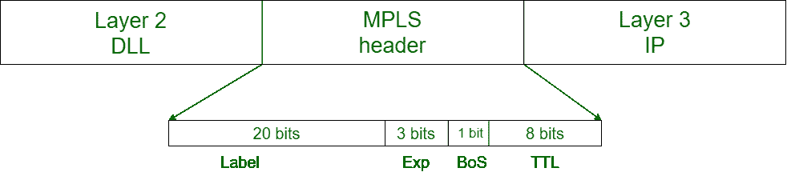
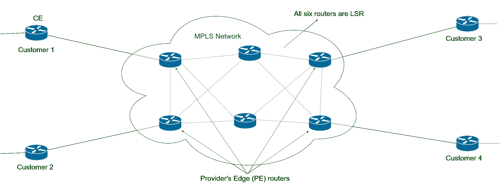

# 多协议标签交换(MPLS)

> 原文:[https://www . geesforgeks . org/多协议-标签交换-mpls/](https://www.geeksforgeeks.org/multi-protocol-label-switching-mpls/)

先决条件–

*   [MPLS 的工作](https://www.geeksforgeeks.org/how-does-multiprotocol-label-switching-mpls-routing-work/)
*   [VPN 和 MPLS 的区别](https://www.geeksforgeeks.org/difference-between-virtual-private-network-vpn-and-multi-protocol-label-switching-mpls/)

**多协议标签交换(MPLS)** 是一种 IP 包路由技术，它通过标签通过路径路由 IP 包，而不是查看路由器的复杂路由表。这项功能有助于提高 IP 数据包的传送速率。

MPLS 使用第三层服务，即互联网协议，并使用路由器作为转发设备。不同客户的流量是相互分离的，因为 MPLS 的工作原理有点像 VPN。它不像加密数据的普通虚拟专用网那样工作，但它确保了来自一个客户的数据包不会被另一个客户收到。MPLS 报头被添加到位于第 2 层和第 3 层之间的数据包中。因此，它也被认为是*层 2.5 协议。*

**MPLS 报头–**
MPLS 报头长 32 位，分为四个部分–

1.  **标签–**该字段长 20 位，可以取值 b/w 0&220–1。
2.  **Exp–**它们是 3 位长，用于*服务质量(QoS)* 。
3.  **堆栈底部–**大小为 1 位。MPLS 标签一个叠一个。如果在 MPLS 报头中只剩下一个标签，则它的值为 1，否则为 0。
4.  **生存时间(TTL)–**8 位长，每跳值减 1，防止数据包卡在网络中。

**Figure –** MPLS Header

**MPLS 中使用的重要术语:**

| 条款 | 描述 |
| --- | --- |
| 提供商边缘路由器 | 位于 MPLS 网络边缘的路由器，用于在 IP 数据包中添加或删除标签。 |
| 客户边缘路由器 | 位于客户网络边缘的路由器，用于发送或接收来自对等方的 IP 数据包。 |
| 标签交换路由器(LSR) | MPLS 网络中使用的能够理解标签的路由器。 |
| LSR 输入 | 从 CE 路由器接收 IP 数据包并添加 MPLS 报头的 LSR 路由器。 |
| 中级 LSR | 交换 MPLS 报头中的标签并被分配用于转发带标签的 IP 数据包的 LSR 路由器。 |
| LSR 出口 | 向 CE 路由器发送 IP 数据包并删除 MPLS 报头的 LSR 路由器。 |
| 推送、弹出和交换 | LSR 分别添加、移除和交换标签的动作。 |

[多协议标签交换(MPLS)路由](https://www.geeksforgeeks.org/how-does-multiprotocol-label-switching-mpls-routing-work/):

**MPLS 中的转发:**
LSRs 接收 IP 数据包 CE，并在第 3 层和第 2 层之间添加 MPLS 报头，这意味着它封装了链路层，即第 2 层帧。这个特性允许 LSR 支持接收包含来自不同协议(如帧中继、城域以太网等)的帧的数据包，这就是为什么它被称为多协议。

MPLS 转发是基于附加在 IP 数据包上的标签。这种标签附件由称为标签分发协议(LDP)的协议管理。每个 LSR 最初都像普通路由器一样学习路由。这个学习从 PE 路由器开始。每个对等路由器从对等路由器学习到不同子网的路由。假设对等路由器 PE1 从对等路由器学习到子网(比如子网 1)的路由。现在，PE1 将为数据包添加标签，转发到它的邻居 LSR，并告诉他们，如果您收到数据包，那么将它转发给我。

这个 LSR 再次重复了这个过程。这样，LSR 学习路线，并将此信息添加到*标签转发信息库(LFIB)* 中。现在，如果任何一个对等体接收到目的地为子网 1 的数据包，那么通过查看标签和 LFIB，LSRs 可以轻松地转发 IP 数据包。

**Figure –** MPLS Network
