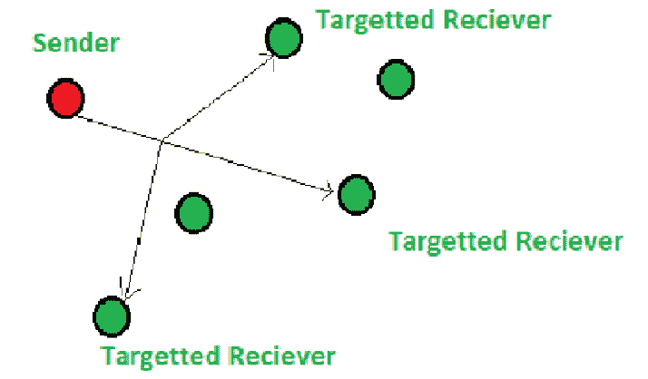

# 计算机网络中的组播

> 原文:[https://www . geesforgeks . org/多播计算机网络/](https://www.geeksforgeeks.org/multicasting-in-computer-network/)

**组播**是一种群组通信方法，发送方同时向网络中的多个接收方或节点发送数据。多播是一种一对多和多对多的通信，因为它允许发送者或发送者通过局域网或广域网同时向多个接收者发送数据包。这个过程有助于最小化网络的数据帧。

**组播**的工作原理类似于广播，但在组播中，信息被发送到网络的目标或特定成员。这项任务可以通过向网络中的每个用户或节点发送单独的副本来完成，但是向每个用户发送单独的副本效率很低，可能会增加网络延迟。为了克服这些缺点，多播允许可以在多个用户之间分割的单个传输，因此，这减少了信号的带宽。

**应用程序:**
多播被用于许多领域，例如:

1.  互联网协议
2.  流媒体

它还支持视频会议应用程序和网络广播。

**IP 组播:**
通过互联网进行的组播被称为 IP 组播。这些多播遵循互联网协议(IP)来传输数据。IP 多播使用一种称为“多播树”的机制在网络用户之间传输信息。多播树；允许单个传输分支到期望的接收器。分支是在互联网路由器上创建的，分支的创建使得传输长度最小。

IP 多播还使用另外两种基本协议来工作；互联网组管理协议(IGMP)，协议无关组播(PIM)。IGMP 允许收件人访问数据或信息。网络路由器使用 PIM 来创建组播树。

总而言之，多播是一种有效的通信方式；它减少了带宽的使用。