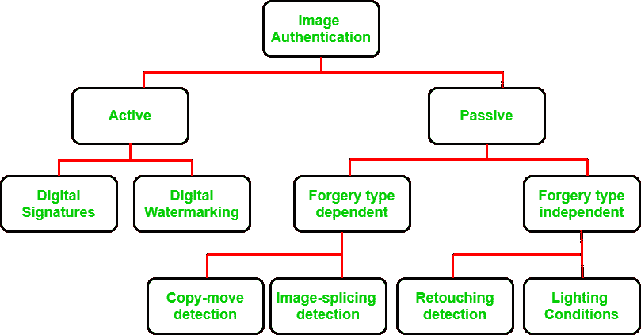
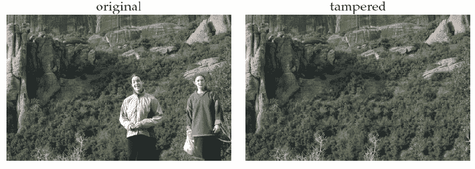
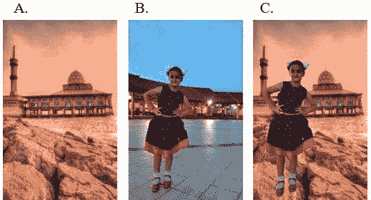
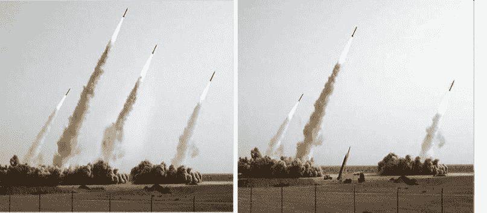

# 多媒体取证

> 原文:[https://www.geeksforgeeks.org/multimedia-forensics/](https://www.geeksforgeeks.org/multimedia-forensics/)

网络取证可能是当今计算世界最令人兴奋的领域之一。今天，我们将讨论网络取证中最有趣的领域之一，即多媒体取证。
计算机取证是对数字证据进行收集、分析和报告的实践，以便在法庭上被采纳。法医调查人员必须从所涉及的计算机中提取证明事实，并使用这些事实来创建一个逻辑场景。多媒体取证是作为第二阶段出现的，在第二阶段中，使用科学方法对内容进行分析。

> 在本文中，我们将讨论以下主题:
> 
> *   **什么是多媒体取证？***   **多媒体认证有哪些方法？***   **什么是数字指纹？**

### **什么是多媒体取证？**

**当应用于多媒体领域时，数字取证开始面临挑战，因为多媒体是混合使用音频、视频、图像和文本的内容。由于移动设备的广泛应用、更便宜的存储、更高的带宽，在线用户正在产生海量数据。这一增长将数字多媒体推向了前沿。数据量如此之大，已经超出了法医专家有效分析和处理数据的能力。多媒体取证现已成为网络取证不可或缺的一部分。
多媒体取证涉及一套用于分析音频、视频、图像等多媒体信号的技术。其目标是:**

*   **揭示数字内容的历史。**
*   **识别产生数据的采集设备。**
*   **验证内容的完整性。**
*   **从多媒体信号中检索信息。**

### **多媒体认证有哪些方法？**

**互联网内容不仅仅局限于文本形式，它有许多不同的种类，因此为分析它们而开发的取证方法也必然在范围上有所不同。这里的目标是分析图像、文本、音频、视频，以便生成一个逻辑取证证据。
多媒体取证将其工作分为两种主要方法–**和 ***被动图像认证*** 。****

********

****从图中可以看出，主动映像身份验证和被动映像身份验证进一步分为几类。
让我们开始详细讨论每个类别。****

## ****活动图像认证:****

****在该技术中，已知的认证码在图像生成时被嵌入到图像中，或者与图像一起发送，以便在接收端访问其完整性。验证此代码可验证图像的原创性。主动认证进一步分为两类:数字水印和数字签名。****

******主动图像认证的缺点:******

*   ****在使用特殊设备进行记录时，需要将认证码嵌入到图像中，因此关于图像的先验信息变得不可或缺。****
*   ****这种方法需要在记录图像时精确地创建数字水印或数字签名，这限制了它处理特殊装备的数字设备的能力。****
*   ****As the majority of the images on the Internet, today don’t have a watermark or a digital signature, which has forced this image authentication method to consider additional techniques –

    **Digital Watermarking:** In this technique a digital watermark is embedded into the image at the time of either image acquisition or in the processing stage.

    **数字签名:**数字签名在采集端将通常从图像中获得的一些次要信息嵌入到图像中。**** 

## ****被动图像认证:****

****被动身份验证也称为图像取证，它使用唯一没有先验信息的图像来访问图像的完整性。被动身份验证基于这样的假设，即使篡改图像可能不会留下任何视觉痕迹，但它们可能会改变底层统计数据。这意味着数字伪造可能会扰乱图像的潜在属性和图像质量，即使没有留下任何物理线索。****

****被动技进一步分为*和 ***伪造型独立技*** 。*****

### *****伪造类型相关–*****

*****它们被设计成仅检测某些类型的伪造，如拷贝-移动和图像拼接，这取决于在图像上进行的伪造的类型。
进一步分为 2 类: ***复制-移动检测*** 和 ***图像拼接检测*** 。*****

*******1。复制-移动检测:**
复制-移动是最流行的照片篡改技术，因为它可以轻松执行。它包括复制图像中的一些区域，并将其移动到图像中的其他区域。由于复制的区域属于同一图像，因此动态范围和颜色与图像的其余部分保持兼容。
在拷贝-移动检测中，使用模糊等后处理操作来减少两幅图像之间的边界不规则的影响。*****

**********

*******2。图像拼接检测:**
图像拼接方法包括合并两个或多个图像，显著改变原始图像以创建伪造图像。请注意，当合并不同背景的图像时，很难区分边框和边界。图像拼接检测是一项具有挑战性的任务，涉及以下技术:*****

*   *****复合区域通过多种方法进行研究。*****
*   *****不同区域之间突然变化的存在为检测所考虑的图像中的拼接提供了有价值的痕迹，这些变化被组合以创建合成图像及其背景。*****

**********

### *****伪造型独立–*****

*****这些方法检测伪造与伪造类型无关，但基于在重新采样过程中以及由于光照不一致而留下的伪像痕迹。它进一步分为两类:*****

*******1。修图检测:**
这种方法最常用于商业和美学应用。修图主要是为了增强或减少图像特征，或创建一个令人信服的 2 幅图像的组合，需要旋转，调整大小或拉伸其中一幅图像。图像修饰检测使用以下技术完成:*****

*   *****查找伪造图像中的模糊、增强或颜色变化和照明变化。*****
*   *****如果原始图像可用，修饰检测很容易，但是盲检测是一项具有挑战性的任务。*****

**********

*******2。照明条件:**
在不同的照明条件下拍摄篡改过程中合成的图像。通过组合照片来匹配照明条件变得非常困难。合成图像中的这种光照不一致可用于检测图像篡改。*****

### *****什么是数字指纹？*****

*****尽管加密工具和访问控制机制确保了多媒体内容在互联网上的安全传输。但是，一旦内容被交付给最终用户并被安全解密，这种保护就结束了。数字指纹技术已经出现，通过识别授权访问明文但将其用于未授权目的的最终用户来满足这种交付后的需求。
数字指纹识别过程涉及调查人员通过被称为“指纹”的独特识别信息来追踪多媒体内容的非法使用，该信息在分发前被嵌入内容中。Youtube 正在使用这项技术扫描文件，并将他们找到的数字指纹与版权材料数据库进行匹配，以查看是否有任何知识产权被侵犯。*****

*****数字指纹是由数学算法产生的技术编码的二进制数字串，它们和人的模拟指纹一样独特。*****

*****越多的图像和视频持续充斥互联网，通过法医调查保护信息就变得越困难。随着在线多媒体内容的增长，用户和创作者了解虚拟世界的法律边界变得非常重要。

**参考文献:**[https://www . research gate . net/fig/An-image-example-拼接-A-和-B-The-true-images-C-The-resulted-image _ fig 3 _ 316667407](https://www.researchgate.net/figure/An-example-of-image-splicing-A-and-B-The-genuine-images-C-The-resulted-image_fig3_316667407)*****