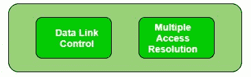
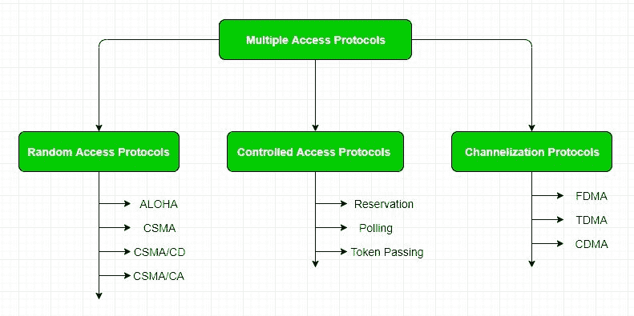

# 计算机网络中的多种访问协议

> 原文:[https://www . geeksforgeeks . org/多址计算机网络协议/](https://www.geeksforgeeks.org/multiple-access-protocols-in-computer-network/)

数据链路层负责两个节点之间的数据传输。它的主要功能是-

*   数据链路控制
*   多重访问控制



**数据链路控制–**
数据链路控制通过使用成帧、错误控制和流量控制等技术，负责在传输信道上可靠地传输消息。关于数据链路控制，请参考–[停止并等待 ARQ](https://www.geeksforgeeks.org/stop-and-wait-arq/)

**多址控制–**
如果发送方和接收方之间有专用链路，那么数据链路控制层就足够了，但是如果没有专用链路，那么多个站可以同时接入信道。因此，需要多种接入协议来减少冲突和避免串扰。例如，在一个挤满学生的教室里，当老师提问时，所有的学生(或站)同时开始回答(同时发送数据)，那么就会产生很多混乱(数据重叠或数据丢失)，然后老师的工作(多种访问协议)就是管理学生，让他们一次回答一个问题。

因此，在非专用信道上共享数据需要协议。多址协议可以进一步细分为–



**1。随机接入协议:**在这种情况下，所有站都有一个相同的优势，那就是没有一个站比另一个站具有更高的优先级。任何站点都可以根据介质的状态(空闲或忙碌)发送数据。它有两个特点:

1.  发送数据没有固定的时间
2.  发送数据的站点没有固定的顺序

随机接入协议进一步细分为:

**(a)ALOHA–**它是为无线局域网设计的，但也适用于共享介质。在这种情况下，多个站可以同时传输数据，因此会导致冲突和数据被篡改。

*   **纯阿洛哈:**
    当一个站点发送数据时，它会等待确认。如果确认没有在分配的时间内到达，那么该站等待一个随机的时间量，称为退避时间(Tb)，并重新发送数据。由于不同的站点等待的时间不同，进一步冲突的概率会降低。

```
Vulnerable Time = 2* Frame transmission time
Throughput =  G exp{-2*G}
Maximum throughput = 0.184 for G=0.5
```

*   **时隙 Aloha:**
    与纯 Aloha 类似，只是我们将时间划分为时隙，只允许在这些时隙的开始发送数据。如果一个电台错过了允许的时间，它必须等待下一个时隙。这降低了碰撞的可能性。

```
Vulnerable Time =  Frame transmission time
Throughput =  G exp{-*G}
Maximum throughput = 0.368 for G=1
```

有关 ALOHA 的更多信息，请参考–[局域网技术](https://www.geeksforgeeks.org/local-area-network-lan-technologies/)

**(b)CSMA–**载波侦听多路访问可确保较少的冲突，因为在传输数据之前，基站需要首先侦听介质(空闲或繁忙)。如果它是空闲的，那么它发送数据，否则它等待直到信道变得空闲。然而，由于传播延迟，在 CSMA 仍有碰撞的可能。例如，如果站 A 想要发送数据，它将首先感测介质。如果发现信道空闲，它将开始发送数据。然而，当从站 A 发送第一位数据时(由于传播延迟而延迟)，如果站 B 请求发送数据并感测到介质，它也会发现它是空闲的，并且也会发送数据。这将导致站 A 和站 b 的数据冲突

CSMA 接入模式-

*   **1-持久:**节点感知信道，如果空闲，则发送数据，否则继续检查介质是否空闲，一旦信道空闲，则无条件发送(概率为 1)。
*   **非持久:**节点感知信道，如果空闲则发送数据，否则在随机时间量(非连续)后检查介质，发现空闲则发送。
*   **P-persistent:** 节点感知介质，如果空闲，则以 P 概率发送数据。如果数据没有被传输((1-p)概率)，那么它等待一段时间并再次检查介质，现在如果它被发现空闲，那么它以 p 概率发送。这种重复一直持续到发送完帧。它用于 Wifi 和分组无线系统。
*   **O-persistent:** 节点的优势是预先决定的，按照这个顺序进行传输。如果介质空闲，节点等待其时隙发送数据。

**(c)CSMA/光盘–**载波侦听多路访问和冲突检测。如果检测到冲突，站点可以终止数据传输。更多详情请参考–[CSMA/光盘效率](https://www.geeksforgeeks.org/computer-network-efficiency-csmacd/)

**(d)CSMA/加州–**载波侦听多路访问并避免冲突。冲突检测过程包括发送方接收确认信号。如果只有一个信号(它自己的信号)，则数据被成功发送，但是如果有两个信号(它自己的信号和与它发生碰撞的信号)，则意味着发生了碰撞。为了区分这两种情况，碰撞肯定对接收信号有很大影响。然而，在有线网络中并非如此，因此在这种情况下使用 CSMA/认证中心。

CSMA/加州通过以下方式避免碰撞:

1.  **帧间空间–**站等待媒体空闲，如果发现空闲，它不会立即发送数据(以避免传播延迟造成的冲突)，而是等待一段时间，称为帧间空间或 IFS。此后，它再次检查介质是否空闲。综合融资战略的持续时间取决于车站的优先级。
2.  **争用窗口–**它是划分为时隙的时间量。如果发送方准备发送数据，它会选择随机数量的时隙作为等待时间，每次介质没有空闲时，等待时间就会翻倍。如果发现媒体繁忙，它不会重新启动整个过程，而是在发现信道再次空闲时重新启动计时器。
3.  **确认–**如果在超时前没有收到确认，发送方会重新传输数据。

**2。受控访问:**
在这种情况下，数据由该站发送，并得到所有其他站的批准。更多详情请参考–[受控访问协议](https://www.geeksforgeeks.org/computer-network-controlled-access-protocols/)

**3。信道化:**
在这种情况下，链路的可用带宽在时间、频率和代码上共享给多个站，以同时接入信道。

*   **频分多址(FDMA)–**可用带宽被划分为相等的频段，以便每个站可以分配自己的频段。还增加了保护频带，这样两个频带就不会重叠，以避免串扰和噪声。
*   **时分多址(TDMA)–**在这种情况下，带宽在多个站之间共享。为了避免冲突，时间被划分为时隙，并且站被分配这些时隙来传输数据。然而，由于每个站需要知道它的时隙，所以存在同步开销。这是通过向每个时隙添加同步位来解决的。时分多址的另一个问题是传播延迟，这可以通过增加保护频带来解决。
    更多详情请参考–[电路切换](https://www.geeksforgeeks.org/computer-network-circuit-switching/)
*   **码分多址(CDMA)–**一个信道同时承载所有传输。既没有带宽的划分，也没有时间的划分。例如，如果一个房间里有许多人同时在说话，那么如果只有两个人说同一种语言，也可以完美地接收数据。同样，来自不同站点的数据可以用不同的代码语言同时传输。