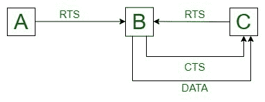

# 带碰撞避免的多路访问(MACA)

> 原文:[https://www . geeksforgeeks . org/多重访问避免碰撞-maca/](https://www.geeksforgeeks.org/multiple-access-with-collision-avoidance-maca/)

**冲突避免多址接入(MACA)** 是无线自组织网络中使用的一种[媒体访问控制(MAC)](https://practice.geeksforgeeks.org/problems/what-is-media-access-controlmac) 层协议。用于解决隐藏终端问题和暴露终端问题。它是载波侦听多路访问(CSMA)的一种替代方案，具有隐藏终端问题和暴露终端问题。

**工作:-**
MACA 工作的主要条件，是站与帧大小和数据速度同步。它包括在信息传输之前的两个帧的传输，称为 RTS 和 CTS。RTS 表示请求发送，CTS 表示清除发送。发射台附近的电台可以听到即时战略战术，并在这里保持沉默。
假设发送站 A 有数据帧要发送给接收站 b

整个过程将如下进行:

*   甲将向乙发送即时战略游戏帧
*   那么 b 将向 A 发送 CTS 帧
*   当甲接收到 CTS 帧时，它将开始向乙发送 dtat 帧
*   成功接收数据后，它将发送确认帧

**隐藏/暴露终端问题解决方案:**
MACA 协议使用 RTS 和 CTS 来避免隐藏和暴露终端问题。在隐藏终端问题中，两个节点试图同时联系同一个节点，这会产生冲突，如果两个节点向同一个节点发送 RTS，那么接收 CTS 的节点将发送数据，而不是另一个节点，这将避免冲突。

在暴露的终端问题中，一个节点停止接收，因为它认为它会造成干扰，因此停止传输尝试，这将使其他节点超出范围。在这种情况下，RTS 和 CTS 解决了这个问题，没有终端可以因为干扰而停止传输。