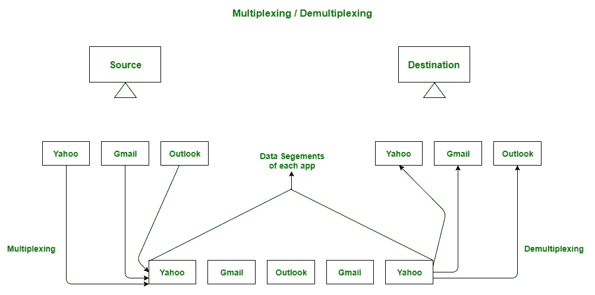
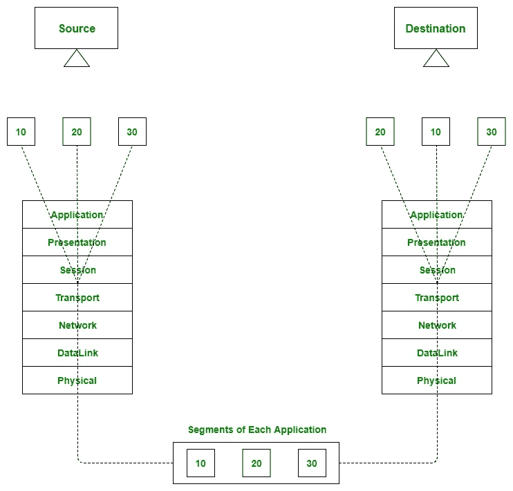
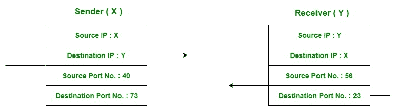
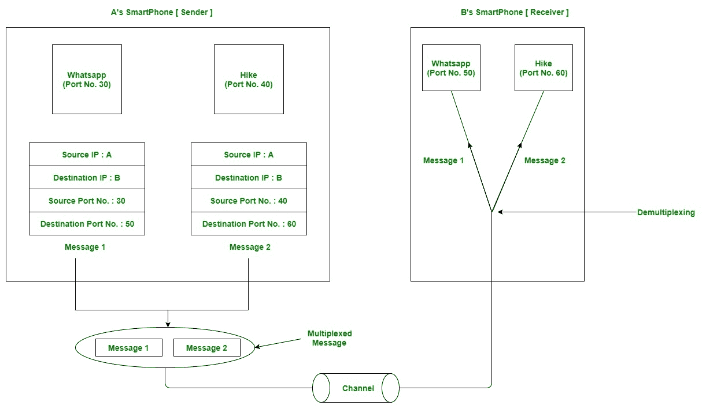

# 传输层的复用和解复用

> 原文:[https://www . geeksforgeeks . org/传输层复用和解复用/](https://www.geeksforgeeks.org/multiplexing-and-demultiplexing-in-transport-layer/)

**先决条件–**[OSI 模型的各层](https://www.geeksforgeeks.org/layers-osi-model/)
几乎所有设计的协议架构都提供多路复用和解复用服务。UDP 和 TCP 通过在段头中包含两个特殊字段来执行解复用和多路复用任务:源端口号字段和目标端口号字段。

**复用–**
从发送方的多个应用程序进程中收集数据，用一个报头封装该数据，并将其作为一个整体发送给预期的接收方，这称为复用。

**解复用–**
在接收器端将接收到的数据段传送到正确的应用程序层进程称为解复用。

**图–**复用和解复用的抽象视图

复用和解复用是由现场视察模型的传输层提供的服务。

**图–**传输层-多路复用和解复用的连接点

复用和解复用有两种类型:

1.  无连接多路复用和解复用
2.  面向连接的复用和解复用

**多路复用和解复用是如何完成的–**
要将数据从发送方的应用程序发送到目的地的应用程序，发送方必须知道目的地的 IP 地址和他想要将数据传输到的应用程序(目的地)的端口号。框图如下所示:

**图–**发送方和接收方应用程序之间的数据包传输

让我们考虑两个现在广泛使用的消息应用程序，即。徒步旅行和 WhatsApp。假设 A 是发送方，B 是接收方。发送方和接收方都在系统中安装了这些应用程序(比如智能手机)。假设 A 想在 WhatsApp 给 B 发消息，两个都徒步。为此，A 在通过 WhatsApp 应用程序发送消息时，必须提到 B 的 IP 地址和 WhatsApp 的目的端口号。同样，对于后一种情况，A 在发送消息时必须提到 B 的 IP 地址和远足的目的端口号。

现在，来自这两个应用程序的消息将与适当的标题(即。源 IP 地址、目的 IP 地址、源端口号、目的端口号)，并作为单个消息发送给接收方。这个过程叫做多路复用。在目的地，通过查看目的地的端口号，接收到的消息被解包，组成消息(即来自 hike 和 WhatsApp 应用程序的消息)被发送到适当的应用程序。这个过程叫做解复用。同样，B 也可以将消息传输给 a。

**图–**使用 WhatsApp 和 hike 消息传递应用程序进行消息传递

**参考–**
[复用/解复用](http://www.cs.ccsu.edu/~stan/classes/cs490/slides/networks4-ch3-1.pdf)
[dcs.bbk.ac.uk](http://www.dcs.bbk.ac.uk/~ptw/teaching/IWT/transport-layer/notes.html)

本文由 **Shivam Shukla** 供稿。如果你喜欢 GeeksforGeeks 并想投稿，你也可以使用[write.geeksforgeeks.org](https://write.geeksforgeeks.org)写一篇文章或者把你的文章邮寄到 review-team@geeksforgeeks.org。看到你的文章出现在极客博客主页上，帮助其他极客。

如果你发现任何不正确的地方，或者你想分享更多关于上面讨论的话题的信息，请写评论。