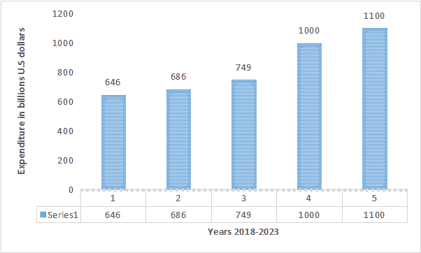

# 物联网 SSL 证书的需求及其关注点

> 原文:[https://www . geeksforgeeks . org/need-of-IOT-SSL-certificates-and-it-关注/](https://www.geeksforgeeks.org/need-of-iot-ssl-certificates-and-its-concerns/)

物联网是近年来最突出的创新之一，它增强了工业自动化。由于基于传感器的进步和云技术的创新，远程机器和现场系统之间的数据交换得到了改善。

同样，移动时代通过大量采用智能设备，如健身带、智能电器、智能灯，甚至智能淋浴，在多个方面推动了物联网技术。这就是为什么到 2023 年全球在物联网设备上的支出将达到 1.1 万亿美元。

然而，在物联网安全方面，几家制造商都有一些缺点。这些物联网品牌大多专注于连接和软件优化，几乎没有留下安全措施的空间。

随着美国政府重新出台关于物联网安全要求的最新法案，制造商现在正寻求改善其物联网安全措施。一种解决方案是安装最好的物联网 SSL 证书。那么，让我们了解一下为什么您的物联网设备需要 SSL 证书，以及它是如何工作的？

### 为什么需要物联网 SSL 证书？

随着设备越来越多，需要有可靠的数据交换安全系统。每个[物联网设备](https://www.geeksforgeeks.org/introduction-to-internet-of-things-iot-set-1/)都通过应用编程接口或应用编程接口与系统连接。它是一种促进异构系统之间数据交换的协议。

虽然这对于基于应用的物联网设备和嵌入式传感器来说是正确的，但智能产品与利用浏览器的网络应用程序同步。此外，物联网 SSL 证书支持加密数据交换，对黑客隐藏并保护数据。

尤其是当有大量数据要处理来自多个物联网设备时，您需要强大的安全系统。IDC 的一份报告显示，到 2025 年底，物联网设备总数将达到 557 亿台，其中 75%的设备连接到物联网平台。到 2025 年，智能设备的如此大规模激增将使数据量增加到 73.1 兆字节。

这里需要关注的是处理大数据，并确保在物联网设备和最终用户设备之间的交换过程中不会出现违规。高级加密层可以确保您的数据安全。这就是为什么您需要带加密算法的物联网 SSL 证书来保护您的数据。

### 物联网 SSL 证书的使用:

物联网 SSL 证书使用加密算法对数据进行加密，因此黑客很难读取数据。它在浏览器或应用程序与物联网设备之间部署这种加密。此外， [SSL 证书](https://www.geeksforgeeks.org/secure-socket-layer-ssl/)在传输过程中加密数据包，阻止网络攻击。所以，即使你的数据包被盗，数据也是不可读的。

另一个重要方面是验证数据访问。SSL 证书还通过额外的一层保护来帮助您验证用户的访问。大多数物联网设备通过局域网或局域网进行通信。

这种网络容易受到一些网络攻击，如碎片攻击。这些网络攻击暴露了 wifi 连接的漏洞，数据包被窃取。物联网 SSL 证书可以帮助您通过加密-解密过程验证用户设备的数据访问。

每个数据包都是通过公钥加密的，公钥可以使用相同的安全密钥或分配给用户的私钥解密。像公钥或私钥这样的安全密钥取决于 SSL 证书使用的加密类型。有两种类型的加密，

*   对称加密-两个安全密钥是相同的
*   不对称加密-加密和解密的安全密钥是不同的

SSL 证书通过加密算法促进了这种加密，这就是为什么您需要选择高级证书的原因。现在，您已经了解了物联网 SSL 证书的工作原理，让我们了解它对组织的完整性有多么重要。

### 数据完整性的物联网安全:

组织需要安全的系统来确保数据的完整性。SSL 证书可以帮助验证每个员工对您的核心服务和数据库的数据访问。因此，更好的法规遵从性和数据完整性保护了您的系统。

另一种确保数据完整性的方法是通过 SSL 认证利用多因素身份验证。用于解密的私钥只能在通过应用程序(如微软认证器应用程序)进行认证后发送到员工的设备。

### 物联网 SSL 认证的优势:

SSL 证书是确保您的数据安全并实现物联网设备可靠认证的绝佳方式。然而，这些只是您通过利用物联网 SSL 证书获得的一些优势。物联网 SSL 认证的其他好处是，

*   您不需要特定的令牌、密码策略或黑客可以轻松利用的任何静态 IDS。
*   即使在数据传输过程中，您也可以进行更改，而不用担心对安全性的影响。
*   您的组织可以实现更好的加密、身份验证和数据完整性。
*   它可以让您的系统同时处理多个物联网设备的安全性。
*   与您的系统连接的物联网设备的异构性可能有不同的 SSL 证书，您可以通过证书管理工具进行管理。

随着物联网设备的增长和组织的扩大，您将需要更可靠的解决方案来应对网络威胁。但是，有了物联网 SSL 证书，您系统的安全性和数据完整性将更加安全。虽然您可以通过集成高级身份验证系统来自定义 SSL 证书，但是您必须评估特定的业务需求。