# Linux 中的 Netstat 命令

> 原文:[https://www.geeksforgeeks.org/netstat-command-linux/](https://www.geeksforgeeks.org/netstat-command-linux/)

Netstat 命令显示各种网络相关信息，如网络连接、路由表、接口统计、伪装连接、多播成员身份等。,

**一些实用的 netstat 命令示例:**

1.  **-a -all** : Show both listening and non-listening sockets. With the –interfaces option, show interfaces that are not up

    ```
    # netstat -a | more : To show both listening and 
    non-listening sockets.
    ```

    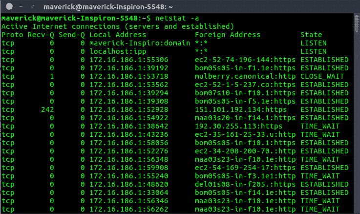
    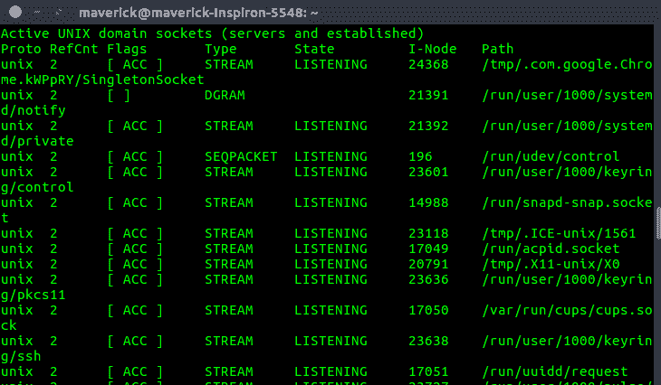

2.  **List all tcp ports.**

    ```
    # netstat -at : To list all tcp ports.

    ```

    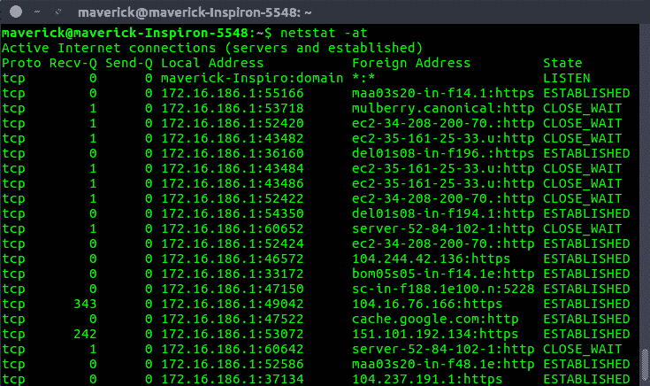

3.  **List all udp ports.**

    ```
    # netstat -au : To list all udp ports.

    ```

    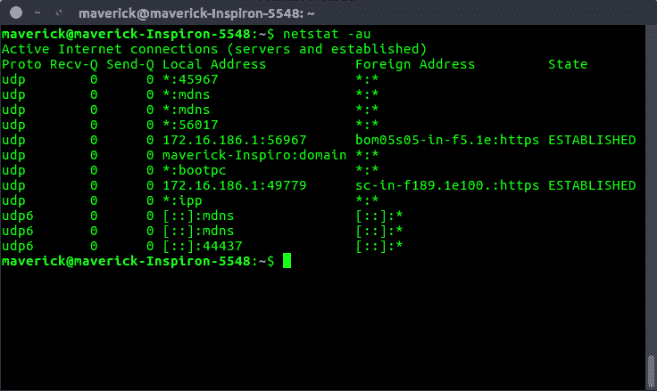

4.  **List only listening ports.**

    ```
    # netstat -l : To list only the listening ports.

    ```

    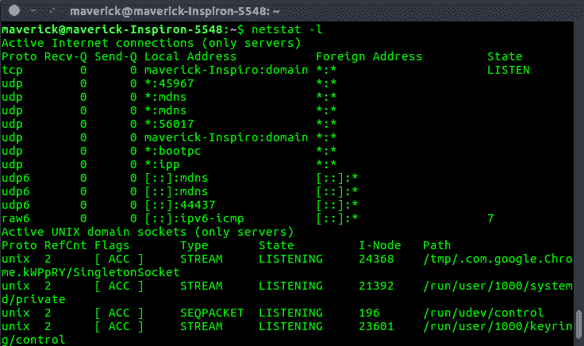

5.  **List only listening TCP ports.**

    ```
    # netstat -lt : To list only the listening tcp ports.

    ```

    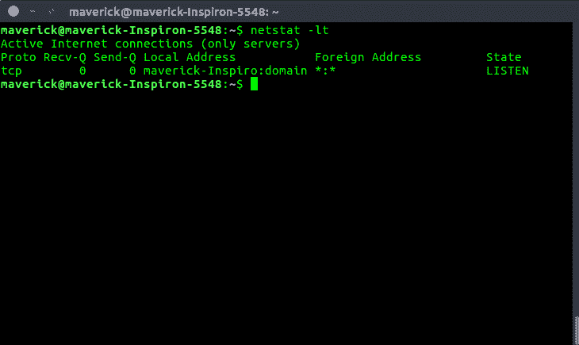

6.  **List only listening UDP ports.**

    ```
    # netstat -lu : To list only the listening udp ports.

    ```

    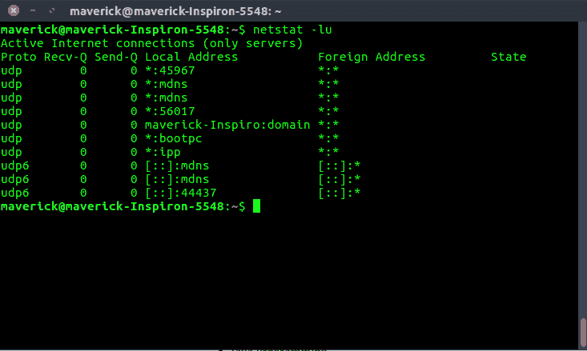

7.  **List only the listening UNIX ports**

    ```
    # netstat -lx : To list only the listening UNIX ports.

    ```

    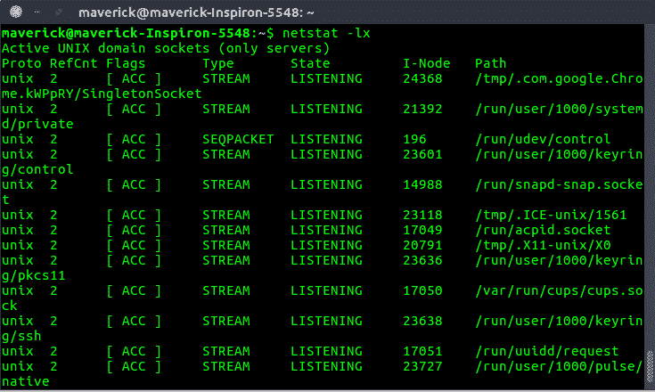

8.  **List the statistics for all ports.**

    ```
    # netstat -s : To list the statistics for all ports.

    ```

    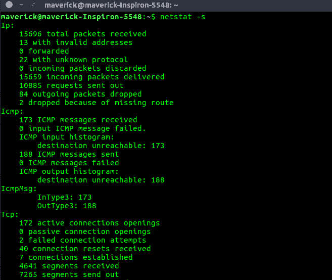

9.  **List the statistics for TCP (or) UDP ports.**

    ```
    # netstat -st(TCP) : To list the statistics for TCP ports.

    ```

    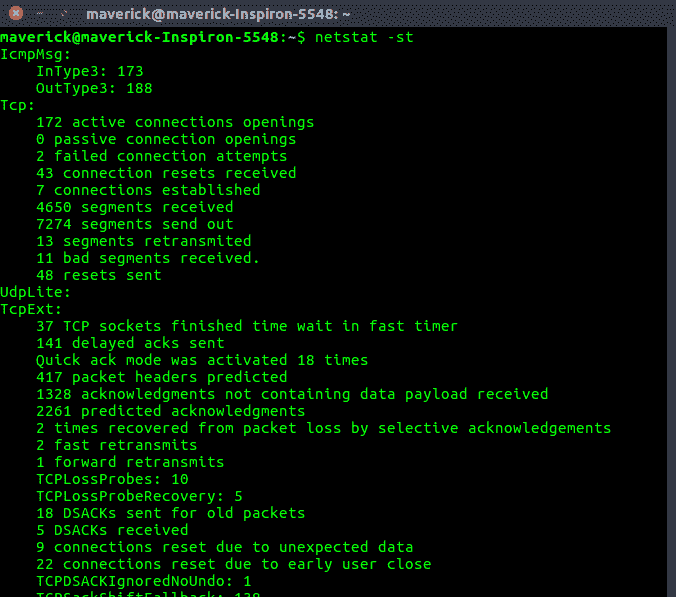

    ```
    # netstat -su(UDP) : List the statistics for UDP ports.

    ```

    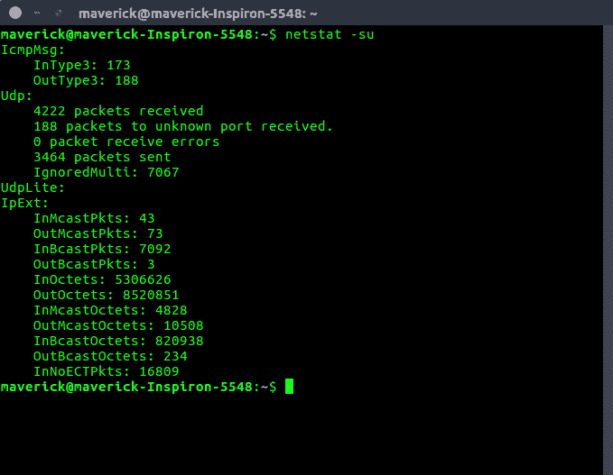

10.  **Display PID and program names in the output.**

    ```
    # netstat -pt : To display the PID and program names.

    ```

    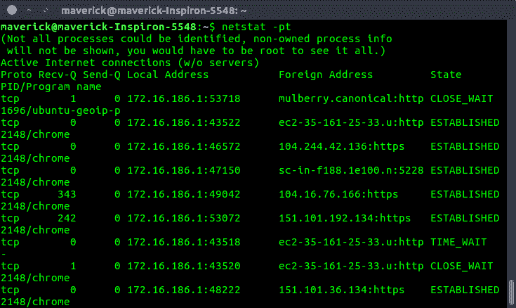

11.  **Print the netstat information continuously.**

    netstat 将每隔几秒钟连续打印信息。

    ```
    # netstat -c : To print the netstat information continuously.

    ```

    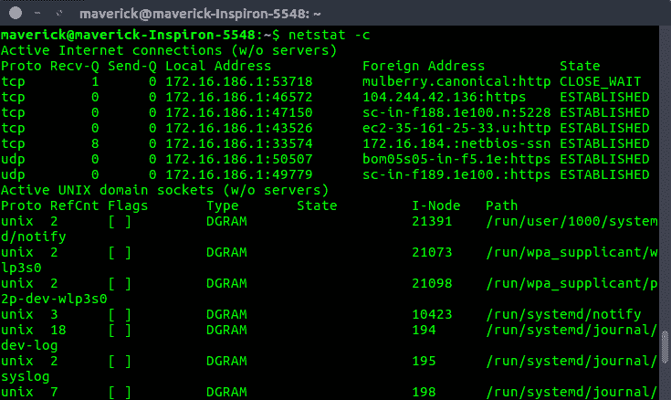

12.  **The non-supportive address families in the system.**

    ```
    # netstat --verbose : To get the non-supportive
    address families in the system.

    ```

    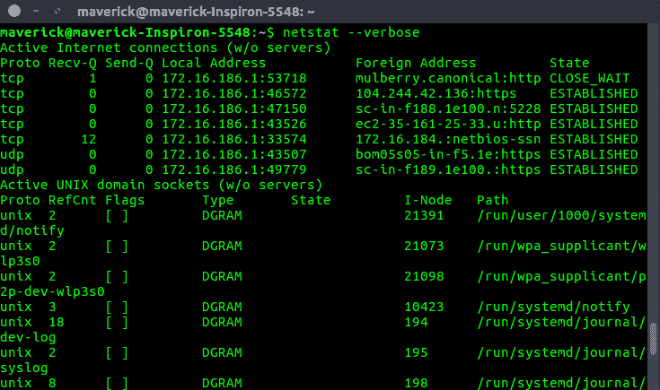

    ```
    At the end, we have something like this : 

    ```

    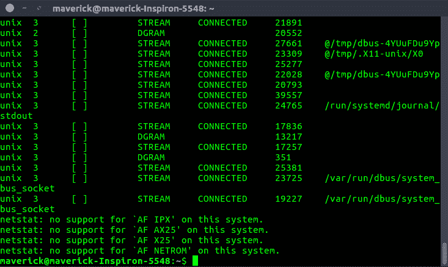

13.  **The kernel routing information.**

    ```
    # netstat -r : To get the kernel routing information.

    ```

    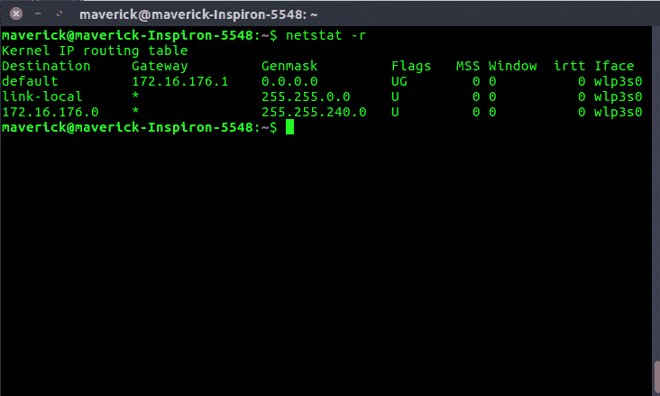

14.  **The port on which a program is running.**

    ```
    # netstat -ap | grep ssh : To get the port
    on which a program is running.

    ```

    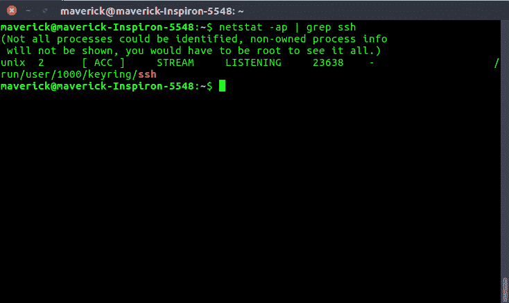

15.  **Which process is using a particular port:**

    ```
    # netstat -an | grep ':80' : To get the process
    which is using the given port.

    ```

    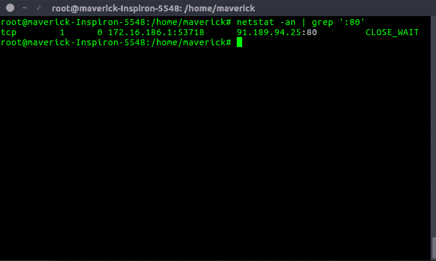

16.  **List of network interfaces.**

    ```
    # netstat -i : To get the list of network interfaces.

    ```

    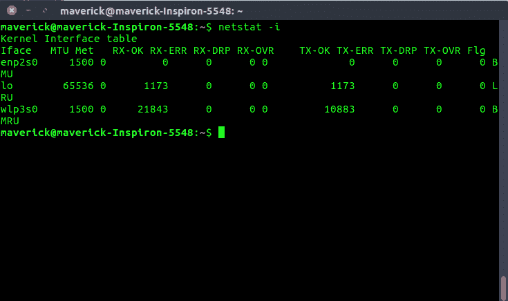

    ```
    Display extended information on the interfaces 
    (similar to ifconfig) using netstat -ie:

    # netstat -ie : To display extended information 
    on the interfaces

    ```

    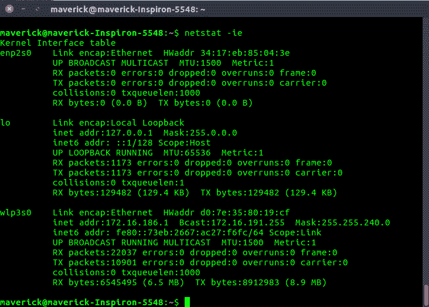

     **参考:**
    [netstat](http://man7.org/linux/man-pages/man8/netstat.8.html)Linux 手册页

    本文由 **[基什莱·维尔马](https://www.linkedin.com/in/kishlayverma/)** 供稿。如果你喜欢 GeeksforGeeks 并想投稿，你也可以使用[contribute.geeksforgeeks.org](http://contribute.geeksforgeeks.org)写一篇文章或者把你的文章邮寄到 contribute@geeksforgeeks.org。看到你的文章出现在极客博客主页上，帮助其他极客。

    如果你发现任何不正确的地方，或者你想分享更多关于上面讨论的话题的信息，请写评论。