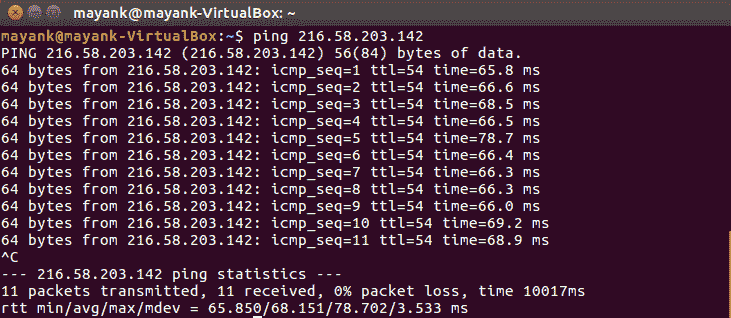
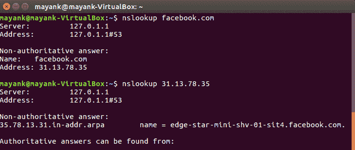
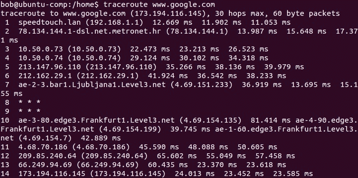
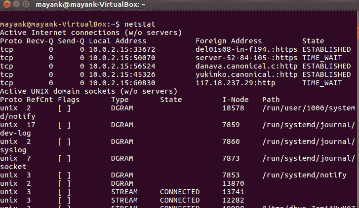
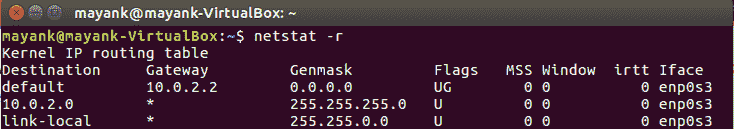
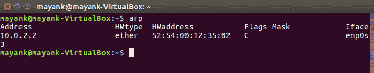
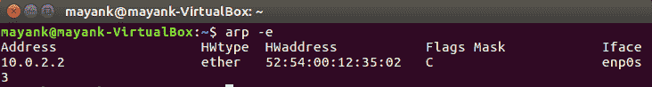
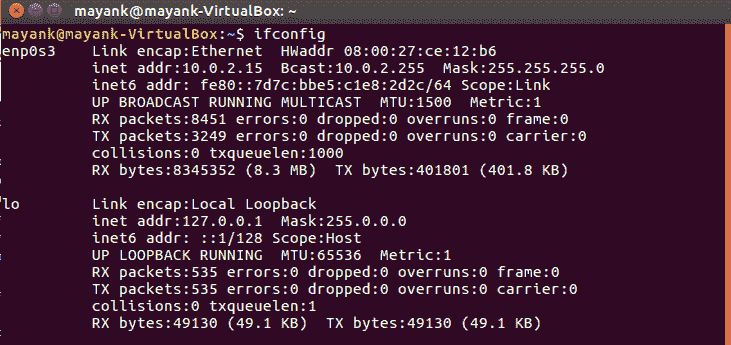

# Linux 中的网络配置和故障排除命令

> 原文:[https://www . geesforgeks . org/network-configuration-疑难解答-commands-linux/](https://www.geeksforgeeks.org/network-configuration-trouble-shooting-commands-linux/)

计算机经常在网络上相互连接。它们以数据包的形式相互发送请求，从主机传输到目的地。Linux 提供了网络配置和故障排除的各种命令。

以下是重要命令的列表:

**1。** [**Ping(数据包互联网协议)**](https://www.geeksforgeeks.org/ping-command-in-linux-with-examples/)
Ping 命令用于确保计算机可以通过网络与指定设备通信。pings 命令以数据包的形式向目标计算机发送互联网控制消息协议(ICMP)回应请求消息，并等待以获得响应。一旦数据包被目的计算机接收到，它就开始发回数据包。该命令一直执行，直到 *si* 中断。

ping 命令提供了以下详细信息

*   传输的数据包数量
*   收到的数据包数量
*   数据包返回所用的时间

ping 命令一般用于以下目的:

*   测量数据包返回所用的时间，以确定连接速度
*   确保主机和目标计算机之间的网络连接可以建立

 

**2。**[**nslookup**](https://www.geeksforgeeks.org/nslookup-command-in-linux-with-examples/)
nslookup 命令查询域名系统，以便从域名系统记录中获取 IP 地址或域名。

**3。**[**traceroute**](https://www.geeksforgeeks.org/traceroute-command-in-linux-with-examples/)
此命令用于获取一个数据包的路由。换句话说，traceroute 命令用于确定数据包的传播路径。它还返回数据包到达目的地所需的跳数。该命令向控制台打印数据包通过的主机列表，以便到达目的地。

**图片来源:** [谷歌图片](http://geek-university.com/wp-content/images/linux/traceroute_command.jpg)

**4。** [**主机**](https://www.geeksforgeeks.org/host-command-in-linux-with-examples/)
主机命令用于查找与该 IP 地址关联的域名或查找与该域名关联的 IP 地址。返回的 IP 地址是 IPv4 或 IPv6。

 

**5。**[**netstat**](https://www.geeksforgeeks.org/netstat-command-linux/)
netstat(网络统计)是用来显示路由表、连接信息、端口状态等的命令。该命令适用于 Linux 网络子系统。这个命令基本上显示了在 Linux 文件系统中定义的/proc/net 文件的内容。

 

**6。** [**Arp**](https://www.geeksforgeeks.org/arp-command-in-linux-with-examples/)
ARP(地址解析协议)命令用于显示和修改 Arp 缓存，其中包含 IP 地址到 MAC 地址的映射。系统的 TCP/IP 堆栈使用 ARP 来确定与 IP 地址相关联的媒体访问控制地址。

 

**7。**[**ifconfig**](https://www.geeksforgeeks.org/ifconfig-command-in-linux-with-examples/)
ifconfig(接口配置)是操作系统中的一个实用程序，用于设置或显示网络接口的 IP 地址和网络掩码。它还提供了启用或禁用接口的命令。许多类似 UNIX 的操作系统在启动时使用 ifconfig 初始化它们的网络接口。ifconfig 还用于查看 MTU(最大传输单位)。

**参考文献:**

*   [Techmint](https://www.tecmint.com/linux-network-configuration-and-troubleshooting-commands/)
*   维基百科(一个基于 wiki 技术的多语言的百科全书协作计划ˌ也是一部用不同语言写成的网络百科全书ˌ 其目标及宗旨是为全人类提供自由的百科全书)ˌ开放性的百科全书

本文由 **Mayank Kumar** 供稿。如果你喜欢 GeeksforGeeks 并想投稿，你也可以使用[write.geeksforgeeks.org](https://write.geeksforgeeks.org)写一篇文章或者把你的文章邮寄到 review-team@geeksforgeeks.org。看到你的文章出现在极客博客主页上，帮助其他极客。

如果你发现任何不正确的地方，或者你想分享更多关于上面讨论的话题的信息，请写评论。