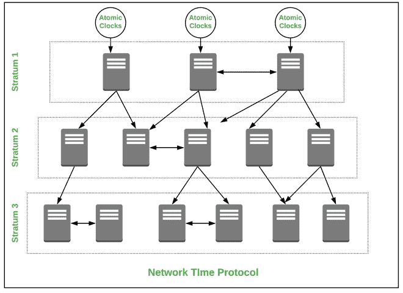

# 网络时间协议(NTP)

> 原文:[https://www.geeksforgeeks.org/network-time-protocol-ntp/](https://www.geeksforgeeks.org/network-time-protocol-ntp/)

先决条件–[应用层协议](https://www.geeksforgeeks.org/protocols-application-layer/)

**网络时间协议** (NTP)是一种帮助计算机在网络中同步时钟时间的协议。该协议是一种应用协议，负责 TCP/IP 网络上主机的同步。NTP 是由戴维·米尔斯于 1981 年在特拉华大学开发的。这在通信机制中是必需的，以便在计算机之间存在无缝连接。

**NTP 的特点:**
NTP 的一些特点是–

*   NTP 服务器可以访问高度精确的原子钟和图形处理器时钟
*   它使用协调世界时来同步中央处理器时钟时间。
*   避免在信息交换通信中出现哪怕是很小的漏洞。
*   为文件服务器提供一致的计时

**NTP 的工作方式:**
NTP 是一种在应用层工作的协议，它使用分层的时间资源系统，并在层服务器内提供同步。首先，在最高层，有高度精确的时间资源 ex。原子钟或全球定位系统时钟。这些时钟资源称为 stratum 0 服务器，它们链接到下面称为 Stratum 2 或 Stratum 3 的 NTP 服务器，以此类推。然后，这些服务器提供准确的日期和时间，以便通信主机相互同步。

**网络时间协议架构:**

**NTP 的应用:**

*   用于录制现场声音的制作系统。
*   用于开发广播基础设施。

**NTP 的优势:**

*   它提供设备之间的互联网同步。
*   它增强了房屋内的安全性。
*   它被用在像 Kerberos 这样的认证系统中。
*   它提供网络加速，有助于排除故障。
*   用于网络同步困难的文件系统。

**NTP 的缺点:**

*   当服务器停机时，同步时间会影响正在运行的通信。
*   由于时区不同，服务器容易出错，可能会发生冲突。
*   时间精度的最小降低。
*   当 NTP 数据包增加时，同步会发生冲突。
*   操作可以同步进行。