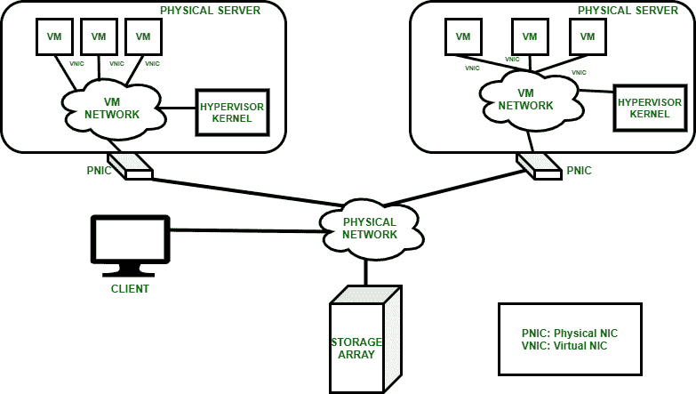

# 云计算中的网络虚拟化

> 原文:[https://www . geeksforgeeks . org/network-云计算中的虚拟化/](https://www.geeksforgeeks.org/network-virtualization-in-cloud-computing/)

**先决条件–**[云计算中的虚拟化](https://www.geeksforgeeks.org/virtualization-to-promote-green-computing/)及其[类型](https://www.geeksforgeeks.org/virtualization-cloud-computing-types/)

网络[虚拟化](https://www.geeksforgeeks.org/characteristics-of-virtualization/)是对物理网络进行逻辑分组，使其作为称为虚拟网络的单个或多个独立网络运行的过程。

网络虚拟化的一般架构

**网络虚拟化工具:**

1.  **物理交换机操作系统**–
    这是操作系统必须具备网络虚拟化功能的地方。
2.  [**【虚拟机管理程序】**](https://www.geeksforgeeks.org/hypervisor/)**—**
    它使用第三方软件或内置网络以及网络虚拟化的功能。

操作系统的基本功能是给应用程序或执行过程提供一组简单的指令。由操作系统生成并通过 libc 库执行的系统调用类似于通过 SAP(服务访问点)在应用程序和网络之间的接口上给出的服务原语。

虚拟机管理程序用于创建虚拟交换机并在其上配置虚拟网络。第三方软件安装在虚拟机管理程序上，它取代了虚拟机管理程序的本机网络功能。虚拟机管理程序允许我们让各种虚拟机在单一计算机硬件上以最佳方式工作。

**网络虚拟化的功能:**

*   它支持虚拟网络中节点的功能分组。
*   它使虚拟网络能够共享网络资源。
*   它允许虚拟网络中节点之间的通信，而无需路由帧。
*   它限制管理流量。
*   它为虚拟网络之间的通信实施路由。

**虚拟数据中心的网络虚拟化:**

**1。物理网络**

*   物理组件:网络适配器、交换机、网桥、中继器、路由器和集线器。
*   授予运行虚拟机管理程序的物理服务器之间、物理服务器和存储系统之间以及物理服务器和客户端之间的连接。

**2。虚拟机网络**

*   由虚拟交换机组成。
*   提供与虚拟机管理程序内核的连接。
*   连接到物理网络。
*   驻留在物理服务器内部。

虚拟数据中心中的网络虚拟化

**网络虚拟化优势:**

**提高可管理性–**

*   节点的分组和重组变得容易。
*   允许使用管理软件从集中式管理工作站配置虚拟机。

**降低资本支出–**

*   降低了为不同节点组建立单独物理网络的要求。

**提高利用率–**

*   多个虚拟机可以共享同一个物理网络，这提高了网络资源的利用率。

**提高性能–**

*   网络广播受到限制，虚拟机性能得到提高。

**增强安全性–**

*   敏感数据从一个虚拟机隔离到另一个虚拟机。
*   从一个虚拟机到另一个虚拟机对节点的访问受到限制。

**网络虚拟化的缺点:**

*   它需要抽象地管理信息技术。
*   它需要在云集成的混合环境中与物理设备共存。
*   复杂性增加。
*   前期成本。
*   可能的学习曲线。

**网络虚拟化示例:**

[**【虚兰(VLAN)**](https://www.geeksforgeeks.org/virtual-lan-vlan/)**–**

*   VLAN 可以提高繁忙网络的性能和速度。
*   VLAN 可以简化网络的添加或任何更改。

**网络覆盖–**

*   一个称为 VXLAN 的封装协议提供了一个框架，用于在第 3 层网络上覆盖虚拟化的第 2 层网络。
*   通用网络虚拟化封装协议(GENEVE)提供了一种新的封装方式，旨在提供隧道端点之间的控制平面独立性。

**网络虚拟化平台:VMware NSX–**

*   VMware NSX 数据中心传输软件中定义和使用的网络和安全组件，如交换、防火墙和路由。
*   它为网络传输虚拟机的操作模型。

**网络虚拟化的应用:**

*   网络虚拟化可用于开发应用测试，以模拟真实世界的硬件和系统软件。
*   它帮助我们将多个物理网络集成到单个网络中，或将单个物理网络分离到多个分析网络中。
*   在应用程序性能工程领域，网络虚拟化允许模拟应用程序、服务、依赖关系和最终用户之间的连接，以进行软件测试。
*   它帮助我们在更短的时间内部署应用程序，从而支持更快的上市。
*   网络虚拟化有助于软件测试团队从网络环境中的预期实例和拥塞问题中得出实际结果。