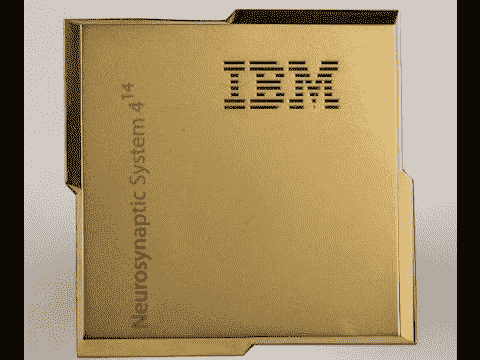
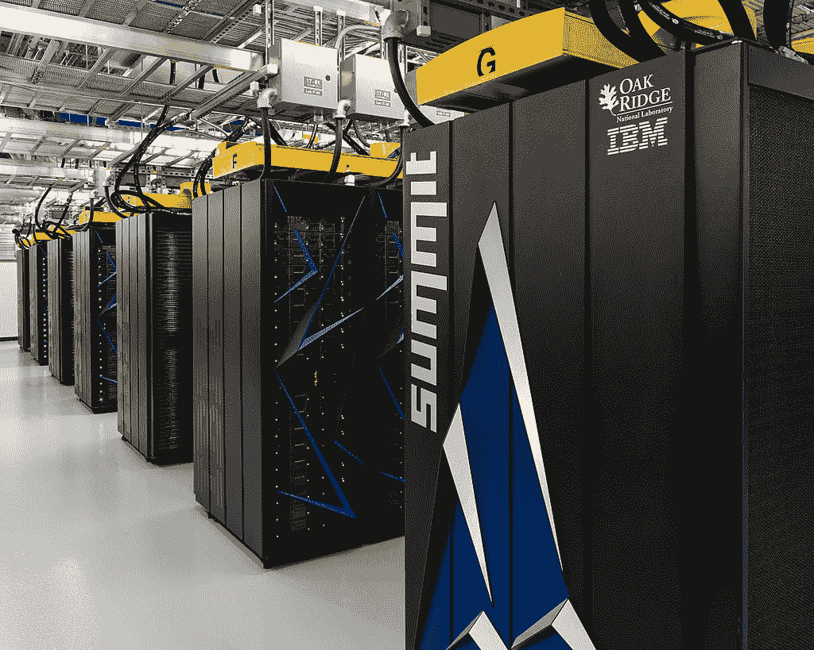

# 神经形态计算

> 原文:[https://www.geeksforgeeks.org/neuromorphic-computing/](https://www.geeksforgeeks.org/neuromorphic-computing/)

**神经形态计算**试图模仿人脑的工作方式。

神经形态计算是下一代计算更好的候选。这个术语最早是由卡弗·米德教授在 80 年代提出的。它描述的是模仿人脑的计算。在过去的十年里，许多公司和机构一直致力于神经形态计算，以 IBM 为例 IBM 真北芯片它是世界上第一个成为非基础架构的神经形态芯片。

**Figure –** Carver Mead

TrueNorth 芯片有 4096 个内核，每个内核包含 256 个数字(大约 100 万个新房间和超过 2.5 亿个突触。).

**Figure –** TrueNorth chip

现在，这是相对较新的计算概念。人脑典型的人脑包含 860 到 870 亿个神经元和 10 到 15 次方的突触。

当我们在大脑中执行计算任务时，我们只消耗整个神经元数量的一小部分。这就是为什么人类大脑的能效极高的原因我们消耗 20 瓦的功率，我们能够实现一个 exaFLOP(exaFLOP 是每秒一百万(1018)次浮点运算或 1000 个 petaFLOPS)让我们把这一点放在正确的角度来看世界上最快的超级计算机 IBM summit 消耗 30 兆瓦的功率，它能够执行 200 次 FLOPS 人类大脑消耗 20 瓦的功率，能够执行 1 个 exaflops，这是 IBM summit 计算能力的 5 倍。

**Figure –** IBM Summit

**使用神经形态计算的神经形态计算机**直接模仿人脑，它使用特殊的人工神经网络方法，称为尖峰神经网络(SNN)。这不能与基于软件的算法相混淆，例如卷积神经网络(CNN)、递归神经网络(RNN)或生成对抗网络(GAN)。

为神经形态计算机提供动力的神经形态芯片可能无法取代传统的计算芯片，如中央处理器、图形处理器或专用集成电路。然而，神经形态计算机有能力添加到现有的计算机中，为人工智能执行深度学习。从 IBM TrueNorth 到英特尔，对曼彻斯特大学的忠诚是一台旋转机器，每个公司或机构都在为神经形态计算芯片开发独特的解决方案。

**局限性:**
虽然当今的计算机可以做许多人类能做的事情，但它们至少在两个方面有所欠缺，即机器推理和迁移学习。莱昂·博图，专家定义的机器推理为

> 为了回答新问题，用代数方法处理以前获得的知识。

迁移学习是指将学习到的经验从一种环境转移到另一种环境的能力。

还有第三个角度，即物理尺寸和能耗。超级计算机代表最高的计算速度，目前的版本以 PFLOPs(每秒 10^15 浮点运算)为单位。但这些设备体积庞大，位于专用建筑内，需要兆瓦级的电力。人脑消耗大约 20 W 的能量。