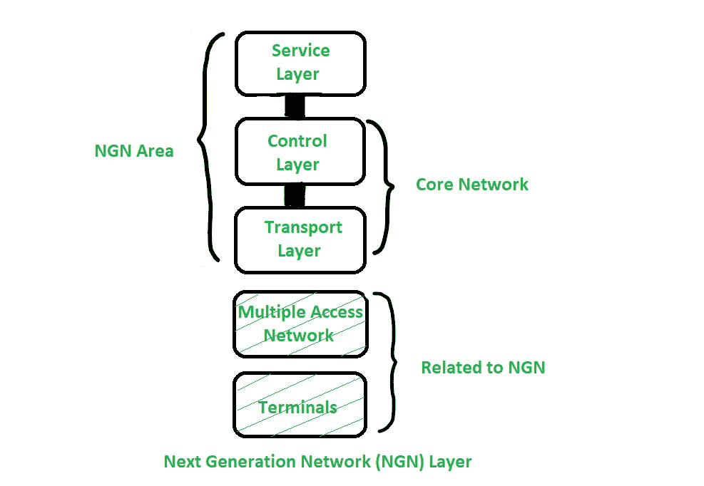

# 下一代网络(NGN)

> 原文:[https://www.geeksforgeeks.org/next-generation-network-ngn/](https://www.geeksforgeeks.org/next-generation-network-ngn/)

**下一代网络(NGN)** 指的是基于分组的网络，它可以用于电信服务以及数据，并且它支持移动性。它能够利用多种宽带能力，尤其是支持服务质量的传输技术，在这些技术中，服务相关功能独立于底层的传输相关技术。

下一代网络(NGN)的主要目标是作为[公共交换电话网(PSTN)](https://www.geeksforgeeks.org/what-are-voip-pstn-and-pots/) 和[综合业务数字网络(ISDN)](https://www.geeksforgeeks.org/integrated-services-digital-network-isdn/) 的替代品。

现在有不同的网络用于不同的目的，如语音、数据和各种视频。电话、互联网和蜂窝网络指的是不同的领域，每个领域都有自己的协议和服务。下一代网络(NGN)背后的理念是，一个网络传输所有类型的数据，并以类似于互联网上使用的数据包形式提供服务。通常，下一代网络是围绕互联网协议构建的。这就是为什么有时 NGN 被称为全 IP 网络来描述向下一代网络(NGN)的转变。

国际电信联盟电信标准化部门(ITU-T)定义下一代网络(NGN)是一个基于分组的网络，它为用户提供电信服务，并使用多个宽带、支持服务质量的传输技术。NGN 是一种通用的移动方法，它允许向用户提供一致和全面的服务。

**定义 NGN 的基本特征:**

*   基于数据包的传输。
*   承载能力、呼叫/会话服务的控制功能分离。
*   服务和网络的分离，开放接口的提供。
*   广泛的服务，如(实时)/流/非实时/多媒体。
*   通过开放接口与传统网络互通
*   支持广义移动性。
*   支持用户不受限制地访问不同的服务提供商。

**NGN 支持的服务:**

*   数据通信服务。
*   多媒体服务。
*   公共利益服务。
*   公共交换电话网(PSTN)/综合业务数字网(ISDN)模拟服务。
*   公共交换电话网/综合业务数字网仿真服务

**下一代网络层:**

*   在接入层，包括不同类型的媒体网关，支持接入网与核心网之间的连接。
*   核心网络层是处理基于互联网协议的融合服务的网络。控制层充当呼叫服务器。它提供呼叫控制功能，还提供对媒体网关的控制。
*   服务层是一个信息技术平台，它创建一个服务创建环境，扩展其功能，以覆盖新的网络场景，如智能网络。

下图说明**下一代网络(NGN)层**如下。

这个基本参考模型将传输层(接入层和核心层)与服务层分开。简而言之，接入层元素处理不同的媒体网关。核心层处理基于 IP 的网络。控制层处理呼叫控制功能和媒体网关的控制。服务层是扮演智能网络服务创建环境角色的信息技术平台。