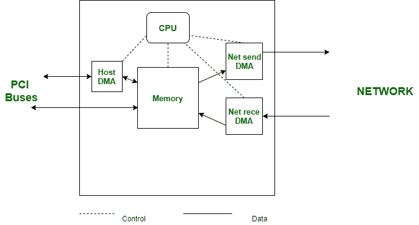

# 网卡完整形式

> 原文:[https://www.geeksforgeeks.org/nic-full-form/](https://www.geeksforgeeks.org/nic-full-form/)

**网卡**代表**网络接口卡**
网卡又称以太网或物理或网卡。网卡是将小工具与网络相关联的主要和必要组件之一。每个必须与网络相关联的小工具都必须有一个网络接口卡。甚至交换机也由排列成与系统相关联的网卡组成。它是最重要的网络组件，没有它，您就无法将任何小工具连接到网络。它可以是一个电路板或一个卡，被引入到计算机或个人电脑中，从而作为组织和计算机或个人电脑的仲裁器。它显示在现场视察秀的第 2 层，这是一个使用媒体访问控制地址的信息接口层。

在一个简单的框架中，它可以被解释为可编程卡，它通过电缆将地址转换成电信号到网络，坏习惯也是如此，如以太网，对于远程设备，它将位转换成无线电信号，坏习惯也是如此，如 Wifi。

**网络接口卡图**

#### 网卡的特性

*   **物理网络地址**
    所有的网络连接器都有一个由卡生产商刻录到卡上的普遍感兴趣的物理地址。物理地址非常容易识别连接到网络电缆或介质的每个单独的卡。因此，物理地址也被称为媒体访问控制地址。媒体访问控制地址有六个字节长。普通的媒体访问控制地址可能显示为 00-00-86-47-F6-65，其中主要的三个字节是商家标识，其他三个字节是特殊信息。
*   **网络连接端口**
    网络连接器卡将具有一个或多个端口，这些端口被安排成特别接通给定种类的排列电缆。一些经验丰富的卡可能有双端口，这样它们就可以连接到一个以上的网线。毫无疑问，请选择端口与您环境中使用的网络介质相匹配的卡。
*   **状态指示灯**
    网络连接器通常有一个或多个发光二极管(Led)状态灯，可以提供网络关联状态的数据。大多数连接器都有一个界面灯，用于在出现来自组织的标志时进行演示。如果接口不亮，总的来说，电缆或物理连接有问题。大多数连接器都有一个移动灯，当包裹被平静或发送时会闪烁。万一灯不停地闪烁，组织可能会被滥用，或者可能会有一个框架制造安排噪音。

#### 网卡的优势

*   利用网络的通信速度通常以千兆字节为单位。
*   高度可靠的连接。
*   许多外围设备可以与利用网卡的许多端口相关联。
*   大量信息可以在众多客户端之间共享。

#### 网卡的缺点

*   在有线网卡的情况下，这种安排很糟糕，因为它不像远程路由器那样通用
*   这种安排应该适合高级沟通。
*   数据不安全。