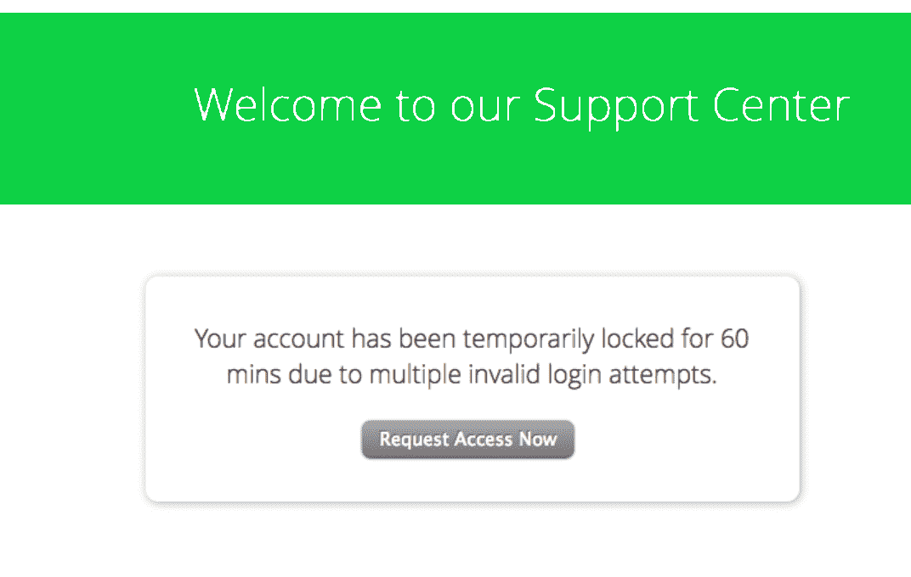
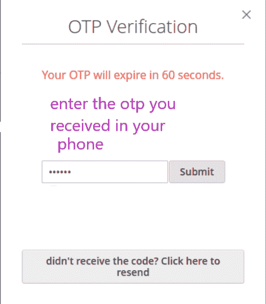

# 网络安全无限速漏洞

> 原文:[https://www . geesforgeks . org/无限速网络安全漏洞/](https://www.geeksforgeeks.org/no-rate-limiting-flaw-in-cyber-security/)

速率限制是一个限制可能的请求的过程。它用于控制网络流量。假设一个 web 服务器每分钟最多允许 20 个请求。如果您尝试发送超过 20 个请求，将会触发一个错误。这是防止攻击者向服务器发送过多请求所必需的。

无速率限制是一个缺陷，它不会限制用户在网站服务器上提取数据的尝试次数。当被攻击者滥用时，这是一个可能被证明是至关重要的漏洞。

**真实生活示例:**

1.  当您尝试登录您的帐户时，在 3-4 次错误尝试后，您的帐户会暂停几个小时。限速是背后的原因！
    示例-

2.你得到的动态口令有一个时间限制，超过这个时间后你的动态口令就失效了。这里，利率限制也是其背后的原因。
**示例–**

**限速功能的使用:**

*   减少网络服务器上的过度负载
*   防止拒绝服务攻击
*   帮助阻止某些类型的恶意机器人活动，如使用多个猜测密码和用户 id 登录帐户
*   还要防止暴力袭击

**ZOOM APP 近期限速缺陷:**
ZOOM APP 在锁定期大受欢迎，它已经成为线下课程必不可少的替代品。攻击者利用 zoom app 的无速率限制漏洞成功破解了私人会议的密码。Zoom 网络客户端允许暴力破解 Zoom 中发生的受密码保护的私人会议。后来，安全专家修补了此漏洞。

**业务影响:**
我们来看一下 OTP 的情况。现在假设，otp 的长度是 3 位数，并且攻击者正在猜测 otp 是否能成功窃取交易。如果在 web 应用程序中没有实现速率限制，黑客可以手动在 otp 上键入 000-999 值来检查哪个是正确的。这个方法有点 cubersome，所以黑客可以用一个 burp suite 工具在更短的时间内完成同样的工作。因此，30 分钟后，otp 解锁，攻击成功。
现在，在相同的场景中，如果在 web 应用程序中实现了速率限制，假设只允许 5 次尝试或 2 分钟的时间限制。在这种情况下，黑客几乎不可能破解 otp。从而防止攻击的发生。

**如何防止限速缺陷？**

*   根据您的速率限制监控 API 活动。
*   捕捉由速率限制引起的错误。
*   减少请求的数量。
*   对登录、otp、凭证等采取额外的预防措施。