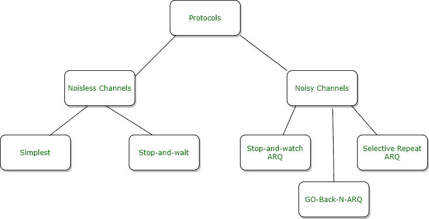
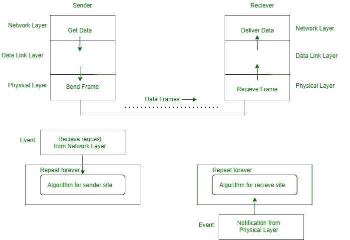
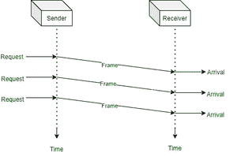
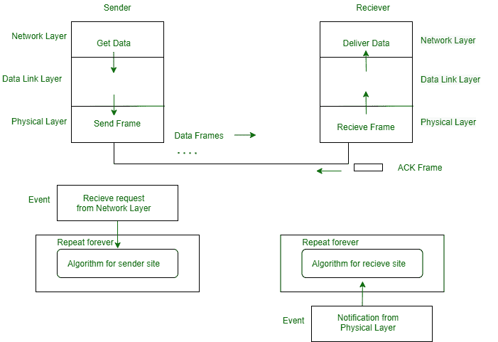
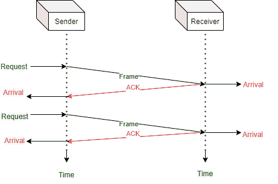

# 无噪声信道协议

> 原文:[https://www.geeksforgeeks.org/noiseless-channel-protocol/](https://www.geeksforgeeks.org/noiseless-channel-protocol/)

**简介:**
协议是两个设备用来通信的一组规则。这些规则集通常由报头决定(由协议决定的固定报头)。这些头指定了消息的内容和处理该消息的方式。要检测错误，报头必须是目的地址、源地址和消息校验和。

**协议的分类:**
协议的探索分为可用于无噪声(无差错)信道的协议和可用于有噪声(引起差错)信道的协议。第一类协议不能在实际生活中使用，但它们可以作为噪声信道协议的基础。



**无噪声通道:**
一个理想的通道，其中没有帧丢失、损坏或复制。该协议不实现这一类别的错误控制。无噪声信道有两种协议，如下所示。

**最简单的协议–**
我们在这里考虑，接收机可以用不重要的处理时间来维持接收到的任何帧。接收方的数据链路层立即从帧中移除报头，并将数据包分配给其网络层，网络层也可以立即接受数据包。也就是说，接收者永远不会被即将到来的帧淹没。

*   **设计:**
    发送方站点的数据链路层从其网络层获取数据，将数据做成帧，然后发送出去。数据链路层(接收方站点)从其物理层接收帧，从帧中提取数据，并将数据传送到其网络层。发送方和接收方的数据链路层为其网络层提供通信/传输服务。数据链路层利用物理层提供的服务进行比特的物理传输。



无差错控制或无流量的最简单协议的设计

*   **发送方和接收方算法:**
    **发送方算法–**

```
*while(true)* //Repeat forever
*{* 
 *waitForEvent();* //sleep untill an event occur
   *if (Event(RequestToSend))* //there is a packet to send
 *{*
   *      GetData();*
      *   MakeFrame();*
   *      SendFrame();           * //send the frame
    }
}
```

*   **接收器算法–**

```
while(true)                           //Repeat forever
{ 
   waitForEvent();                    //sleep untill an event occur
   if (Event(ArrivalNotification))    //data frame arrived
   {
         ReceiveFrame();
         ExtractData();
         DeliverData();               //Deliver data to network layer
    }
}
```

*   **流程图:**
    该流程图显示了使用最简单协议的通信示例。很简单。发送方发送一系列帧，而无需进一步考虑接收方。举个例子，发送方会发送三帧，接收方会接收三帧。请记住，数据框由倾斜的方框显示；盒子的高度定义了帧中第一位和最后一位之间的传输时间差。
*   **图表**–



最简单协议的流程图

**停止和等待协议**–
如果数据帧接收器到达现场的速度超过了处理速度，则必须存储数据帧，直到它们被使用。通常，接收器没有足够的存储空间，尤其是当它从多个来源接收数据时。

*   **设计:**
    关于停止等待协议设计模型与最简单协议设计模型的比较，我们可以看到前/前向信道(从发送方到接收方)和后/反向信道上的流量。任何时候，前向信道上都有一个数据帧，反向信道上都有一个确认帧。我们这里需要半双工链路。



停止等待协议的设计

*   **发送方和接收方算法:**
    **发送方算法–**

```
*while(true)* //Repeat forever
*canSend = true* // Allow the first frame to go
*{* 
 *waitForEvent();* //sleep untill an event occur
 *if (Event(RequestToSend)AND canSend)* //there is a packet to send
 *{*
 *GetData();*
 *MakeFrame();*
 *SendFrame();* //send the data frame
 *canSend = false;* //cannot send untill ACK arrives
    }
 *WaitForEvent();* //sleep untill an event occurs
 *if(Event(ArrivalNotification))* //An ACK has arrived
 *{*
 *RecieveFrame();* //Recieve the ACK frame
 *CanSend = true;*
*}* 
```

*   **接收器算法–**

```
while(true)                                //Repeat forever

{ 
   waitForEvent();                         //sleep untill an event occur
   if (Event(ArrivalNotification)          //data frame arrives
   {
         ReceiveFrame();
         ExtractData();
         DeliverData();               //Deliver data to network layer
         SendFrame();                 //Send an ACK frame
    }
 }
```

*   **流程图:**
    此图显示了使用停止等待协议的通信示例。这仍然很简单。发送方发送一个帧，等待接收方的响应。当确认(确认)将从接收端到达，然后发送下一帧，以此类推。请记住，当有两个帧时，发送方将参与四个事件，接收方将参与两个事件。



停止和等待协议流程图