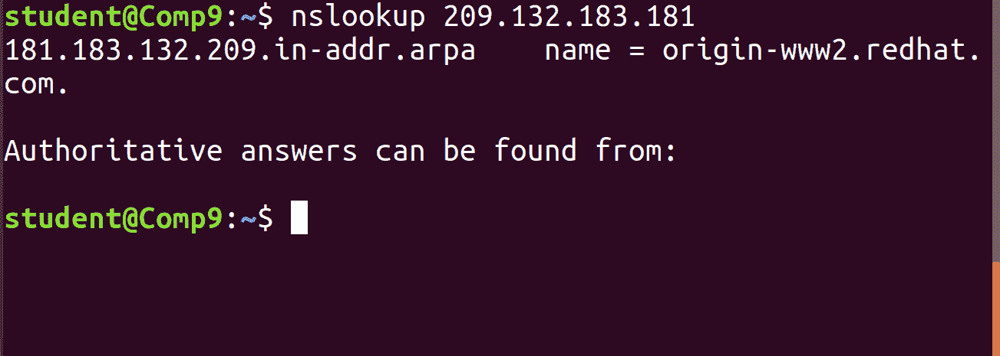
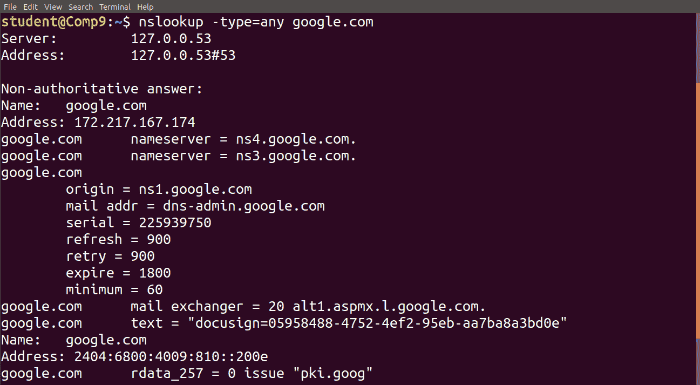
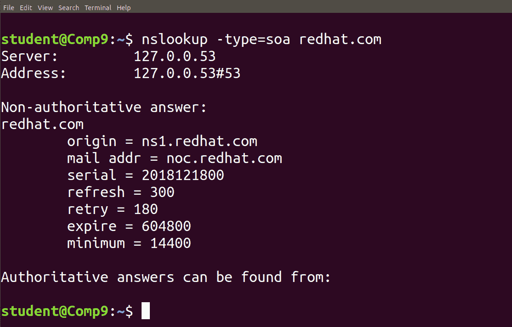
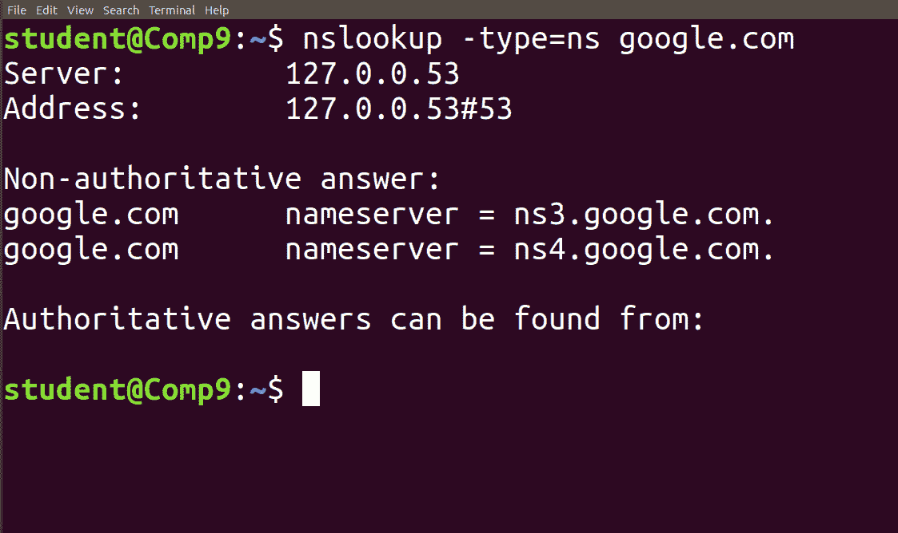
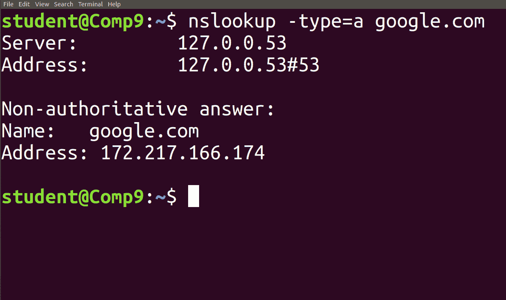
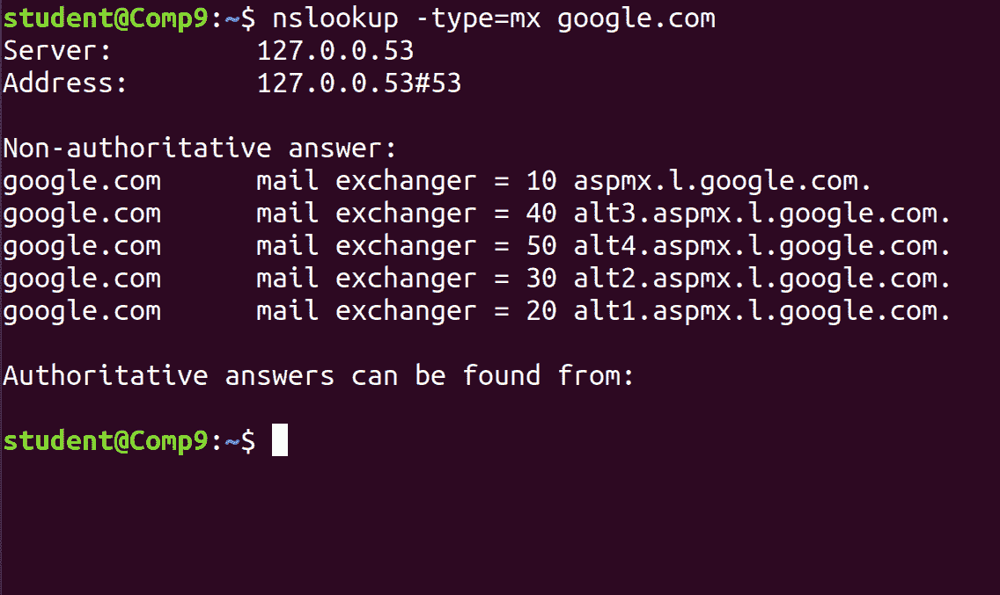
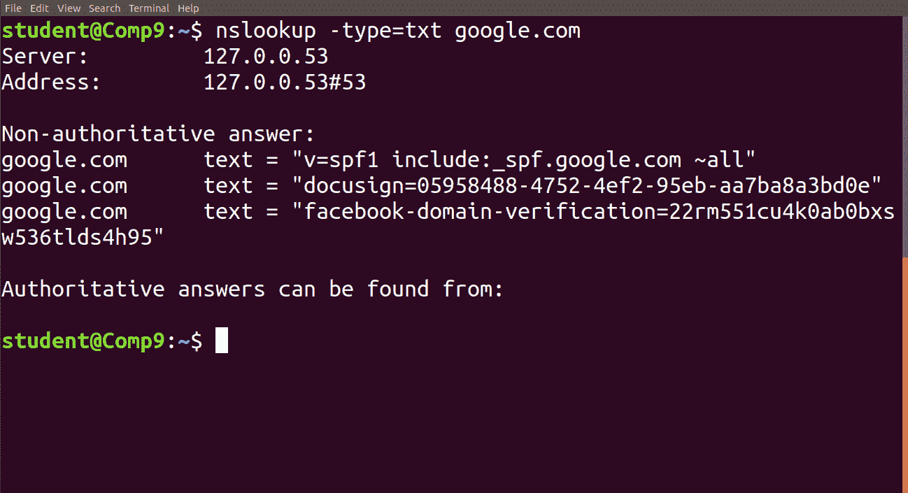

# Linux 中 nslookup 命令示例

> 原文:[https://www . geesforgeks . org/nslookup-command-in-Linux-with-examples/](https://www.geeksforgeeks.org/nslookup-command-in-linux-with-examples/)

**Nslookup** (代表“名称服务器查找”)是从 DNS 服务器获取信息的有用命令。它是一种网络管理工具，用于查询域名系统(DNS)以获取域名或 IP 地址映射或任何其他特定的 DNS 记录。它还用于解决与域名系统相关的问题。

**语法:**

```
nslookup [option]
```

**nslookup 命令的选项:**

*   **nslookup google.com:**
    nslookup 后跟域名将显示该域的“A Record”(IP 地址)。使用此命令查找域的地址记录。它向域名服务器查询并获取详细信息。


*   **nslookup 192.168.0.10:** Reverse DNS lookup 

    您也可以通过向 nslookup 提供 IP 地址作为参数来进行反向 DNS 查找。



*   **nslookup-type =任意 google.com:**查找任意记录
    我们还可以使用*type =任意*选项查看所有可用的 DNS 记录。



*   **nslookup-type = soa redhat.com:**查找 SOA 记录
    SOA 记录(权限的开始)，提供关于域的权威信息、域管理员的电子邮件地址、域序列号等…



*   **nslookup-type = ns google.com:**查找 NS 记录
    NS(名称服务器)记录将域名映射到该域的权威 DNS 服务器列表。它将输出与给定域相关联的服务名称。



*   **nslookup-type = a google.com:**查找 a 记录
    我们还可以使用**type = a*选项查看特定记录的所有可用 DNS 记录。*

**

*   ***nslookup-type = mx google.com:**查找 MX 记录
    MX(邮件交换)记录将域名映射到该域的邮件交换服务器列表。MX 记录告诉我们，所有发送到“google.com”的邮件都应该被路由到该域中的邮件服务器。*

**

*   ***nslookup-type = txt google.com:**查找 TXT 记录
    TXT 记录对于多种类型的记录都很有用，如 DKIM、SPF 等。您可以使用以下命令找到为任何域配置的所有 TXT 记录。*

**