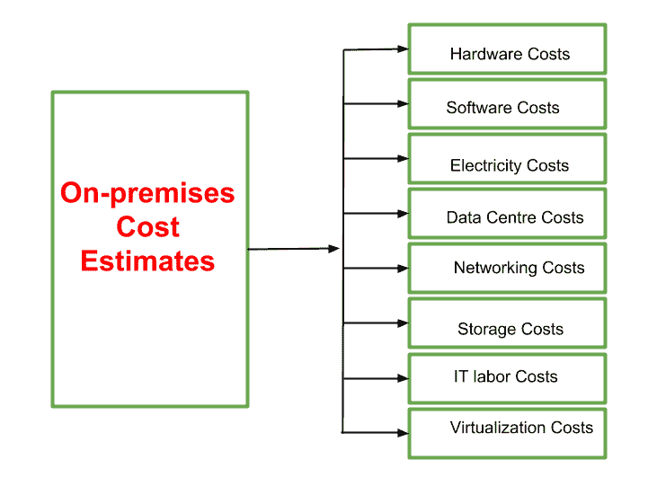

# 虚拟化的内部成本估算

> 原文:[https://www . geesforgeks . org/内部虚拟化成本估算/](https://www.geeksforgeeks.org/on-premises-cost-estimates-of-virtualization/)

**先决条件**–[虚拟化和虚拟化类型](https://www.geeksforgeeks.org/virtualization-cloud-computing-types/)、[虚拟化特征](https://www.geeksforgeeks.org/cloud-computing-characteristics-of-virtualization/)

内部成本是根据各种因素计算的，如硬件类型、使用的操作系统、存储、数据库、虚拟化工具和其他各种因素。默认成本率可以在成本估算器的帮助下进行估算。在云成本控制设置中，内部成本用于估计虚拟机(用于虚拟化)和其他资源的每月成本。

虚拟化是一种设计任何硬件服务的虚拟(非物理)版本的方法。虚拟化是一种资源高效的技术，因为它具有成本效益，并且使用较少的资源，如硬件和能源。借助虚拟化，可以在单个硬件上同时安装和使用多个操作系统和其他应用程序。

虚拟化的内部成本估计有八种类型，如下所示:

现场成本估算

### **硬件成本**

根据用户的描述，计算器使用估计的市场价格来预测必需的物理硬件的成本。计算器还会增加维护物理硬件的成本，以计算总的估计硬件成本。它包括用户系统根据使用情况使用的所有硬件的成本。

### **软件成本**

如果用户将 Windows 指定为其环境的操作系统，则计算器会根据用户环境所需的内核数量来估计 Windows 许可成本。所有的软件和应用程序都属于这一类，其使用成本是根据用户的使用情况来计算的。为了方便用户，该软件有时可以按周、月或年打包使用，否则管理日常使用的软件会变得复杂。

### **电费**

估计大概的用电成本。这是通过将额定功率分配给用户的硬件配置，然后将其乘以行业标准的功耗来实现的。系统和系统的所有外围设备消耗的功率都属于这一类。它的成本是在我们计算我们家的电费时计算出来的。由于电力是一项基本公共事业，与其他成本相比，它更便宜。

### **数据中心成本**

根据用户的描述，计算器估计标准化机架空间的必要数量。然后，计算器使用估计的单位机架空间成本来预测内部环境的数据中心成本。在这种情况下，计算用户的系统的各种软件和应用所消耗的数据的成本。每单位的数据速率是固定的。用户可以随时部署或使用某些数据计划，这为他们提供了根据使用情况灵活使用数据的能力。

### **联网成本**

网络硬件和软件成本估计为内部硬件和软件成本的固定百分比。计算器还根据用户指定的出站带宽要求添加服务提供商成本。系统使用的网络成本属于这一类。它是根据用户系统使用的带宽计算的。它提供了以下几个好处:

*   降低成本
*   空间效率
*   加快部署速度
*   灵活性

### **仓储费用**

计算器通过将 DAS、SAN 和 NAS 的估计市场价格乘以用户指定的磁盘空间量来计算存储成本。除了存储，用户还可以估计当前的备份和归档量。它是按每千兆字节的成本计算的，即每千兆字节的成本。用户可以使用任意数量的存储空间。它提供了一个灵活且可扩展的环境，帮助他们根据需要增加或减少存储使用。

### **IT 人工成本**

根据用户的描述，计算器估计维护内部环境所需的 IT 管理员工时数。系统运行所需的所有雇员和人员的费用都属于这一类。

### **虚拟化成本**

如果用户描述包括虚拟机，计算器将使用行业标准的每台虚拟机管理费率来估计虚拟化总成本。该成本代表用户环境的虚拟机管理程序成本和虚拟机管理软件成本的估计。计算虚拟化成本有四种方法，它们是:

*   作业成本计算
*   分级定价
*   服务成本与基础设施成本
*   额外的