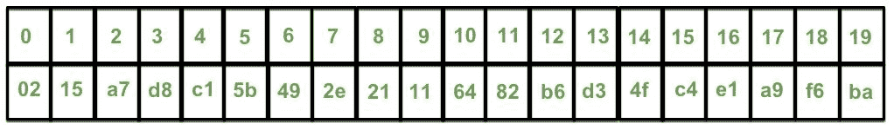

# 密码学中的一次性密码算法

> 原文:[https://www . geesforgeks . org/一次性密码-OTP-密码算法/](https://www.geeksforgeeks.org/one-time-password-otp-algorithm-in-cryptography/)

**认证**，识别和验证个人的过程是授予访问任何受保护服务(如个人帐户)的权限之前的基本步骤。身份验证已被纳入网络安全标准，并提供防止未经授权访问受保护资源的功能。如今的身份验证机制在解锁任何受保护的信息之前都会创建一个双层网关。

这种称为双因素身份验证的双层安全性创建了一条路径，该路径需要验证凭据(用户名/电子邮件和密码)，然后创建并验证**一次性密码(OTP)** 。动态口令是一个数字代码，在每次身份验证事件中随机唯一生成。这增加了额外的安全层，因为每次尝试身份验证时生成的密码都是一组新的数字，并且它为下一个创建的会话提供了不可预测的质量。

传送 OTP 的两种主要方法是:

1.  **基于短信:**
    这个挺直白的。这是常规身份验证成功后通过文本消息传递动态口令的标准过程。这里，动态口令在服务器端生成，并通过文本消息传递给认证者。这是跨服务遇到的最常见的 OTP 交付方法。
2.  **基于应用程序:**
    这种 OTP 生成方法是在用户端使用特定的智能手机应用程序完成的，该应用程序扫描屏幕上的二维码。应用程序负责唯一的动态口令数字。与基于短信的传递相比，这减少了 OTP 的等待时间，并降低了安全风险。

由开放身份验证倡议定义的最常见的生成动态口令的方式是**基于时间的一次性口令(TOTP)** ，这是一种时间同步的动态口令。在这些动态口令系统中，时间是生成唯一口令的主要因素。

生成的密码是使用当前时间创建的，它还包含一个密钥。这种动态口令生成的一个例子是基于时间的动态口令算法(TOTP)，描述如下:

1.  后端服务器生成密钥
2.  服务器与生成动态口令的服务共享密钥
3.  A hash based message authentication code (HMAC) is generated using the obtained secret key and time. This is done using the cryptographic SHA-1 algorithm.

    由于请求动态口令的服务器和设备都可以访问时间，时间显然是动态的，因此在算法中将时间作为一个参数。这里，考虑了独立于时区的 Unix 时间戳，即从 1970 年 1 月 1 日开始以秒为单位计算时间。让我们考虑“0215 a7 D8 c 15 b 492 e 21116482 B6 d 34 fc 4 E1 a9 F6 ba”作为从 HMAC-SHA1 算法生成的字符串。

4.  The code generated is 20 bytes long and is thus truncated to the desired length suitable for the user to enter. Here dynamic truncation is used. For the 20-byte code “0215a7d8c15b492e21116482b6d34fc4e1a9f6ba”, each character occupies 4 bits. The entire string is taken as 20 individual one byte sting.

    

    我们看最后一个字符，这里是 a。它的十进制值用来确定开始截断的偏移量。从偏移值开始，10 读取接下来的 31 位以获得字符串“6482b6d3”。剩下要做的最后一件事，就是取我们的十六进制数值，并转换成十进制，这样就给出了 1686288083。

    我们现在需要的是所获得的十进制字符串的最后一个期望长度的 OTP 数字，如果需要的话用零填充。这很容易通过取 OTP 中所需的十进制字符串(模 10 ^位数)来实现。我们以“288083”作为我们的 TOTP 代码结束。

5.  计数器用于跟踪经过的时间，并在设定的时间间隔后生成新代码
6.  生成的动态口令通过上述方法传递给用户。

除了上述基于时间的方法，还存在用于动态口令生成的某些数学算法，例如从先前创建的动态口令创建后续动态口令的单向函数。

双因素认证系统是一种有效的策略，它利用了“你知道的东西”和“你拥有的东西”的认证原则。由一次性密码算法实现的后一原则的动态特性对于安全性至关重要，并且提供了有效的保护层来抵御恶意攻击者。动态口令的不可预测性阻碍了这种加密方法所能提供的层的剥离。