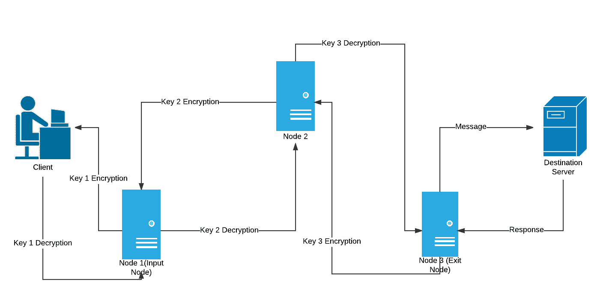

# 洋葱布线

> 原文:[https://www.geeksforgeeks.org/onion-routing/](https://www.geeksforgeeks.org/onion-routing/)

洋葱路由是一种通过计算机网络进行匿名通信的技术。在洋葱网络中，消息被封装在加密层中，类似于洋葱层。

有大量的预防措施和最佳实践可以让用户的网页浏览更加安全。假设您向服务器发送了一个 HTTPS 请求，有人拦截了该请求，但此人无法知道该消息的内容，因为它是加密的。但是您仍然对这种安全级别不满意，并且希望更上一层楼，也就是说，您甚至不希望网络上的任何嗅探知道您正在联系的是哪台服务器，以及您是否正在提出任何请求。这就是洋葱路由进来的地方。

详见[本](https://en.wikipedia.org/wiki/Onion_routing#/media/File:Onion_diagram.svg)图。

**洋葱路由是如何工作的？**

如果你在一个普通的网络浏览器上浏览互联网，比如 chrome、firefox 等，你可以通过向服务器发出简单的 GET 请求来请求网页，而不需要任何中介。它只是客户端和服务器之间的单一连接，在您的网络上嗅探的人可以知道您的计算机正在联系哪个服务器。

*   洋葱路由做的不同。在洋葱路由中，连接在不同的节点之间保持，即连接从一个服务器跳到另一个服务器，当它到达这条线路上的最后一个服务器时，它是我们想要联系的服务器，它将处理我们的请求，并为我们提供所需的网页，该网页使用相同的节点网络发送回我们。
*   现在你一定会想为什么叫洋葱路由器。这是因为我们发送的消息和收到的响应都用不同的密钥加密，每个不同的跳或服务器访问都有一个唯一的加密密钥。
*   客户端可以访问所有密钥，但服务器只能访问特定于该服务器的加密/解密密钥。
*   因为这个过程**将你的信息包裹在加密层**之下，而加密层必须像洋葱一样在每一跳被剥开，这就是它被称为洋葱路由器的原因。

**理解洋葱路由概念示例**

现在假设你正在使用 Tor(洋葱路由器)浏览互联网，这是一个特殊的浏览器，允许你使用洋葱路由器。你想访问 YouTube，但你生活在中国，由于 YouTube 在中国被禁止，你不想让你的政府知道你正在访问 YouTube，所以你决定使用 Tor。你的电脑需要联系一个特定的服务器来获得 YouTube 的主页，但它不会直接联系那个服务器。它通过服务器前的 3 个节点/服务器/路由器(这些服务器由志愿者在世界各地维护)来实现这一点，这样就没有人可以追溯到您与该服务器的对话。为了使这个例子简单，我使用 3 个节点，但一个真正的 Tor 网络可以有数百个节点之间。

洋葱路由电路(使用清晰图表制作)

1.  能够访问所有加密密钥的客户端，即**密钥 1、密钥 2 &密钥 3** 对消息(获取请求)进行三次加密，像洋葱一样将其包裹在三层之下，一次只能剥一层。
2.  该**三重加密消息**然后被发送到第一服务器，即**节点 1(输入节点)。**
3.  **节点 1** 只有**节点 2** 和**键 1** 的地址。所以它**使用**密钥 1** 解密**消息，并意识到它没有任何意义，因为它仍然有两层加密，所以它将其传递给**节点 2**
4.  **节点 2** 有**键 2** 和**输入&出口节点的地址。**所以它**使用**密钥 2** 解密**消息，意识到它仍然是**加密的**，并将其传递到**出口节点**
5.  **节点 3(退出节点)**剥离最后一层加密，找到 youtube.com 的 **GET 请求**，并将其传递到**目的服务器**
6.  服务器处理请求并提供所需的网页作为**响应。**
7.  响应以相反的方向通过相同的节点，其中每个节点使用其特定的密钥进行**层加密**
8.  它最终以**三重加密**响应的形式到达客户端，该响应可以被解密，因为客户端可以访问所有密钥

**它如何提供匿名性？**

想象一下，如果有一个嗅探器在第一次连接(客户端-输入节点)**时监听，它所能知道的只有输入节点的地址和一条三次加密的消息**，这是没有意义的。所以所有的攻击者/嗅探器都知道你在浏览 tor。
类似地，如果嗅探在出口节点开始，嗅探器看到的只是一个服务器联系另一个服务器，但它无法跟踪客户端或生成请求的来源。
但是现在您可能会认为，如果有人在节点 2 侦听，他们将知道输入和退出的地址，并且可以跟踪客户端和目标服务器。但没那么简单，这些节点中的每一个都有数百个并发连接，要知道哪一个通向正确的源和目的地并不那么容易。在我们的电路中，节点 2 是一个中间节点，但它可以是不同连接上另一个电路的一部分，在这里它充当接收请求的输入节点或从各种服务器提供网页的输出节点。

**洋葱路由中的漏洞**

洋葱路由中唯一的安全缺陷是，如果有人同时在服务器上监听，并通过分析在目的服务器上截取的请求或响应中发现的字符的长度和频率，将目的服务器上的请求与网络另一端的客户端发出的请求相匹配，并使用该长度和频率与客户端发出的相同请求相匹配 (请求和响应的时间戳也有助于推断这一点)然后追踪他们，了解他们的在线活动，粉碎匿名的想法。 这很难做到，但并非不可能。但是从 Tor 中消除这个缺陷实际上是不可能的。

**参考文献:**T2】电脑爱好者

本文由 [Palash Nigam](https://www.linkedin.com/in/palash25) 供稿。如果你喜欢 GeeksforGeeks 并想投稿，你也可以使用[write.geeksforgeeks.org](https://write.geeksforgeeks.org)写一篇文章或者把你的文章邮寄到 review-team@geeksforgeeks.org。看到你的文章出现在极客博客主页上，帮助其他极客。

如果你发现任何不正确的地方，或者你想分享更多关于上面讨论的话题的信息，请写评论。