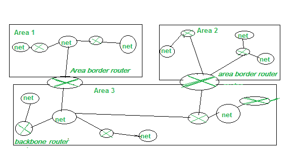
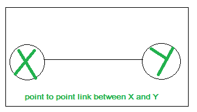
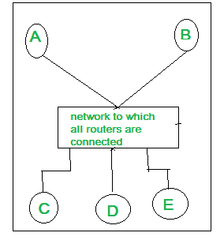

# 先打开最短路径(OSPF)–第 2 集

> 原文:[https://www . geesforgeks . org/open-最短路径-first-ospf-set-2/](https://www.geeksforgeeks.org/open-shortest-path-first-ospf-set-2/)

OSPF 简称为开放最短路径优先。OSPF 是一种域内路由协议，是链路状态路由协议的实现。它属于内部网关协议组，在单个自治系统中运行。OSPF 被设计为内部网关协议。它用于自治系统，如局域网。

为了高效、及时地处理路由，该协议将自治系统划分为多个区域。区域是包含在自治系统中的路由器、主机和网络的集合。一个自治系统可以分成许多不同的区域，但同时，一个区域内的所有网络必须连接起来。

从上面给出的图中，我们可以看到网络被划分，它可以被结构化或细分为路由区域，以简化管理并优化流量和资源利用率。一个区域内的路由器向该区域发送大量路由信息。在区域边界有一个特殊的路由器“区域边界路由器”。这些路由器汇总其所在区域的信息，并将信息发送到其他区域。在这些区域中，有一个被称为“主干”的区域，所有其他区域都与其相连，并作为主要区域。每个区域都有一个标识。两个不同的区域不能直接连接，但它们需要通过主干网连接，这是强制性的。位于两个区域(例如区域 1 和区域 3)边界的路由器通过区域边界路由器连接。

OSPF 协议支持身份验证，其更新通过多播地址 224.0.0.5/6 发送。如果其中一条链路出现故障，协议会找到另一条到达目的地的最短路径，因此收敛速度更快。通信 hello 数据包每 10 秒发送一次，如果在 40 秒内没有收到回复，则视为超时。此外，当路由器配置略有变化(添加/删除路由器)时，路由表会快速更新。它基于链路状态路由协议。

顾名思义，“最短路径优先”，OSPF 根据一种算法计算通过网络到达目的地的最短路径。它使用 Dijkstra 算法来计算最短路径。

连接也称为链接。链路也可以是两台路由器/网络之间的连接。在 OSPF，定义了四种不同类型的链接:

*   **Point to Point:** These types of links are present in between two routers and as it is a point to point, there lies no hosts, routers in between the two connected routers. 

*   **Transient link:** If there lies a large number of routers attached to a network. There can be Lan, wifi, several different routers then this configuration is termed as transient link. It can be represented with two topology: Realistic and Unrealistic. 

*   **Stub:** 是与单个网络连接的网络。数据包通过同一路由器发送和接收。

*   **虚拟链路:**由于某种原因链路断开时，可能会出现一些情况。那时，网络管理员在两台通信路由器之间创建一条虚拟链路。这些类型的链接称为虚拟链接。

OSPF 协议中有五种不同类型的数据包，它们是:

1.  哈啰包

2.  数据库描述

3.  链接状态请求

4.  链接状态更新

5.  链路状态确认

当出现传递数据包的情况时，问题是它应该传递到哪个网络，为什么？
决策基于优化。其中一种方法是分配通过网络的成本，这种成本被称为度量。但是，分配给每个网络的度量取决于协议的类型。OSPF 协议允许管理员根据服务类型分配通过网络的费用。它可以基于最大延迟、最大吞吐量、速度和无错误等。基于不同类型的服务，可以有多个路由表。

OSPF 使用 100 Mbps 的参考带宽进行成本计算。计算成本的公式是参考带宽除以接口带宽。例如，在以太网的情况下，它是 10 Mbps / 10 Mbps = 1。