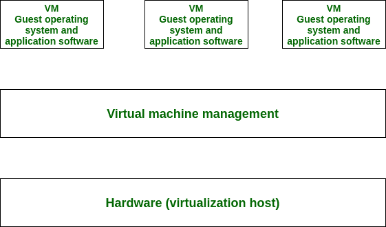

# 基于操作系统的虚拟化

> 原文:[https://www . geesforgeks . org/基于操作系统的虚拟化/](https://www.geeksforgeeks.org/operating-system-based-virtualization/)

先决条件–[服务器虚拟化的类型](https://www.geeksforgeeks.org/computer-network-types-server-virtualization/)、[基于硬件的虚拟化](https://www.geeksforgeeks.org/hardware-based-virtualization/)
基于操作系统的虚拟化是指一种操作系统功能，其中内核支持各种独立的用户空间实例的存在。虚拟化软件的安装也指基于操作系统的虚拟化。它安装在预先存在的操作系统上，该操作系统称为主机操作系统。

在这种虚拟化中，用户像任何其他程序一样在他的系统的操作系统中安装虚拟化软件，并利用该应用来操作和生成各种虚拟机。这里，虚拟化软件允许用户直接访问任何创建的虚拟机。由于主机操作系统可以为硬件设备提供强制支持，即使硬件驱动程序没有分配给虚拟化软件，操作系统虚拟化也可能会影响硬件的兼容性问题。

虚拟化软件能够将需要独特软件才能运行的硬件信息技术资源转换为虚拟化信息技术资源。由于主机操作系统本身是一个完整的操作系统，因此许多基于操作系统的服务都是可用的，因为组织管理和管理工具可用于虚拟化主机管理。

下面提到一些主要的基于操作系统的服务:

1.  备份和恢复。
2.  安全管理。
3.  集成到目录服务。

基于操作系统的虚拟化的各种主要操作描述如下:

1.  可以使用硬件功能，例如网络连接和中央处理器。
2.  可与之交互的已连接外围设备，如网络摄像头、打印机、键盘或扫描仪。
3.  可以读取或写入的数据，如文件、文件夹和网络共享。

操作系统可能具有允许或拒绝访问这种资源的能力，这是基于程序请求这些资源的方式以及程序运行的上下文中的用户帐户。操作系统也可能隐藏这些资源，这导致当计算机程序计算它们时，它们不会出现在枚举结果中。然而，从编程的角度来看，计算机程序已经与那些资源交互，并且操作系统已经管理了交互行为。

通过操作系统虚拟化或容器化，有可能在容器中运行程序，而这些资源只有一部分被分配到容器中。一个被期望感知整个计算机的程序，一旦在一个容器中运行，只能看到分配的资源，并认为它们是所有可用的资源。在每个操作系统上可以形成几个容器，计算机资源的一个子集被分配给每个容器。每个容器可以包括许多计算机程序。这些程序可能并行运行，也可能明显地相互关联。

基于操作系统的虚拟化会带来与性能开销相关的需求和问题，例如:

1.  主机操作系统使用中央处理器、内存和其他硬件信息技术资源。
2.  来自客户操作系统的与硬件相关的调用需要在硬件之间来回导航许多层，这会降低整体性能。
3.  除了每个客户操作系统的单独许可证之外，许可证对于主机操作系统来说通常是必不可少的。