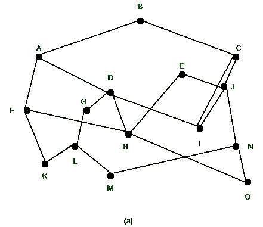
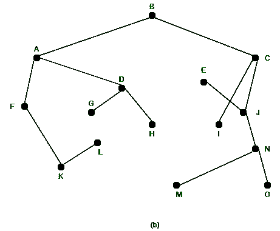

# 网络拓扑中的最优性原则

> 原文:[https://www . geeksforgeeks . org/网络拓扑中的最优性原理/](https://www.geeksforgeeks.org/optimality-principle-in-network-topology/)

#### 导言:

一般来说，最佳路由与网络拓扑或流量无关。这种说法被称为最优性原则(贝尔曼，1975)。

#### **<u>陈述</u>**<u>**<u>最优性原则</u>** <u>:</u></u>

<u>它指出，如果路由器 J 在从路由器 I 到路由器 K 的最佳路径上，那么从 J 到 K 的最佳路径也沿着相同的路由。调用从 I 到 J 的路线 *r1* 和其余路线 *r2* 。它可以与 *r1* 连接，以改进从 I 到 K 的路线，这与我们的陈述相矛盾，即 *r1r2* 只有在从 J 到 K 存在比 r2 更好的路线时才是最佳的</u>

#### <u>路由器的接收器树:</u>

<u>我们可以看到，作为最优性原理的直接结果，从所有源到给定目的地的最优路径集合是从扎根于目的地的树开始的。这种树被称为**下沉树**，如图(1)所示。</u>

#### <u>**<u>描述图:</u>**</u>

<u>在给定的图中，距离度量是跳数。因此，所有路由算法的目标都是发现并使用所有路由器的汇聚树。</u>

<u>

网络</u> <u>

路由器乙的接收树</u> 

<u>接收器树不是唯一的，也可能存在具有相同路径长度的其他树。如果我们允许选择所有可能的路径，树就变成了一个更一般的结构，叫做 **DAG(有向无环图)。**DAG 没有循环。对于这两种情况，我们将使用下沉树作为方便的简写。我们将对这两种情况采取技术假设，即路径不会相互干扰，因此，例如，一条路径上的交通堵塞不会导致另一条路径转向。</u>

#### <u>结论:</u>

<u>接收器树不包含任何循环，因此每个数据包都将在有限的跳数内传送。实际上，生活并不太容易。链路和路由器可以在运行过程中继续运行和恢复，因此不同的路由器可能对当前的拓扑有不同的想法。此外，我们还发现了一个问题，即每台路由器是否必须单独获取作为其接收器树计算基础的信息，或者该信息是否是通过其他方式收集的。汇聚树和最优性原则提供了一个基准，其他路由算法可以根据它来衡量。</u>