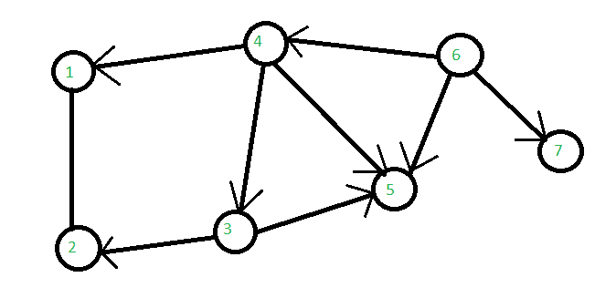

# 优化链路状态路由协议

> 原文:[https://www . geesforgeks . org/optimized-link-state-routing-protocol/](https://www.geeksforgeeks.org/optimized-link-state-routing-protocol/)

**OLSR** 代表**优化链路状态路由**协议。在这种情况下，每个节点周期性地泛洪其链路的状态。每个节点重新广播从其邻居接收的链路状态信息。每个节点跟踪从其他节点接收的链路状态信息。每个节点使用上述信息来确定每个目的地的下一个希望。它是主动的和表驱动的。

**[链路状态路由](https://www.geeksforgeeks.org/unicast-routing-link-state-routing/) :**

*   每个节点扩展一个生成树。
*   每个节点可以获得整个网络的拓扑结构。

**示例:**



```
TC(6) = <4, 5, 7>
```

*   节点 6 生成通告 MS(6) = {4，5，7}中节点的 TC 消息。
*   节点 4 从节点 6 转发 TC(6)，节点 3 从节点 4 转发 TC(6)。
*   在节点 3、4 和 6 生成 TC 消息后，所有节点都有链路状态信息可以路由到任何节点。

它利用一种技术来减少消息泛滥-**多点中继(MPR)** 。

在这种情况下，网络中的每个节点 N 选择一组邻居节点作为多点中继，MPR(N)，它们从不在 MPR(N)中的 N 个邻居重发控制分组，处理来自 N 个邻居的控制分组，但是它们不转发分组。选择多平面重建(N)，使得 N 的所有两跳邻居都被多平面重建(N)的(一跳邻居)覆盖。

**OLSR 优势:**

*   OLSR 具有较小的平均端到端延迟，因此用于需要最小延迟的应用。
*   与其他协议相比，OLSR 实现更加用户友好，而且更容易解决问题。
*   它也是一种平面路由协议。
*   它不需要中央管理系统来处理其路由过程。
*   随着源和目的地对的快速变化，它增加了协议对自组织网络的适用性。
*   它不需要控制消息的可靠链接，因为消息是定期发送的，并且传递不必是连续的。

**OLSR 的劣势:**

*   它维护所有可能路由的路由表。
*   当移动主机数量增加时，来自控制消息的开销也会增加。
*   重新发现断开的链接需要相当长的时间。
*   发现备用路由时，它比其他协议需要更多的处理能力。