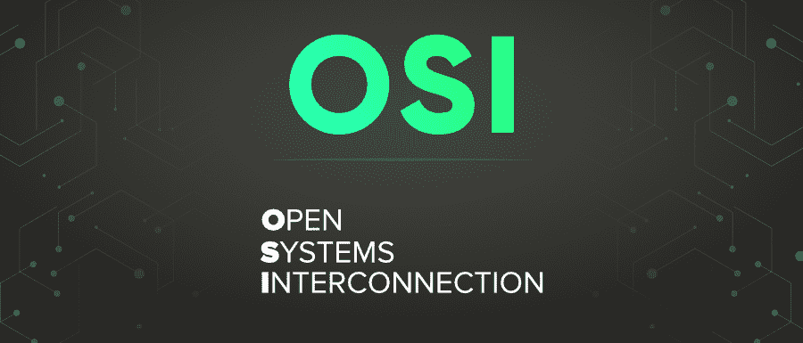

# 计算机网络中的现场视察模型完整形式

> 原文:[https://www . geeksforgeeks . org/OSI-model-完整形式计算机网络/](https://www.geeksforgeeks.org/osi-model-full-form-in-computer-networking/)

**OSI** 代表**开放系统互联。** OSI 模型由国际标准化组织(ISO)开发。它是应用程序如何通过网络通信的参考模型。现场视察模型将计算功能描述为一套通用的规则和要求，以支持不同产品和软件之间的互操作性。

现场视察模型可以被认为是计算机网络的通用语言。它基于分而治之的概念，将通信系统分成 7 个抽象层，并将该层堆叠在前一层之上。

#### 现场视察模型的层次

现场视察模型有七层，如下所示:

1.  物理层
2.  数据链路层
3.  网络层
4.  传输层
5.  会话层
6.  表示层
7.  应用层

要了解更多关于层的信息，请访问现场视察模型的[层](https://www.geeksforgeeks.org/layers-of-osi-model/)

#### 特征

*   它是一个概念模型，使不同的通信系统能够使用网络进行通信。
*   它是由国际标准化组织在 1984 年开发的。
*   它充当计算机间通信的架构。
*   它分为 7 层，每层执行特定的任务。
*   每一层都是相互独立的，可以独立执行其操作。

#### 优势

*   它是一个分层模型，每一层本质上都是独立的。因此，一个图层中的更改不会影响其他图层。
*   它把复杂的函数分成更小的部分。
*   这是一个通用模型，因为它具有适应许多协议的灵活性。
*   它支持面向连接和无连接服务。
*   它比将所有服务捆绑在一层中更安全、适应性更强。

#### 不足之处

*   这纯粹是一个理论模型，忽略了资源和技术的可用性。因此，它的实际实施受到了一些限制。
*   非常复杂。最初的实施是繁琐、缓慢和昂贵的。
*   这些层相互依赖，它们不能并行操作，因为它们必须等待来自前一层的数据/数据包。