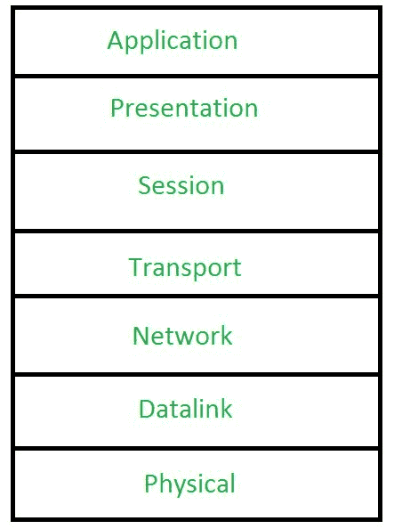
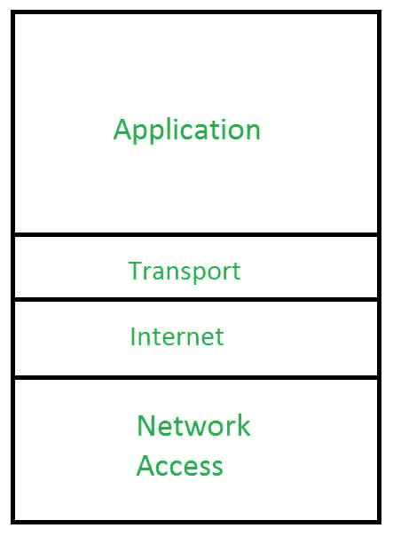
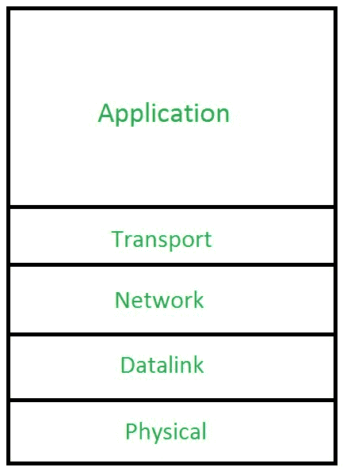

# OSI、TCP/IP 和混合模型

> 原文:[https://www.geeksforgeeks.org/osi-tcp-ip-and-hybrid-models/](https://www.geeksforgeeks.org/osi-tcp-ip-and-hybrid-models/)

[**OSI 模型**](https://www.geeksforgeeks.org/layers-osi-model/) **:**
由国际标准化组织或 ISO 开发，开放系统互连模型或 OSI 模型是网络中的关键构建模块。它有助于排除故障和理解网络，因为它遵循分层方法；不同的层是:

```
(i) Physical layer
(i) Data Link layer
(ii) Network layer
(iii) Transport layer
(iv) Session layer
(v) Presentation layer
(vi) Application layer 
```

这些层自下而上给出如下。



**优势:**

*   提供标准和互操作性。
*   拆分开发(在第 3 层工作的人不需要关心第 7 层)。
*   更快的开发(由于每一层都相互独立，因此与旧的专有模型相比，现场视察模型中的开发速度更快)。

[**TCP/IP 模型**](https://www.geeksforgeeks.org/tcp-ip-model/) **:**
OSI 模型用于 CLNS 和 CLMNP 等无连接协议；但是随着 TCP(面向连接协议)新模型的出现；即 TCP/IP 模式开始发挥作用。该模型将开放系统互连模型的应用层、表示层和会话层结合起来形成了开放系统互连模型中的应用层，将开放系统互连模型中的数据链层和物理层结合起来形成了开放系统互连模型中的网络接入层，开放系统互连模型中的互联网层相当于开放系统互连模型中的网络层。



**优势:**

*   TCP/IP 支持多种网络路由协议。
*   它是可扩展的，并且基于客户机-服务器架构。
*   它是一个开放的协议套件，也就是说，它不是专有的，所以任何人都可以使用它。
*   TCP/IP 独立于操作系统工作。

**混合模型:**
在现实世界中，我们使用 OSI 模型和 TCP/IP 模型的混合，称为混合模型。在混合模型中，应用层是现场视察模型(类似于 TCP/IP 模型)的第 7 层、第 6 层和第 5 层的组合。其余层(第 1、2、3 和 4 层)与现场视察模型相同。

