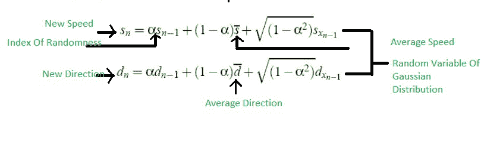

# 户外移动模型|高斯-马尔可夫

> 原文:[https://www . geesforgeks . org/outdoor-mobility-model-gauss-Markov/](https://www.geeksforgeeks.org/outdoor-mobility-model-gauss-markov/)

有随机行走、随机路点、随机方向等室内移动模型。同样，也有像高斯马尔可夫和随机行走的概率版本这样的户外移动模型。

**高斯-马尔可夫:**
这个移动性模型是为模拟个人通信服务而提出的。例如，几年前，只有固定电话，但现在有无线电话，你可以在家里到处走动。对于这种类型的服务，使用高斯马尔可夫模型。

该模型适应不同程度的随机性。在室内移动模型中，有固定的模拟区域，我们可以在其中进行随机行走或随机路点或随机方向。但是在室外移动模型中，没有模拟区域的概念。这完全是随机的。

最初，每个移动节点被分配一个当前速度和方向。这意味着每个节点都有它的初始方向和初始速度，它可以随机改变自己。它可以自由进出。

使用以下公式计算第 n 个实例的速度和方向值。新速度和新方向可以使用以下公式轻松计算:

现在，由于这个模型中没有模拟区域。假设，它从那个区域出来，或者在这个区域的边界。然后，用平均值代替平均速度和平均方向值。为了计算平均值，我们使用量角器。连接两个量角器，我们有一个完整的 360 度。

它照看它所在的附近区域。假设，它在范围 225 附近。它涵盖了这一点，并得到它的内部和它的全面覆盖。要照顾的重点只是随机性指标、平均速度和高斯分布的随机变量。

**优势–**理解起来很简单。
**缺点–**会降低图像的细节和边缘。