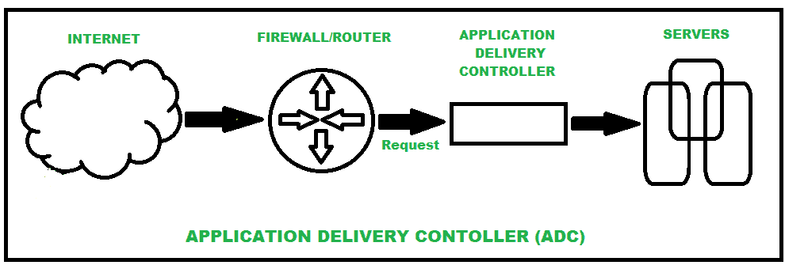

# 应用交付控制器(ADC)概述

> 原文:[https://www . geesforgeks . org/overview-of-application-delivery-controller-ADC/](https://www.geeksforgeeks.org/overview-of-application-delivery-controller-adc/)

应用交付控制器(ADC)被认为是下一代[负载平衡器](https://www.geeksforgeeks.org/load-balancer-system-design-interview-question/)，更常见的是应用交付网络(ADN)的一部分，位于[防火墙](https://www.geeksforgeeks.org/introduction-of-firewall-in-computer-network/)和网络/应用服务器之间的数据中心。通过消除服务器上的更多负载，它使应用程序交付过程更加灵活和可靠。它倾向于提供更高级的功能，如内容转发以及服务器运行状况监控。

**应用交付控制器(ADC) :**
应用交付控制器(ADC)这个名字本身就定义了它是什么。当软件应用程序的使用在过去几年中大量增加时，类似地，将应用程序和服务提供给用户就是“交付”的意思。应用交付控制器是基于先进技术和实践的新一代网络设备，旨在管理应用交付要求并控制客户端和应用服务器之间的通信，以提供改进的应用服务。简而言之，它位于数据中心、防火墙和应用程序服务器之间，用于请求和响应，更注重通过互联网交付的应用程序的可用性、加速、性能、安全性和弹性。

**ADC 最常见的特性:**

*   模数转换器可以作为设备进行物理部署，也可以默认作为运行在 86x 服务器上的软件进行部署。
*   ADC 可以提供[开放系统互连(OSI)](https://www.geeksforgeeks.org/layers-of-osi-model/) 第 3、4、7 层负载均衡。
*   设备之间的模数转换器连接可以使用循环或最少数据包的方法。
*   像[域名系统](https://www.geeksforgeeks.org/domain-name-system-dns-in-application-layer/)、[文件传输协议](https://www.geeksforgeeks.org/file-transfer-protocol-ftp-in-application-layer/)、[超文本传输协议](https://www.geeksforgeeks.org/http-full-form/)、HTTPS、TCP、UDP 等协议。可用于监控..
*   支持与多种网络和协议的集成。

**ADC 的工作:**
应用交付控制器(ADC)，放置在数据中心，始终努力确保通过互联网交付的软件应用的高性能。多项任务的 it 绩效旨在为最终客户提供更好的服务。它在关注负责提供软件应用程序更好性能的主要领域方面发挥了很大作用。喜欢

1.  它执行负载平衡
2.  贮藏
3.  它通过 3A 原则(认证、授权和可用性)提供安全性
4.  多路技术
5.  内容切换等。

为了执行所有这些动作，模数转换器使用多种技术。
下图表示应用交付控制器

**ADC 用来提升性能的技术:**
这四种技术被认为是 ADC 用来提升性能的常用技术。

*   **负载平衡–**
    它是指通过将传入的请求分布在多组服务器上来降低服务器上的负载。
*   **缓存–**
    它是指将一些内容本地存储在模数转换器中，而不是每次请求都从服务器获取。
*   **压缩–**
    是指压缩图像、音乐、视频文件等静态资产。在网络上传输之前。
*   **卸载 SSL 处理–**
    它是指对需要由服务器执行的请求进行解密，对响应进行加密。

**应用交付控制器的服务:**

1.  [服务器负载平衡](https://www.geeksforgeeks.org/load-balancing-on-servers-random-algorithm/)
2.  SSL 卸载
3.  [域名系统应用防火墙](https://www.geeksforgeeks.org/domain-name-system-dns-in-application-layer/)
4.  中央认证
5.  网络应用防火墙
6.  [DDoS 保护](https://www.geeksforgeeks.org/denial-of-service-ddos-attack/)
7.  多租户支持

**应用交付控制工具:**
应用连接控制技术通常出现在网络端点，并通过各自的 CPU 进行区分。他们部署了一套优化技术来改进在线应用程序呈现，并使用实时数据来确定访问和应用程序的优先级。这些技术一旦部署就构成了应用交付网络。应用交付控制器和广域网优化控制器(WOC)是构成应用交付网络的两个组件。

模数转换器被视为应用交付网络的一部分，因为它位于应用交付网络的末端，位于数据中心的 WOC 专注于改善延迟、提高应用性能，还处理压缩、缓冲、协议欺骗和去复制等问题。尽管 ADN 有时被称为内容交付网络(CDN)，但 ADN 提高了动态内容加速，而 CDN 专注于静态内容。

**ADC 的优势:**

*   模数转换器有助于提高应用性能。
*   模数转换器可以使用各种技术来更好地提供服务。
*   模数转换器可以处理加密和解密的流量。并且在到达服务器之前解密流量。
*   模数转换器提供了呈现内容的可见性，并改善了图像密集型网页的交付。

**ADC 的缺点:**
与 ADC 的优点相比，缺点的数量非常少-

*   操作人员需要经常忽视 ADC。
*   ADC 实施需要前期资本投资。
*   缺乏当今动态环境所需的敏捷性和分布式体系结构。
*   专业人士需要 ADC 软件知识才能操作。