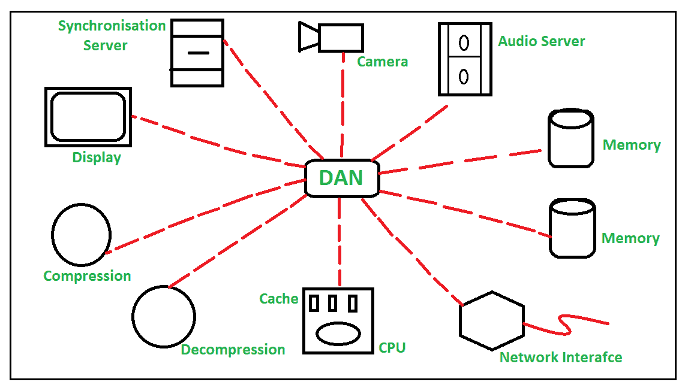

# 桌面区域网络(DAN)概述

> 原文:[https://www . geesforgeks . org/overview-of-desk-area-network-Dan/](https://www.geeksforgeeks.org/overview-of-desk-area-network-dan/)

桌面区域网络是基于自动柜员机互连的多媒体工作站架构，简单地说，它是围绕[异步传输模式(自动柜员机)](https://www.geeksforgeeks.org/asynchronous-transfer-mode-atm-in-computer-network/)的计算机设备之间的互连。此桌面区域网络将工作站、多媒体设备、其他外围设备和其他网络的网桥相互连接。

工作站是集成了其他高性能内存、多任务处理设施、高质量图形和其他高级功能的高性能计算机系统，供单个用户或用户组用来执行技术或科学应用。

在多媒体设备连接到工作站之前，没有将多媒体设备或其他外围设备直接连接到网络的设施。但是由于这种桌面区域网络，这些设备现在直接连接到网络。借助这种 DAN 架构，外围设备和[中央处理器](https://www.geeksforgeeks.org/difference-between-cpu-and-gpu/)之间进行通信，这种桌面区域网络支持通过网络共享资源。

**DAN 的架构:**
桌域网的架构相当简单。DAN 网络由音频/视频(A/V)软件组成。使用设备到设备连接或设备到中央处理器连接来建立 DAN 网络。自动柜员机技术允许异步传输所有称为自动柜员机信元的信息，这些信元是小而固定大小的数据包。多媒体包含各种类型的内容，如音频、图像、视频、文本等。演示节点、附加处理器、内存连接到桌面区域网络。

中央处理器节点包括 ARM 600 处理器和 256 个额外的高速缓冲存储器，提供高性能服务。主要是自动柜员机技术简化了丹网络的工作，因为自动柜员机负责内部传输。

**Figure –** DAN Architecture

**DAN 中的 ATM–**
异步传输模式(ATM)是一种非常高速的网络协议，工作在开放系统互连(OSI)模型的[数据链路层。它是一个跨服务提供商，允许数据在 DAN 中高效顺畅地流动。桌面局域网(DAN)围绕](https://www.geeksforgeeks.org/layers-of-osi-model/)[异步传输模式(ATM)](https://www.geeksforgeeks.org/asynchronous-transfer-mode-atm-in-computer-network/) 工作。

**DAN 的工作:**
DAN 在 ATM 技术的帮助下工作。DAN 自动柜员机信元中用于通信和数据传输的每个设备。网络是已建立的设备到设备的连接或设备到中央处理器的连接。可靠性和效率如此之高，因为它使用了自动柜员机技术。因此，当任何信元通过任何网络传输时，它都会到达目的地或基于路由功能的特定位置，具有很高的安全性。

**使用 DAN 的好处:**

*   在设备到设备或中央处理器到设备之间提供高性能通信。
*   提供可靠的数据传输。
*   面向连接的传输模式。
*   使用自动柜员机提供高水平带宽。