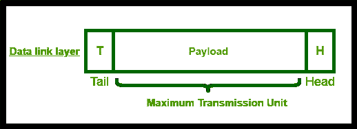
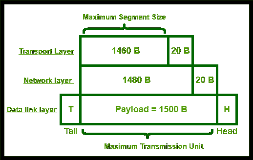

# 最大分段尺寸概述

> 原文:[https://www . geesforgeks . org/最大细分市场规模概述/](https://www.geeksforgeeks.org/overview-of-maximum-segment-size/)

先决条件: [TCP/IP 模型](https://www.geeksforgeeks.org/tcp-ip-model/)和[现场视察模型](https://www.geeksforgeeks.org/layers-of-osi-model/)

在建立 TCP 连接时，最大网段大小至关重要。MSS 指的是 TCP 报头中的字段，表示设备在 TCP 段中可以接收的最大数据量(以字节为单位)。

考虑数据链路层的帧结构。

数据链路层帧格式的结构

1.  数据链路层有助于将帧从一个节点移动到下一个节点。它由头部(包含数据包数量的信息)、尾部(表示数据包流的结尾)和有效负载(数据包的一部分，已传输)组成。这由实际信息组成)。
2.  有效载荷被称为“最大传输单位”。它是可以通过网络(如互联网)发送的最大数据包或帧大小，以字节为单位。

**示例–**以太网。

1.  在以太网中，最大传输单位= 1500 字节。这在数据链路层中表示。
2.  有效载荷为 1500 字节，由网络层接收，表示为数据报/有效载荷的 1480 字节和报头的 20 字节。
3.  TPayload 为 1480 B，当传输层接收时，观察到有效负载大小为 1460 B，报头大小为 20 B。这里的有效负载称为“最大段大小”。为了良好的通信，数据段和报头中的字节数加起来必须低于最大传输单位中的字节数。

**注意–**
因此，最大段大小是指最高有效负载大小，终端设备准备在单个数据包内接受。最大传输单位是可以在网络中流动而不被分割的最大数据包大小。