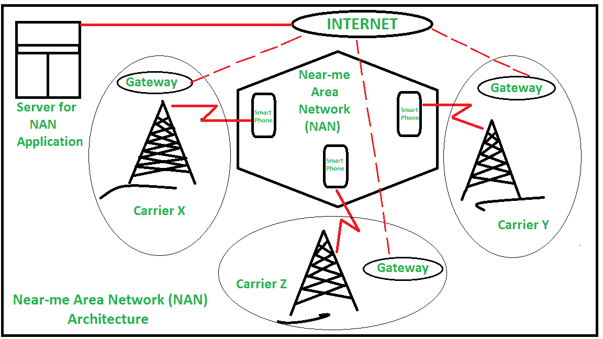

# 近距局域网(NAN)概述

> 原文:[https://www . geesforgeks . org/near-me-area-network-nan 概述/](https://www.geeksforgeeks.org/overview-of-near-me-area-network-nan/)

**Near-me Area Network (NAN)** 是一种逻辑通信网络，专注于近距离区域内的无线设备(如智能手机和个人数字助理等)之间的通信。这个近在咫尺的区域网络建立在现有的物理网络基础设施之上。简单地说，在一个[局域网(LAN)](https://www.geeksforgeeks.org/local-area-network-lan-technologies/) 中，所有连接的设备都在同一个网段中，但是在近场区域网络的情况下，NAN 上连接的设备可能使用不同的网络基础设施。

例如，考虑两个地理位置相近但使用不同移动运营商网络服务的智能手机用户。随着技术的发展，加上移动互联网和[全球定位系统](https://www.geeksforgeeks.org/how-gps-works/)近距局域网的工作。它侧重于用户之间的双向交流。

即使使用来自不同[互联网服务提供商(ISP)](https://www.geeksforgeeks.org/isp-full-form/) 或移动运营商 NAN 的互联网连接的不同智能手机作为基于位置的通信网络运行良好。近距局域网(NAN)就像[无线局域网(WLAN)](https://www.geeksforgeeks.org/wlan-full-form/) 一样，但设备来自不同的网络基础设施。

**近距局域网的类型:**
近距局域网有 2 种类型:

1.  **封闭的 NAN–**
    在使用同一运营商网络的移动设备之间形成，它在没有[全球定位系统(GPS)](https://www.geeksforgeeks.org/how-gps-works/) 的情况下工作。但是运营商将为此目的使用位置数据库，通过监控来自蜂窝塔及其服务移动电话的信号，该位置可以被运营商利用。

2.  **全球 NAN–**
    它是在具有 GPS 系统和互联网连接的设备之间形成的。全球定位系统跟踪位置，并将其更新到互联网的中央服务器。

下图说明了 NAN 的**架构:**

近距局域网的一些**例子**:

*   萨提亚在技术研讨会，他有一张额外的票。所以他分享了他的额外电影票，看看他的朋友中是否有人想买额外的电影票。
*   不幸的是 Omm 丢失了他的钱包，所以他发了信息，所以如果任何诚实的人找到它，他们可以归还它
*   绍拉夫要去市场购物，所以他会查看他的朋友列表，如果有，他可以一起去购物。

**退出人工智能应用程序:**

*   苹果设备支持握手应用程序，允许与附近的其他人共享联系信息，而无需输入。
*   鹰击是 NAN 的一个应用，雅虎用它来记录人的位置，这个轨迹可以被任何应用使用。
*   WhosHere 是一个 NAN 应用程序，它有助于找到感兴趣的人。它为志同道合的人提供了一种不同的交流方式。
*   循环允许用户在任何位置找到他们的朋友。例如，你在一个新的地点，但是 Loop 会帮助你找出你的朋友中是否有人在那个地点。
*   另一个 NAN 系统的例子是 WhozThat，它允许用户找到他/她周围其他人的信息。

**NAN 应用的挑战:**

1.  准确识别一个地方和这个地方的位置。
2.  支持 NAN 的移动设备的广泛可用性。

**NAN 的优缺点:**

*   NAN 的主要优势包括通过提供双向通信，在近距离之间实现轻松、快速的通信。

*   同样，人工神经网络的主要缺点包括人工神经网络的可用性和全球定位系统在任何地方的实施可能都不完美。