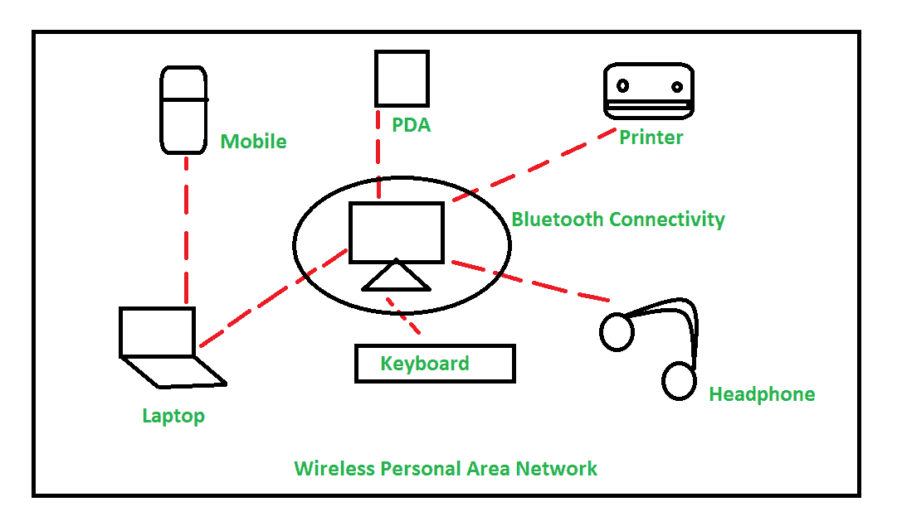
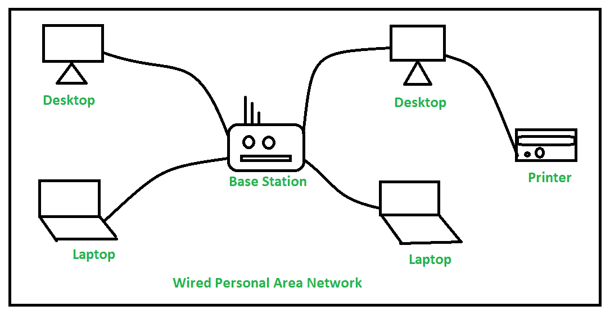

# 个人区域网(PAN)概述

> 原文:[https://www . geesforgeks . org/个人区域网概述-pan/](https://www.geeksforgeeks.org/overview-of-personal-area-network-pan/)

[计算机网络](https://www.geeksforgeeks.org/basics-computer-networking/)是一组互连的计算机/设备，其中建立互连的目的是在计算机/设备之间进行通信，以共享资源、数据和应用程序。存在[不同类型的计算机网络](https://www.geeksforgeeks.org/types-of-area-networks-lan-man-and-wan/)，其被设计成在它们所覆盖的区域上运行，并且根据网络要求、服务类型、网络覆盖区域对它们进行分类。

**个人局域网(PAN)** 是连接个人范围内的计算机/设备的计算机网络。由于 PAN 提供的网络范围在一个人的范围内，通常在 10 米(33 英尺)的范围内，它被称为个人区域网络。个人区域网络通常包括计算机、电话、平板电脑、打印机、PDA(个人数字助理)以及其他娱乐设备，如扬声器、视频游戏控制台等。

托马斯·齐默曼和麻省理工学院媒体实验室的其他研究人员首先提出了 PAN 的概念。由于在灵活性和效率方面的高性能，它在家庭、办公室和小型网络区域非常有用。

**个人区域网(PAN)的类型:**
个人区域网根据其连接可以有两种类型，即无线 PAN 和有线 PAN。
解释如下。

1.  **无线 PAN–**
    无线个人区域网(WPAN)通过红外、 [ZigBee](https://www.geeksforgeeks.org/introduction-of-zigbee/) 、[蓝牙](https://www.geeksforgeeks.org/bluetooth/)和超宽带等信号连接。
2.  **有线 PAN–**
    有线 PAN 通过诸如火线或 [USB(通用串行总线)](https://www.geeksforgeeks.org/universal-serial-bus-usb-in-computer-network/)等电缆/电线连接。

**PAN 的例子:**

*   **人体区域网络–**
    它是一个随人物范围移动的移动网络，例如当一个人将他的智能手机连接到蓝牙耳机，并在市场上移动时，它指的是人体区域网络。
*   **离线网络–**
    在这种情况下，多个设备通过蓝牙或 Wi-Fi 连接。连接到计算机的设备(包括打印机、鼠标、扬声器和其他设备)是使用个人区域网络(PAN)集成的，不使用互联网。因此，在一个小的单一空间(例如家庭)中使用的设备之间形成了通信网络。

*   **家庭办公室–**
    在家庭办公室设置中，出于工作目的设置了一个独立的较小网络，该网络与其他家用电器使用的网络分开。该网络作为一个独立的整体工作，多个其他设备连接在一起用于办公目的。

**PAN 的优点和缺点–**
以下是 PAN 的一些优点:

*   PAN 相对灵活，为短网络范围提供高效率。
*   它需要简单的设置和相对较低的成本。
*   它不需要频繁的安装和维护
*   它便于携带。
*   需要较少的技术技能来使用。

以下是 PAN 的一些缺点:

*   低网络覆盖区域/范围。
*   限于相对较低的数据速率。
*   设备之间不兼容。
*   内置的 WPAN 设备有点贵。

**PAN 的应用–**

*   家庭和办公室
*   组织和商业部门
*   医疗和医院
*   学校和大学教育
*   军事和国防